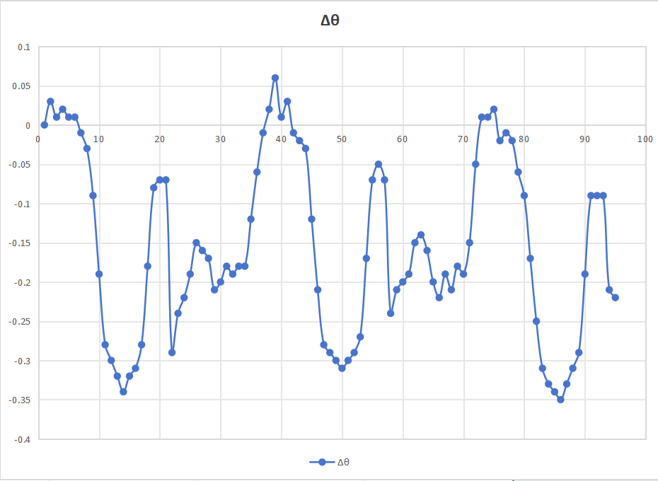

# 旋转轴角度一致性误差分析报告（多圈验证）

## 一、实验背景

设备旋转轴由伺服电机通过蜗轮蜗杆机构驱动。
系统中存在两套角度信息：

- **电机角度**：来自伺服电机自带绝对编码器，用于控制与显示；
- **负载角度**：来自安装在旋转轴上的外置绝对编码器，用于精度验证。

本次实验的目的在于：

> **评估在多圈连续旋转条件下，电机角度与负载实际角度之间的误差特性及其稳定性。**

------

## 二、实验方法说明

- 旋转方式：**单方向连续旋转（无正反切换）**
- 旋转范围：**0° → 940°（约 2.6 圈）**
- 采样间隔：**每 10° 记录一次**
- 数据处理方式：
  - 对负载编码器角度进行连续展开（多圈展开）；
  - 计算负载角度与电机角度的差值 Δθ。

------

## 三、实验结果总体结论

### 3.1 误差量级

​	

根据实验数据统计：

- **最大正误差**：约 **+0.06°**
- **最大负误差**：约 **−0.35°**
- **最大峰峰值误差**：约 **0.41°**

该误差在整个 0°～940° 范围内 **未出现发散或累积失控现象**。

------

### 3.2 误差稳定性

实验结果显示：

1. **误差在多圈旋转中保持稳定**
   - 第 1 圈、第 2 圈、第 3 圈中，
   - 相同角度区间的误差幅值和形态高度一致。
2. **误差不会随圈数增加而放大**
   - 在 360°、720° 等关键位置，误差均回到接近 0；
   - 说明不存在“圈数累积误差”或“编码器同步漂移”。

------

## 四、误差分布特征分析（重点）

### 4.1 误差具有明显的角度相关性

从数据可以观察到：

- 在约 **80°～150° 区间**，负载角度相对电机角度偏小，负误差达到峰值（约 −0.35°）；
- 在接近整圈位置（360°、720°）附近，误差趋近于 0；
- 同一误差分布在每一圈中**重复出现**。

这说明：

> 误差与“当前角度位置”强相关，而非随机波动。

------

### 4.2 误差具有周期性与可重复性

- 每 **360° 为一个完整误差周期**；
- 多圈数据中，误差曲线形态高度一致。

这是一类典型的：

> **蜗轮蜗杆传动结构引入的系统性角度误差**

------

## 五、原因分析

综合判断，该误差主要来源于以下因素：

1. **蜗轮蜗杆制造与装配误差**
   - 齿形误差、导程误差导致角速度传递不完全均匀；
2. **负载受力与结构刚性差异**
   - 在不同角度位置，受力状态略有变化；
3. **传动系统固有特性**
   - 蜗轮蜗杆并非“高绝对角度精度传动”，该误差属于正常工程现象。

需要特别说明的是：

> ❗ 该误差**不是**编码器故障
> ❗ 也**不是**控制算法异常
> ❗ 而是机械传动结构层面的可预测误差

------

## 六、关于补偿的工程评估结论

### 6.1 理论可行性

从工程原理上看：

- 由于误差具有**周期性、稳定性、可重复性**；
- 可以通过“角度位置查表补偿”的方式将最大误差进一步压缩。

------

### 6.2 当前阶段不实施补偿的原因

结合现有系统与业务代码，当前阶段不建议立即引入补偿，原因如下：

1. **现有控制架构未预留角度补偿入口**
   - 角度数据直接参与业务逻辑判断；
   - 强行引入补偿存在系统风险。
2. **补偿复杂度与当前收益不成比例**
   - 当前最大误差约 0.4°；
   - 对现阶段功能与安全无直接影响。
3. **误差已被清晰量化与验证**
   - 系统行为可预测、可解释；
   - 具备工程可接受性。

------

## 七、阶段性结论

1. 电机角度与负载角度在多圈旋转中保持良好一致性；
2. 系统存在最大约 **0.4° 的周期性角度误差**；
3. 该误差不随圈数累积，不存在发散风险；
4. 误差来源明确，属于蜗轮蜗杆传动的系统特性；
5. 当前系统状态**满足现有业务使用要求**。

------

## 八、一句话总结

> 本次多圈测试确认，旋转轴角度误差最大约 0.4°，且在多圈运行中稳定、可重复、不累积，属于蜗轮蜗杆传动的固有特性，存在影响验收的问题。

------

