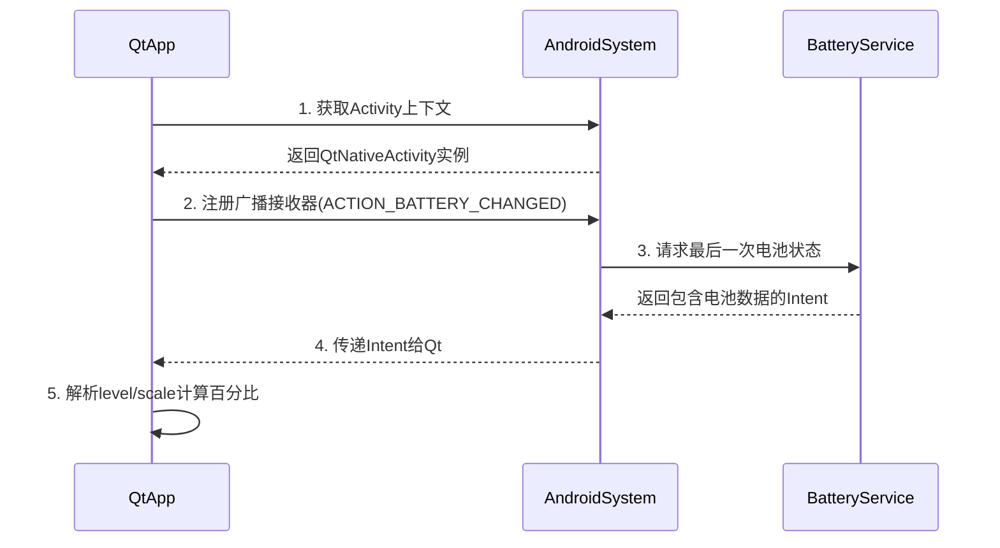
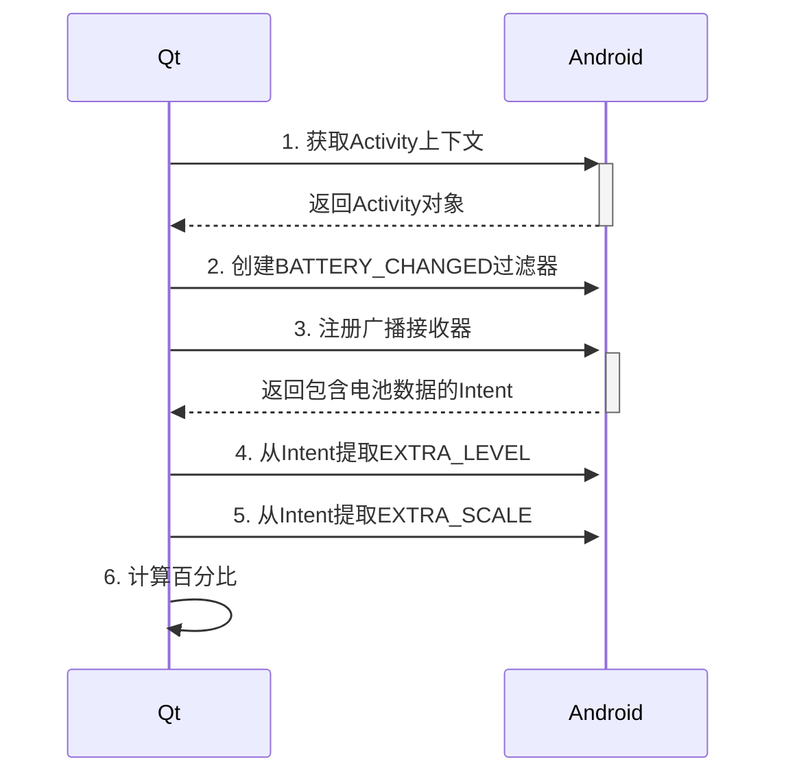

# 5.6

今天的任务，就是尝试将servo程序移植到安卓系统上面。

经过一上午的尝试，发现只能通过重装才能将安卓的QT组件安装到QT creator上面。

现在完成另外一个问题，就是Y2电机的配置问题。现在已经实现了Y2电机通过数据库字段`isEnable`来实现配置是否展示和操作。为了简化操作，需要通过配置界面来配置Y2电机。

## 界面配置Y2电机展示

### 需求

- 在servo配置界面中，展示`isEnable`的信息。起名为`展示生效`
- 点击Y2电机配置后，实现配置字段`isEnable`，来确定电机是否展示
- 电机型号中，加入伺服电机型号`M60A`，代指`AIMtor`电机Y2

需求完成后，可以实现在界面中配置Y2电机是否展示生效，简化了配置难度。

### 实践

1. 在`BaseConfig::createTb()`中，加入`isEnable`字段的支持，展示`isEnable`的信息。

   ```Cpp
   m_tModel->setHeaderData(m_tModel->fieldIndex(("position")),Qt::Horizontal,tr("安装位置"));
   ```

2. 在`BaseConfig::on_tViewClicked()`中，加入字段`isEnable`的支持

   ```CPP
   // 创建 [展示生效] 按钮，控制 isEnable 字段使能
   QComboBox *isEnable_cmb = new QComboBox(&dialog);
   isEnable_cmb->addItem("展示", 1);
   isEnable_cmb->addItem("不展示", 0);
   isEnable_cmb->setCurrentText((record.value(QString("isEnable")).toInt()==1)?"展示":"不展示");
   f_right->addRow(tr("展示生效"), isEnable_cmb);
   ```

   以及在点击确认按钮后，数据库的写入操作

   ```Cpp
   record.setValue(QString("isEnable"), isEnable_cmb->currentData());
   ```

3. 在`DbCtrl::DbIint`中，加入伺服电机型号`M60A`

   ```cpp
   Model<<"P100S"<<"KS300"<<"M60A";
   ```

4. 调整弹出框的样式，使之居中

   ```Cpp
   f_all.addWidget(motor_cfg, 0, 1, 1, 1, Qt::AlignCenter);
   f_all.addWidget(&buttonBox, 2, 1, 1, 1, Qt::AlignCenter);
   ```

经过测试，可以很正常地修改Y2电机展示与否。

## QT安卓开发记录

现在需求是，将QT代码的servo程序，移植到安卓13系统的掌机上，并做摇杆适配。

安卓开发环境除了QT开发框架，还有JDK、SDK和NDK的支持。这里简单区别下这几个

> ## 简单记忆法
>
> - **JDK**："Java大厨"的基础工具
> - **SDK**："Android餐厅"的专用设备
> - **NDK**："米其林大厨"的秘密武器

简单理解后，我们需要开始根据掌机安卓13的版本，来配置QT的开发环境了。这里我们首先要弄清楚，要想QT程序能运行到安卓13版本上，我们需要注意工具的版本问题。


# 5.7

## 版本选择

现在由于QT版本为5.14.1，所以先按照这个QT版本，来做对应的安卓适配。如果有问题再换。

下载需要的安卓套件（重新安装即可），然后按照[教程1](https://www.cnblogs.com/kn-zheng/p/18134865)下载对应的JDK1.8、[Android SDK](https://zhuanlan.zhihu.com/p/606029167)（其中包含了具体的安装选项）和NDK。安装完毕后，再从QT creator中配置安卓的开发环境：

- 工具 -> 选项 -> 设备 -> 安卓

将所涉及到的工具配置完毕后，最后`JAVA Settings`会展示

```text
✔Java Settings are OK. 
```

Android Settings会展示

```
✔Android settings are OK. (SDK Version: 25.2.5, NDK Version: 20.1.5948944)
```

这样就基本配置完毕了，我们测试下，基于QT 5.14.1的版本安卓软件，能否在安卓13上运行。写了一个简单Hello World测试，发现是可以实现的。（埋雷中：并不知道servo的复杂功能是否能够在此安卓设备上运行）

## servo适配

基于QT 5.14.1的版本安卓开发环境已经完成，现在需要将servo编译到安卓13上。现在记录下在编译servo的时候，遇到的问题以及解决方法。

### Unknown module(s) in QT

第一步构建servo程序，报错

```text
:-1: error: Unknown module(s) in QT: serialbus axcontainer
```

错误表明了项目配置中引用了 Qt 的 `serialbus` 和 `axcontainer` 模块，但是 Qt 安卓环境没有包含这些模块。

经过搜索，发现问题出现在QT安卓的开发组件中，并不包含`serialbus`和`axcontainer`两个模块。现在已知的是，`serialbus`是必须存在的，因为涉及到与伺服的通信。但是模块`axcontainer`是否也是必须的呢？

尝试办法：删除`axcontainer`然后再从windows环境下编译运行，查看运行结果是否正确。经过测试发现注释掉的`axcontainer`模块并不会影响项目的运行，可以尝试解决`serialbus`的报错问题。

### serialbus

这个模块是必须的，所以需要考虑下，怎么才能让安卓的组件加入这个模块。下载源码后，打开对应的`examples.pro`文件来打开项目，执行构建报错

```bash
E:\work\project\qtserialbus-dev\examples\..\examples\serialbus\can\canbusdeviceinfobox.cpp:43: error: 'const class QCanBusDeviceInfo' has no member named 'plugin'
     m_ui->pluginLabel->setText(tr("Plugin: %1").arg(info.plugin()));
                                                          ^~~~~~
```

报错原因是因为

> 在较新版本的 Qt（如 5.15+），`QCanBusDeviceInfo::plugin()` 可能已被移除或替换为其他方法。你的代码可能是基于较新的 Qt 版本编写的，但在 Qt 5.14.1 上编译时找不到该方法。

查看了qt5.14中关于类`QCanBusDeviceInfo`的[描述](https://doc.qt.io/archives/qt-5.14/qcanbusdeviceinfo.html)，发现其并没有支持并没有这个函数`plugin()`。看了[qt6的文档](https://doc.qt.io/qt-6/qcanbusdeviceinfo.html)，发现在6.2后，才支持的这个函数。

```CPP
(since 6.2) QString	plugin() const
```

所以我现在需要按照qt的版本，下载相应QT5.14版本的`serialbus`源文件。

- 找到`serialbus`的镜像地址

  ```bash
  https://github.com/qt/qtserialbus#
  ```

- 切换到5.14版本

  ```bash
  git clone git@github.com:qt/qtserialbus.git
  cd qtserialbus
  git checkout 5.14  # 切换到 5.14 版本
  ```

- 这时候查看`qtserialbus`目录

  ```bash
  Administrator@MS-CONBVUTOAIJI MINGW64 /e/work/project/qtserialbus (5.14)
  $ ll
  total 103
  -rw-r--r-- 1 Administrator 197121 23411 May  7 13:41 LICENSE.FDL
  -rw-r--r-- 1 Administrator 197121 15643 May  7 13:41 LICENSE.GPLv2
  -rw-r--r-- 1 Administrator 197121 36327 May  7 13:41 LICENSE.GPLv3
  -rw-r--r-- 1 Administrator 197121  8349 May  7 13:41 LICENSE.LGPLv3
  drwxr-xr-x 1 Administrator 197121     0 May  7 13:40 config.tests/
  -rw-r--r-- 1 Administrator 197121    59 May  7 13:41 configure.json
  drwxr-xr-x 1 Administrator 197121     0 May  7 13:41 dist/
  drwxr-xr-x 1 Administrator 197121     0 May  7 13:41 examples/
  -rw-r--r-- 1 Administrator 197121   162 May  7 13:41 qtserialbus.pro
  drwxr-xr-x 1 Administrator 197121     0 May  7 13:41 src/
  -rw-r--r-- 1 Administrator 197121   193 May  7 13:41 sync.profile
  drwxr-xr-x 1 Administrator 197121     0 May  7 13:41 tests/
  ```

好的，我们继续编译。报错

```bash
14:08:44: 正在启动 "G:\BaiduNetdiskDownload\android-ndk-r20b\prebuilt\windows-x86_64\bin\make.exe" "INSTALL_ROOT=E:\work\project\build-qtserialbus-Android_for_armeabi_v7a_arm64_v8a_x86_x86_64_Clang_Qt_5_14_2_for_Android-Debug\android-build" install

cd src\ && ( if not exist Makefile D:\develop\Qt\qtAndroid\5.14.2\android\bin\qmake.exe -o Makefile E:\work\project\qtserialbus\src\src.pro -spec android-clang "CONFIG+=debug" "CONFIG+=qml_debug" "ANDROID_ABIS=armeabi-v7a" ) && G:/BaiduNetdiskDownload/android-ndk-r20b/prebuilt/windows-x86_64/bin/make -f Makefile install
make[1]: Entering directory `E:/work/project/build-qtserialbus-Android_for_armeabi_v7a_arm64_v8a_x86_x86_64_Clang_Qt_5_14_2_for_Android-Debug/src'
cd serialbus\ && ( if not exist Makefile D:\develop\Qt\qtAndroid\5.14.2\android\bin\qmake.exe -o Makefile E:\work\project\qtserialbus\src\serialbus\serialbus.pro -spec android-clang "CONFIG+=debug" "CONFIG+=qml_debug" "ANDROID_ABIS=armeabi-v7a" ) && G:/BaiduNetdiskDownload/android-ndk-r20b/prebuilt/windows-x86_64/bin/make -f Makefile install
make[2]: Entering directory `E:/work/project/build-qtserialbus-Android_for_armeabi_v7a_arm64_v8a_x86_x86_64_Clang_Qt_5_14_2_for_Android-Debug/src/serialbus'
文件名、目录名或卷标语法不正确。
make[2]: *** [install_target] Error 1
make[2]: Leaving directory `E:/work/project/build-qtserialbus-Android_for_armeabi_v7a_arm64_v8a_x86_x86_64_Clang_Qt_5_14_2_for_Android-Debug/src/serialbus'
make[1]: *** [sub-serialbus-install_subtargets] Error 2
```

可以看出是在`install`环节出现了报错，表明在 `make install` 阶段，系统无法正确处理某些文件或路径名称（可能是路径包含非法字符、空格或中文）。但是经过[大牛的帖子](https://blog.csdn.net/qq_19649851/article/details/126227486)指示，可以不予理会，继续进行下一步的操作：将debug生成的所有文件，复制到qt5.14.1的android组件下。

```text
D:\develop\Qt\qtAndroid\5.14.2\android
```

`serialbus`安装完毕后，继续编译servo

### install失败

编译到安装的步骤，报错

```bash
Android deploy settings file not found, not building an APK
```

解决办法：重启。重启后，编译能够通过。

# 5.8

今天继续昨天的安卓设备适配。当前任务还有：

- 找出servo在安卓上创建表失败的原因
- 调整servo的界面显示，使其展示的较为合理
- 输出servo的日志在一个指定的目录
- 摇杆适配，让摇杆适配servo的前进、后退按钮

## 打开表失败

需要查看在打开servo后，查看报错原因。但是安卓日志报错信息较为复杂，需要理解如何找到自己想要的日志。

那么现在问题是什么呢？

> 问题描述：将QT程序交叉编译为`apk`文件后，在安卓设备上运行，会提示报错
>
> ```tex
> 打开 servoMotor_tb 表失败！
> ```
>
> 但是在windows环境下，编译运行就不会报错。而是会按照QT中写好的初始化数据库函数`DbIint()`，来创建一个数据库并且写入默认的数据。
>
> 那么在安卓设备上运行此程序报错的原因可能是什么呢？

那么就尝试下，在QT android上，如何使用sqlite。首先检查下程序是否有读写安卓系统文件的权限。

### 读写测试

参看[qt for android存储文本文件到本地](https://blog.csdn.net/qq_37603131/article/details/90319067)实现此测试。

创建`qtSQLTest`项目，检测是否能在安卓设备上读写。`qtSQLTest`逻辑如下：

1. 创建一个槽函数 `onButtonClicked()` 与 ui 界面按钮连接
2. 槽函数 `onButtonClicked()` 的逻辑是 按两下才能退出程序，并且再按下第二次的时候，调用函数`Open_File()`来实现安卓目录下文件的读写
3. `Open_File()` 逻辑为：
   1. 检测是否存在 `UIDdate` 目录，如果不存在则创建，如果存在则继续执行
   2. 根据当前时间 `yyyyMMddhhmmss`生成唯一的文件名
   3. 打开文件并写入测试数据

最终测试结果完成，可以验证 QT 安卓程序读写文件没问题

### sqlite创建测试

现在经过测试，已经可以实现在安卓设备上读写文件。那么下一步就是测试在安卓设备上创建`sqlite`并进行读写。

按照现在的测试框架，加入一个函数`createSQLite()`，实现：

- 创建目录`/storage/emulated/0/dbDir`
- 在目录中初始化一个`sqlite`数据库`sqlTest_configs.db`并且初始化一个表为`user_tb`。其包含的字段以及默认值为
  - username - chenruixin
  - password - 123456
  - role - admin

经过测试，发现创建成功！

### 表失败问题分析

以上两个测试，证明在安卓系统下，程序读取和写入数据都是可行的。当然也包括了特殊的`sqlite`数据库。

那么servo项目创建失败数据库的问题，可能在于编译到安卓环境的时候，默认的数据库路径依旧是跟windows相同的路径`/data/`下。现在尝试下，编译到安卓环境的时候，能够使用一个合适的存储路径。

```CPP
// 根据平台选择不同的基础路径
#ifdef Q_OS_ANDROID
    // Android环境使用应用专属外部存储路径
    m_base_path = QStandardPaths::writableLocation(QStandardPaths::AppDataLocation);
#else
```

配置完成后，解决servo表打开失败问题。至此移植的第一步问题已解决。

## 输出日志

现在安卓端程序生成的日志不知道在哪里获取了，现在想让它生成到指定的目录中。在`main()`函数中，添加函数`setupFileLogging()`来实现单独的安卓日志路径。

```CPP
#ifdef Q_OS_ANDROID
    // Android平台使用应用专属存储目录
    logDir = "/storage/emulated/0/Documents/MyAppLogs";
    // 检查并请求存储权限
    QtAndroid::PermissionResult r = QtAndroid::checkPermission("android.permission.WRITE_EXTERNAL_STORAGE");
    if(r == QtAndroid::PermissionResult::Denied) {
        QtAndroid::requestPermissionsSync(QStringList() << "android.permission.WRITE_EXTERNAL_STORAGE");
    }
#else
    // 其他平台使用应用目录
    logDir = QCoreApplication::applicationDirPath();
#endif
```

经过测试，发现可以生成日志到指定目录。并且找到了合适的[文本文件阅读器](https://github.com/jecelyin/920-text-editor-v2/releases)

## 按钮展示缺失

现在的界面展示缺失了按钮组的展示。经过分析，发现这几个缺失的按钮都有相同的结构

- **按钮创建**：在 `MotorCtrl` 的构造函数中创建按钮，并设置了其位置和大小。
- **QSS 文件读取**：通过 `QFile` 读取其`qss` 文件，并将其内容应用到按钮上。

具体实现方法以`[上下]`按钮的`qss`展示为例：

- **按钮创建**：在 `MotorCtrl` 的构造函数中创建按钮`m_upDown_bt`，并且设置其位置和大小。其变量名为`upDown_bt`。

  ```CPP
  // [上下] 按钮的创建以及功能连接
  m_upDown_bt = new QPushButton(this);
  m_upDown_bt->setObjectName("upDown_bt");
  ```

- **QSS文件的**配置：在`PAD.qss`中，通过对象名称选择该按钮，把 SVG 图片作为按钮的边框图像

  ```css
  QPushButton#upDown_bt{
      height: 200px;
      width: 200px;
      border-image: url(:/images/skin/svg/updown.svg);
  }
  QPushButton#frontBack_bt:hover, QPushButton#upDown_bt:hover, QPushButton#leftRight_bt:hover, QPushButton#revolveLR_bt:hover{
      border:2px solid rgb(127, 0, 0);;
      border-radius: 100px;
      background-color: rgb(127, 0, 0);
  }
  QPushButton#frontBack_bt:checked, QPushButton#upDown_bt:checked, QPushButton#leftRight_bt:checked, QPushButton#revolveLR_bt:checked{
      border:2px solid rgb(127, 0, 0);
      border-radius: 100px;
      background-color: rgb(127, 0, 0);
  }
  QPushButton#frontBack_bt:disabled, QPushButton#upDown_bt:disabled, QPushButton#leftRight_bt:disabled, QPushButton#revolveLR_bt:disabled{
      background-color: grey;
      border-radius: 100px;
  }
  ```

- **主题适配**：在`ThemeMenu`的方法`CHANGEPAD()`中，使用`PAD.qss`

  ```CPP
  void ThemeMenu::initConnect()
  {
      connect(actionMaps[tr("PC")], SIGNAL(triggered()), this, SLOT(changePC()));
      connect(actionMaps[tr("PAD")], SIGNAL(triggered()), this, SLOT(changePad()));
      connect(this, SIGNAL(triggered(QAction*)), this, SLOT(updateCheckedAction(QAction*)));
  }
  
  void ThemeMenu::changePad()
  {
      setSkinForApp(QString(":/qss/skin/qss/PAD.qss"));
      emit skinChange(1);
  }
  ```

- **界面初始化**：在`MainWindow`中调用初始化UI的函数`init_UI()`，实现软件运行的时候，根据数据库的模式来决定使用哪个配置文件

  ```CPP
  void MainWindow::init_UI()
  {
  //....
      if(DbCtrl::m_systemInfo_tb.mode){
          themeMenu = new ThemeMenu("PAD", this);
      }else{
          themeMenu = new ThemeMenu("PC", this);
      }
  //...
  }
  ```

那现在的问题在于，`PAD`模式下，`updown.svg`无法正确展示。但是经过测试，可以展示`png`图片来解决。步骤如下：

- 转换图片为`png`格式，并将`png`图片放入到与`svg`图像相同的目录下

- 修改`PAD.qss`对应的图片路径

  ```CPP
  QPushButton#frontBack_bt{
      height: 200px;
      width: 200px;
      border-image: url(:/images/skin/svg/frontback.png);
  }
  ```

- 修改`.qrc`文件：加入对应`png`格式文件的支持。

如果想大批量解决`PAD`模式下，`svg`转换为`png`展示的问题，需要：

- 将`PAD`模式下涉及到的所有[`svg`资源转换为`png`](https://svgtopng.com/zh/)
- 修改`PAD.qss`下所有的以`.svg`为后缀的文件路径为`.png`
- 修改`.qrc`文件：将所有的在`skin/svg/`目录下的`.svg`文件修改为`.png`文件

# 5.9

## qss展示按钮

现在按钮展示没问题了，但是对应的按下去和松开的展示效果出问题了。在安卓掌机上，按钮按下与松开均显示为红色而无回弹效果。

现在分析下按钮的展示问题。按照`upDown_bt`的`qss`按钮展示效果为例：

### 1. 基础样式定义

```css
QPushButton#upDown_bt{
    height: 200px;
    width: 200px;
    border-image: url(:/images/skin/svg/updown.png);
}
```

- **upDown_bt 按钮**：固定大小为 200×200 像素，背景使用资源路径中的`updown.png`图片。

### 2. 悬停状态样式

```css
QPushButton#frontBack_bt:hover, 
QPushButton#upDown_bt:hover, 
QPushButton#leftRight_bt:hover, 
QPushButton#revolveLR_bt:hover{
    border:2px solid rgb(127, 0, 0);
    border-radius: 100px;
    background-color: rgb(127, 0, 0);
}
```

- 所有按钮（frontBack_bt、upDown_bt、leftRight_bt、revolveLR_bt）：当鼠标悬停时：
  - 显示 2 像素宽的暗红色边框
  - 圆角半径 100px（使按钮呈现圆形）
  - 背景色变为暗红色（RGB: 127,0,0）

### 3. 选中状态样式

```css
QPushButton#frontBack_bt:checked, 
QPushButton#upDown_bt:checked, 
QPushButton#leftRight_bt:checked, 
QPushButton#revolveLR_bt:checked{
    border:2px solid rgb(127, 0, 0);
    border-radius: 100px;
    background-color: rgb(127, 0, 0);
}
```

- 所有按钮：当处于选中状态（如按下或 ToggleButton 切换到选中）时：
  - 样式与悬停状态完全一致（暗红色边框 + 圆形 + 暗红色背景）

### 4. 禁用状态样式

```css
QPushButton#frontBack_bt:disabled, 
QPushButton#upDown_bt:disabled, 
QPushButton#leftRight_bt:disabled, 
QPushButton#revolveLR_bt:disabled{
    background-color: grey;
    border-radius: 100px;
}
```

- 所有按钮：当被禁用时：
  - 背景色变为灰色
  - 保持圆形外观（圆角半径 100px）

### 关键特性总结

1. **圆形按钮设计**：通过`border-radius: 100px`将按钮设计为圆形
2. **状态统一效果**：悬停和选中状态的样式完全相同，因此按钮在这两种状态下没有视觉差异
3. **资源引用**：使用`border-image`引入本地 SVG 图片作为背景
4. **响应式交互**：仅通过颜色变化提供交互反馈（灰色表示禁用，暗红色表示可操作状态）

## 按钮回弹（TODO）

现在按钮回弹不对，分析`m_upDown_bt`按钮当前的逻辑

```cpp
// [上下] 按钮的创建以及功能连接
m_upDown_bt = new QPushButton(this);
m_upDown_bt->setObjectName("upDown_bt");
m_upDown_bt->setCheckable(true);
connect(m_upDown_bt, &QPushButton::clicked, this, &MotorCtrl::on_funSl_changed);
```

按钮设置为 **可选中状态**（`setCheckable(true)`），这是按钮展示红色的原因。但是为什么进去的时候，其背景框也变红了？

这通常是由于QSS样式应用不完整或Android平台渲染差异导致的。

> ## **原因分析**
>
> 1. **`border-radius` 在 Android 上可能未正确裁剪背景**
>    - 虽然您设置了 `border-radius: 100px`（圆形），但 Android 的 Qt 渲染引擎可能没有正确应用 `overflow: hidden`，导致背景色溢出到整个矩形区域。
> 2. **`background-color` 覆盖了整个按钮区域**
>    - 您的 QSS 中 `:checked` 状态的 `background-color` 会填充整个按钮，而不仅仅是圆形区域。
> 3. **`border-image` 和 `background-color` 冲突**
>    - 您同时使用了 `border-image`（SVG 图标）和 `background-color`（红色），在 Android 上可能没有正确分层渲染。

暂时先放一下渲染问题，因为这个渲染并不会很影响用户使用。接下来看下为何点击设置按钮的时候，弹出的输入框不能输入文字的问题。

## 输入框失效

### 设置按钮获取输入

首先找到QT是调用这个设置输入框来获取输入的：

- “设置”按钮变量为`m_cfg_bt`，其按下动作与槽函数`on_cfgBt_clicked()`连接

  ```CPP
  // 右上角的 [ 设置] 按钮
  m_cfg_bt = new QPushButton(this);
  m_cfg_bt->setObjectName("cfg_bt");
  connect(m_cfg_bt, &QPushButton::clicked, this, &MotorCtrl::on_cfgBt_clicked);
  ```

- `on_cfgBt_clicked()`：如果不是管理员，则需要调用`AdminAuthDialog()`来创建窗口验证当前用户是否有权限操作。

- 管理员认证对话框`AdminAuthDialog()`创建一个 `QLineEdit` 控件，用于输入密码。

但是很奇怪的是，在安卓设备上运行此程序的时候，键盘输入的密码并不能输入：输入后什么都不显示，并不会类似于刚进入登录界面的时候，输入密码会变成星号。

截取点击设置按钮`m_cfg_bt`后，点击输入框安卓键盘弹出时的日志

```bash
W libservo_armeabi-v7a.so: QObject::connect: No such signal QPushButton::cursorPositionChanged()
W libservo_armeabi-v7a.so: QObject::connect:  (sender name:   'cfg_bt')
D InputMethodManager: showSoftInput() view=org.qtproject.qt5.android.QtEditText{81115ff VFED..... .F....I. 28,145-908,231 aid=1073741824} flags=0 reason=SHOW_SOFT_INPUT
W libservo_armeabi-v7a.so: QMetaObject::invokeMethod: No such method QPushButton::inputMethodQuery(Qt::InputMethodQuery,QVariant)
W libservo_armeabi-v7a.so: QMetaObject::invokeMethod: No such method QPushButton::inputMethodQuery(Qt::InputMethodQuery,QVariant)
W libservo_armeabi-v7a.so: QMetaObject::invokeMethod: No such method QPushButton::inputMethodQuery(Qt::InputMethodQuery,QVariant)
W libservo_armeabi-v7a.so: QMetaObject::invokeMethod: No such method QPushButton::inputMethodQuery(Qt::InputMethodQuery,QVariant)
D InsetsController: show(ime(), fromIme=true)
```

> 当点击设置按钮打开管理员认证对话框后，Android 设备上的键盘输入无法正常显示在密码输入框中。这通常是由于焦点管理或输入法集成问题导致的。
>
> ### 关键错误点
>
> 1. **信号连接错误**：日志显示你尝试连接`QPushButton::cursorPositionChanged()`信号，但这个信号属于`QLineEdit`，而非`QPushButton`。这表明你的代码中可能存在控件类型混淆。
> 2. **输入法查询错误**：系统多次尝试在`QPushButton`上调用`inputMethodQuery()`，而该方法只存在于可编辑的控件中（如`QLineEdit`）。这说明输入法系统错误地与按钮进行了交互。
>
> ### 可能的原因
>
> 1. **对话框局部变量问题**：`AdminAuthDialog` 在 `on_cfgBt_clicked()` 中被声明为局部变量，这可能导致焦点管理异常。
> 2. **输入法与 Qt 的交互问题**：Android 上输入法与模态对话框的集成需要特殊处理。
>
> - 输入框未正确获取焦点
> - Android输入法未正确关联到Qt控件
> - 对话框或输入框的窗口属性阻止输入传递

### 焦点管理

测试办法：

1. 将`AdminAuthDialog`作为`MotorCtrl`的成员变量而不是局部变量
2. `AdminAuthDialog`在构造窗口的时候，设置应用程序模态，阻止用户与 **应用程序的所有窗口** 交互，直到当前窗口关闭。

经过测试，发现依旧报错。现在做一个小测试，模拟类似的调用情况，看下问题到底出在哪里。🤨

# 5.12

## 键盘输入测试

在Qt代码中，设置弹窗属性为`Qt::Tool`导致安卓平台出现信号连接错误的原因及解决方案

### **原因分析**

1. **错误的信号连接**：
   - 错误信息表明尝试连接`QPushButton`的`cursorPositionChanged`信号，但该信号属于`QLineEdit`或`QTextEdit`。
   - 代码中可能误将名为`cfg_bt`的按钮控件（`QPushButton`）与`cursorPositionChanged`信号绑定，而该按钮实际不存在此信号。
2. **窗口标志干扰输入法**：
   - `Qt::Tool`属性在某些平台上可能影响焦点管理，导致安卓输入法弹出时焦点异常，间接引发错误信号连接。

### 解决方案

判断在安卓设备环境下，不加入`QT::Tool`的窗口属性

```CPP
SQDialog::SQDialog(QWidget *parent) :
    QDialog(parent)
{
#ifndef Q_OS_ANDROID
    this->setWindowFlags(Qt::Tool | Qt::WindowStaysOnTopHint | Qt::FramelessWindowHint);
#endif
}
```

# 5.13

任务：

- 电池展示适配
- 蓝牙适配

~~感觉今天应该能做好两个方面的适配。~~尝试一下）

## 电池展示适配

现在我的思路是：

- 测试`Qt5.14.2`开发环境下，正确获取安卓电量功能
- 测试将电量信息展示为电池图标🔋
- 移植 servo 进行电池展示适配

## 安卓电池信息

以下是针对 Android 设备电量获取原理的详细解释，以及为什么需要 Qt Activity 上下文和广播机制的说明：

---

### 一、Android 获取电量的底层原理
#### 1. **电池信息的数据来源**
Android 系统通过 **BatteryService**（系统服务）持续监控电池状态，包括：
- 当前电量百分比
- 充电状态（充电中/放电中）
- 电池健康状态
- 温度/电压等物理指标

这些数据存储在系统的 `/sys/class/power_supply/` 目录下（Linux 内核层），由系统服务定期更新。

#### 2. **应用层获取方式**
应用开发者不能直接读取底层文件（需要系统权限），必须通过以下两种官方 API：
- **广播接收器 (Broadcast Receiver)**  
  监听 `ACTION_BATTERY_CHANGED` 系统广播（实时性强）
- **BatteryManager API**  
  通过 `getIntExtra()` 读取 Intent 中的键值对数据

---

### 二、广播机制的作用解析
#### **为什么用广播？**
- `ACTION_BATTERY_CHANGED` 是 **粘性广播 (Sticky Broadcast)**  
  系统会保存最后一次广播的 Intent，新注册的接收器能立即收到
- **优势**：不需要持续监听，按需获取最新状态

---

### 完整数据流图示


------

## 正确获取电池信息

以下是 `queryBatteryLevel()` 方法的完整逻辑解析，通过 **6个关键步骤** 实现 Android 设备电量获取，每个步骤都包含明确的意图和底层原理说明：

---

### 1. 获取 Android Activity 上下文

```cpp
QAndroidJniObject activity = QAndroidJniObject::callStaticObjectMethod(
    "org/qtproject/qt5/android/QtNative",
    "activity",
    "()Landroid/app/Activity;");
```
- **作用**：获取 Qt 应用所在的 Android Activity 上下文  
- **原理**：通过 JNI 调用 Qt 安卓桥接类的静态方法 `activity()`  
- **失败标志**：`activity.isValid()` 为 `false`  
- **日志示例**：  
  ```log
  ✔ Successfully obtained Android activity context
  或
  ✖ Failed to get Android activity context!
  ```

---

### 2. 创建广播 IntentFilter
```cpp
QAndroidJniObject actionString = QAndroidJniObject::fromString("android.intent.action.BATTERY_CHANGED");
QAndroidJniObject intentFilter("android/content/IntentFilter", "(Ljava/lang/String;)V", actionString.object());
```
- **作用**：监听系统广播 `BATTERY_CHANGED`（电池状态变化时会自动触发）  
- **关键参数**：  
  - `android.intent.action.BATTERY_CHANGED`：系统级广播 Action  
- **Android 原生等价代码**：  
  ```java
  IntentFilter filter = new IntentFilter(Intent.ACTION_BATTERY_CHANGED);
  ```
- **日志验证**：打印转换后的 Java 字符串值  

---

### 3. 注册广播接收器并获取 Intent
```cpp
QAndroidJniObject batteryIntent = activity.callObjectMethod(
    "registerReceiver",
    "(Landroid/content/BroadcastReceiver;Landroid/content/IntentFilter;)Landroid/content/Intent;",
    nullptr,
    intentFilter.object());
```
- **作用**：动态注册广播接收器（不实际创建 Receiver，直接获取最后一次广播的 Intent）  
- **关键参数**：  
  - `nullptr`：表示不创建永久 Receiver，仅获取当前状态  
- **返回值**：包含电池信息的 `Intent` 对象  
- **原生 Android 逻辑**：相当于直接调用 `registerReceiver(null, filter)`  

---

### 4. 获取当前电量值（EXTRA_LEVEL）
```cpp
QAndroidJniObject levelKey = QAndroidJniObject::getStaticObjectField(
    "android/os/BatteryManager",
    "EXTRA_LEVEL",
    "Ljava/lang/String;");

int level = batteryIntent.callMethod<jint>(
    "getIntExtra",
    "(Ljava/lang/String;I)I",
    levelKey.object(),
    -1);
```
- **数据来源**：从 Intent 中提取 `EXTRA_LEVEL` 字段值  
- **物理意义**：当前电池的剩余电量（绝对数值，如 3000 mAh）  
- **典型值范围**：0 ~ `scale`（见下一步）  
- **错误值**：-1（获取失败）  

---

### 5. 获取最大电量刻度（EXTRA_SCALE）
```cpp
QAndroidJniObject scaleKey = QAndroidJniObject::getStaticObjectField(
    "android/os/BatteryManager",
    "EXTRA_SCALE",
    "Ljava/lang/String;");

int scale = batteryIntent.callMethod<jint>(
    "getIntExtra",
    "(Ljava/lang/String;I)I",
    scaleKey.object(),
    -1);
```
- **作用**：获取电池满电量时的刻度基准值  
- **常见值**：100（百分比制）或实际容量值（如 4000 mAh）  
- **计算公式**：  
  ```cpp
  电量百分比 = (level / scale) * 100
  ```
- **保护逻辑**：检查 `scale != 0` 避免除零错误  

---

### 6. 计算最终百分比
```cpp
double percentage = (level / (double)scale) * 100;
int roundedPercentage = static_cast<int>(percentage);
```
- **转换逻辑**：  
  1. 强制将 `level` 转为浮点数避免整数除法截断  
  2. 乘以 100 转换为百分比  
  3. 四舍五入取整  
- **示例输出**：  
  ```log
  Raw values - level: 85 scale: 100
  Calculated percentage: 85.0 %
  Rounded percentage: 85 %
  ```

---

### 完整调用流程（时序图逻辑）


---

### 关键注意事项
1. **权限要求**：  
   - 此方法不需要显式声明权限（系统广播是公开的）
   - 但部分 Android 版本可能需要 `<uses-permission android:name="android.permission.BATTERY_STATS"/>`

2. **性能优化**：  
   - 频繁调用时建议缓存 `scale` 值（通常不变）
   - 生产环境移除详细日志

3. **Android 版本兼容性**：  
   - Android 8.0+ 对后台广播有限制，但此代码不受影响（因使用 `null` Receiver 直接获取当前状态）

4. **错误处理增强建议**：  
   ```cpp
   if (level < 0 || scale <= 0) {
       qWarning() << "Invalid battery data (level:" << level << "scale:" << scale << ")";
       return -1;
   }
   ```

## 电池信息移植

现阶段获取电池电量的方法是`updateWindowsBattery()`，目的是获取`windows`环境下电池的电量信息。现在要加入安卓的电池电量显示方法`getBatteryLevel()`

所以要修改之前的逻辑使之支持安卓设备和windows设备的电量展示均正确。

### 修改函数名

目前将获取电池电量的方法统一改为`getBatteryLevel()`，然后再添加条件编译，区分安卓和其他设备的获取电量逻辑

```CPP
void SBattery::updateBatteryLevel()
{
#ifdef Q_OS_ANDROID
    int batteryLevel = getBatteryLevel();
    setValue(batteryLevel);
#else
    SYSTEM_POWER_STATUS status;
    GetSystemPowerStatus(&status);
        setValue(status.BatteryLifePercent);
#endif
}
```

### 安卓设备获取电量

在获取电池电量信息的函数`getBatteryLevel()`中，条件编译获取安卓设备电量的逻辑

```CPP
int SBattery::getBatteryLevel()
{
#ifdef Q_OS_ANDROID
    qDebug() << "开始获取电池电量信息...";
    ....
#endif
}
```

# 5.14

## 蓝牙连接

现在的问题是，经过测试发现安卓掌机连接`MOTOR06ae`的时候，显示连接上后，便不再连接了。与windows上显示问题一致：连接上设备了，但是蓝牙显示未连接，但是对应的蓝牙转为COM端口又能访问。

我现在在思考的问题是：

- 为什么windows环境上，连接此蓝牙设备`MOTOR06ae`就会映射为`COM10`和`COM11`端口
- 在安卓设备上，我该怎么才能查看这种类型的端口访问硬件

##  SPP 的核心协议栈

```tex
|-----------------------------|
|         Application         |  (例如：串口终端、AT 指令传输)
|-----------------------------|
|            SPP              |  (Serial Port Profile)
|-----------------------------|
|          RFCOMM             |  (模拟串口通信，提供多路复用)
|-----------------------------|
|     	    L2CAP             |  (逻辑链路控制与适配协议)
|-----------------------------|
|         Baseband/PHY        |  (蓝牙物理层和数据链路层)
|-----------------------------|
```

- **RFCOMM**：核心协议，模拟串口通信，支持多设备同时连接（通过不同 `Channel`）。
- **L2CAP**：提供数据分段和重组，确保可靠传输。
- **SPP UUID**：标准服务 UUID 为 `00001101-0000-1000-8000-00805F9B34FB`。

------

## COM10和COM11

蓝牙进度暂时卡住，现在的问题描述：

- 蓝牙映射为串口：在windows环境上，连接蓝牙设备`MOTOR06ae`后，在蓝牙的COM端口会展示这个信息

  ```tex
   [蓝牙设置] - [COM端口] ：
   端口			方向			名称
   COM10		 传出			   MOTOR06ae 'SPP_SERVER'
   COM11        传入		    MOTOR06ae
  ```

- servo连接串口：Qt的`servo`程序在 Winodows 编译运行可以通过串口调试功能模块，检测到设备的 COM10 和 COM11 端口。此时选择**传出**方向的` MOTOR06ae 'SPP_SERVER'`COM10端口，即可进行串口的连接、接收/发送数据。

- Android设备连接蓝牙：Qt的`servo`程序在 Android 环境上，无法检测像 windows 环境上的 COM10 和 COM11 端口，导致串口调试功能模块失效

想要知道的东西：

- 为什么 windows 环境上连接蓝牙后，在蓝牙的COM端口就会展示类似串口设备的端口
- 为什么 android 环境连接蓝牙，就不会被检测到？
- 如果想在 android 环境上使用相同的方法连接设备：
  - 连接蓝牙，获取其传出设备`MOTOR06ae 'SPP_SERVER'`的端口号
  - 通过`servo`的串口通讯模块，连接到上一步获取到的设备端口号

### 1. Windows 环境为何能显示蓝牙 COM 端口？

- **SPP 协议支持**：
  Windows 蓝牙协议栈实现了 **SPP（Serial Port Profile）**，该协议将蓝牙设备模拟为虚拟串口（COM 端口）。当蓝牙设备（如 `MOTOR06ae`）支持 SPP 服务时，Windows 会自动创建两个方向的虚拟串口：
  - **传出 (Outgoing)**：对应 `COM10`，用于向蓝牙设备发送数据。
  - **传入 (Incoming)**：对应 `COM11`，用于接收蓝牙设备的数据。
- **底层驱动抽象**：
  Windows 通过 `RFCOMM`（蓝牙的串行仿真协议）将蓝牙通信映射为标准的串口操作，使得 Qt 的串口模块 (`QSerialPort`) 可以直接操作 `COM10` 进行通信，无需感知蓝牙底层细节。

### 2. Android 环境为何无法检测到类似 COM 端口？

- **系统架构差异**：
  Android 系统不提供将蓝牙 SPP 映射为虚拟串口的机制，而是通过 **Bluetooth API**（如 `BluetoothSocket`）直接操作蓝牙连接。因此：
  - **无虚拟串口**：Android 没有 `/dev/tty` 或 `/dev/rfcomm` 等设备节点，Qt 的串口模块 (`QSerialPort`) 无法检测到类似 COM 端口的抽象。
  - **权限与接口限制**：Android 的蓝牙通信需要通过系统 API 实现，无法直接访问底层硬件资源。
- **Qt 串口模块的局限性**：
  Qt 的 `QSerialPort` 在 Android 上仅支持物理串口（如 USB OTG 转串口），不支持蓝牙虚拟串口。

### 关键结论表

| 问题点              | Windows 原因                 | Android 原因                   | Android 解决方案                               |
| :------------------ | :--------------------------- | :----------------------------- | :--------------------------------------------- |
| 蓝牙映射为 COM 端口 | SPP 协议 + RFCOMM 驱动虚拟化 | 无虚拟串口抽象，依赖蓝牙 API   | 使用 `QBluetoothSocket` 直接通信               |
| Qt 检测 COM 端口    | 标准串口接口 (`COM10`)       | 仅支持物理串口，无蓝牙虚拟串口 | 需改用蓝牙 API 或第三方虚拟串口驱动（需 Root） |
| 跨平台代码适配      | 直接使用 `QSerialPort`       | 需调用 Android 蓝牙 API        | 条件编译或抽象通信层                           |

经过Deepseek的分析，我们需要直接用蓝牙 API 进行蓝牙通讯。

------

## 蓝牙连接慢

在 [设置] - [通讯测试] 的时候，通讯测试的速度奇慢。查看日志

```tex
INFO  2025-05-14T11:36:11.608 "连接MOTOR06ae蓝牙设备成功." 
INFO  2025-05-14T11:36:11.608 "蓝牙读请求发送:" "010300000001840a" 
ERROR 2025-05-14T11:36:16.607 "蓝牙读请求发送成功，但未收到回应" 
INFO  2025-05-14T11:36:16.607 "蓝牙MOTOR06ae连接关闭" 

INFO  2025-05-14T11:36:16.802 "连接MOTOR06ae蓝牙设备成功." 
INFO  2025-05-14T11:36:16.802 "蓝牙读请求发送:" "0203000000018439" 
ERROR 2025-05-14T11:36:21.807 "蓝牙读请求发送成功，但未收到回应" 
INFO  2025-05-14T11:36:21.807 "蓝牙MOTOR06ae连接关闭" 

INFO  2025-05-14T11:36:21.933 "连接MOTOR06ae蓝牙设备成功." 
INFO  2025-05-14T11:36:21.933 "蓝牙读请求发送:" "03030000000185e8" 
ERROR 2025-05-14T11:36:26.931 "蓝牙读请求发送成功，但未收到回应" 
INFO  2025-05-14T11:36:26.931 "蓝牙MOTOR06ae连接关闭" 

INFO  2025-05-14T11:36:27.123 "连接MOTOR06ae蓝牙设备成功." 
INFO  2025-05-14T11:36:27.123 "蓝牙读请求发送:" "040300000001845f" 
ERROR 2025-05-14T11:36:32.118 "蓝牙读请求发送成功，但未收到回应" 
INFO  2025-05-14T11:36:32.118 "蓝牙MOTOR06ae连接关闭" 

INFO  2025-05-14T11:36:32.243 "连接MOTOR06ae蓝牙设备成功." 
INFO  2025-05-14T11:36:32.243 "蓝牙读请求发送:" "050300000001858e" 
ERROR 2025-05-14T11:36:37.248 "蓝牙读请求发送成功，但未收到回应" 
INFO  2025-05-14T11:36:37.248 "蓝牙MOTOR06ae连接关闭" 

INFO  2025-05-14T11:36:37.513 "连接MOTOR06ae蓝牙设备成功." 
INFO  2025-05-14T11:36:37.513 "蓝牙读请求发送:" "06030000000185bd" 
INFO  2025-05-14T11:36:37.575 "蓝牙接收:" "060302013b4dc7" 
INFO  2025-05-14T11:36:37.575 "蓝牙MOTOR06ae连接关闭" 

INFO  2025-05-14T11:36:37.687 "连接MOTOR06ae蓝牙设备成功." 
INFO  2025-05-14T11:36:37.687 "蓝牙读请求发送:" "070300000001846c" 
ERROR 2025-05-14T11:36:42.673 "蓝牙读请求发送成功，但未收到回应" 
ERROR 2025-05-14T11:36:42.673 "连接MOTOR06ae蓝牙设备失败." 
INFO  2025-05-14T11:36:42.673 "蓝牙MOTOR06ae连接关闭" 
```

在36分11秒时发送蓝牙读请求，但是在5秒后的35分16秒时候会报错“蓝牙读请求发送成功，但未收到回应”的问题。我们查看下蓝牙的读请求相关的代码，检查下当前读相关的逻辑。

## 通讯测试

从按钮 [通讯测试] 按下去开始，到调用 read 读取蓝牙数据，看下调用流程。

### BaseConfig

首先按钮的创建以及信号连接为

```CPP
BaseConfig::BaseConfig(QWidget *parent) : QWidget(parent)
{
    ....
    m_connect_test_bt = new QPushButton(this);
    m_connect_test_bt->setText(tr("通讯测试"));
    m_connect_test_bt->setObjectName("connect_test_bt");
    connect(m_connect_test_bt, &QPushButton::clicked, this, &BaseConfig::on_connect_test_clicked);
    ....
}
```

其点击按钮的槽函数为`on_connect_test_clicked()`，我们看下具体实现。

```CPP
void BaseConfig::on_connect_test_clicked()
{
    // 显示连接状态列（如果之前隐藏）
    m_tView->setColumnHidden(m_tModel->fieldIndex(("linkStat")), false);
    
    // 检查当前是否已选择并成功打开设备
    if(MotorRegs::get_instance()->getHanleStat(m_com_cb->currentText())){
        // 第一步：初始化所有电机状态为"--"（清除旧状态）
        for(int i=0; i<m_tModel->rowCount(); i++){
            QSqlRecord rc = m_tModel->record(i);
            rc.setValue("linkStat", "--");
            m_tModel->setRecord(i, rc);
        }
        
        // 第二步：更新每个电机的实际连接状态
        for(int i=0; i<m_tModel->rowCount(); i++){
            QSqlRecord rc = m_tModel->record(i);
            // 查询第i个电机的连接状态（在服/异常）
            if(MotorStatus::getLinkStat(i)){
                rc.setValue("linkStat", tr("在服"));  // 连接正常
            }else{
                rc.setValue("linkStat", tr("异常"));  // 连接断开或故障
            }
            // 更新数据库模型中的记录
            m_tModel->setRecord(i, rc);
        }
    }else{
        // 若未选择设备或设备打开失败，显示错误提示
        SMessageBox::sQdialogBoxOk(m_parent, QMessageBox::Critical, tr("打开设备失败!请选择设备后重试！"));
    }
}
```

### MotorStatus

调用函数`getLinkStat()`查询第i个电机的连接状态

```Cpp
bool MotorStatus::getLinkStat(qint32 motorID)
{
    quint16 val = 0;
    if(motorID>DbCtrl::m_servoMotor_tb.size()){
        return false;
    }
    if(!m_motorsState.size()){
        m_motorsState.resize(DbCtrl::m_servoMotor_tb.size());
    }
    bool ret = MotorRegs::get_instance()->readReg16(motorID, 0, val);
    m_motorsState[motorID] = ret;
    if(!ret){
        m_initOk = false;
    }
    return ret;
}
```

查询电机的连接状态时候，就是向该点击发送一个`0`值，看看是否有回应。

而最终会落实到`readReg16()`的方法去获取数据。而在蓝牙模式下，会调用`ModbusBt::read()`进行读操作.

### ModbusBt::read()

但是很明显的是，这里的超时时间为 5 秒，远大于应该有的响应时间。将超时时间改为 500 ms即可。

## 电机配置速度错误

Z2 电机初始速度为 20mm/s ，然后将其改为 30mm/s ，但是改完后结果为 11182mm/s。日志为

```tex
INFO  2025-05-14T14:50:22.661 "蓝牙写数据发送:" "0606020400b0c9b0" 
INFO  2025-05-14T14:50:22.788 "蓝牙接收:" "0606020400b0c9b0" 
INFO  2025-05-14T14:50:22.788 "电机5写入成功,16(516,176)" 
INFO  2025-05-14T14:50:22.788 "电机Z2设置位置速度成功，RPM=176" 
INFO  2025-05-14T14:50:22.788 "蓝牙写数据发送:" "0606001500b0980d" 
INFO  2025-05-14T14:50:22.863 "蓝牙接收:" "0606001500b0980d" 
INFO  2025-05-14T14:50:22.863 "电机5写入成功,16(21,176)" 
INFO  2025-05-14T14:50:22.863 "电机Z2设置点动速度成功，RPM=176" 
INFO  2025-05-14T14:50:22.928 "getLocation: ************ 开始 *************" 
INFO  2025-05-14T14:50:22.928 "蓝牙读请求发送:" "060310180004c179" 
INFO  2025-05-14T14:50:22.978 "蓝牙接收:" "06030800010000000000009f63" 
INFO  2025-05-14T14:50:22.978 "getLocation: 电机[Z2]当前的绝对位置脉冲数为1" 
INFO  2025-05-14T14:50:22.978 "getLocation: 电机[Z2]带动的负载旋转圈数 6.35783e-07" 
INFO  2025-05-14T14:50:22.978 "getLocation: 电机[Z2]丝杆螺距：123 mm, 负载当前的位置为：0.000 mm" 
INFO  2025-05-14T14:50:22.978 "getLocation: ************ 结束 *************" 
INFO  2025-05-14T14:50:22.978 "蓝牙读请求发送:" "0603001500019479" 
INFO  2025-05-14T14:50:23.033 "蓝牙接收:" "06030200b00c30" 
INFO  2025-05-14T14:50:23.033 "电机Z2读取点动速度成功，RPM=65456" 
INFO  2025-05-14T14:50:23.033 "蓝牙读请求发送:" "060302040001c5c4" 
INFO  2025-05-14T14:50:23.083 "蓝牙接收:" "06030200b00c30" 
INFO  2025-05-14T14:50:23.083 "电机Z2读取速度成功，RPM=65456" 
```

将 30 mm/s 的速度转换为电机的转速，就是 176 rpm 的转速。

现在存在的问题可能是：

- 通过蓝牙向电机设备写数据时错误，导致电机蓝牙接收到错误的转速

我应该怎么确定蓝牙发送的数据是否为为正确的？

### **1. 验证写入数据帧的正确性**

#### **写入指令解析**

日志中写入指令为：

```TEX
发送: 0606020400b0c9b0
接收: 0606020400b0c9b0
```

- **Modbus 协议解析**：
  - `06`: 从机地址。
  - `06`: 功能码（06 表示写单个寄存器）。
  - `0204`: 寄存器地址（0x0204）。
  - `00b0`: 写入的数值（0x00B0 = 176）。
  - `c9b0`: CRC16 校验码。

#### **关键验证点**

- **寄存器地址**：确认 `0x0204` 是电机的第一段内部位置速度寄存器`P4_4 = 0x204`
- **数值格式**：确认 `0x00B0` 是否为 176 RPM 的正确编码。
  - 若设备期望 **高位在前（Big-Endian）**，则 `00b0` 正确。
  - 若设备期望 **低位在前（Little-Endian）**，则需发送 `b000`（即 `0xb000` = 45056，显然不符合预期）。
- **CRC 校验**：验证 `0606020400b0` 的 CRC16 计算结果是否为 `c9b0`。
  使用在线工具 [CRC Calculator](https://crccalc.com/) 验证是OK的。

经过验证，发现写入和接收的数据都是正确的。

### **2. 分析读取数据的异常值**

日志中读取指令为：

```tex
发送: 0603001500019479
接收: 06030200b00c30
```

- **Modbus 响应解析**：
  - `06`: 从机地址。
  - `03`: 功能码（03 表示读寄存器）。
  - `02`: 数据字节数（2 字节）。
  - `00b0`: 读取的数值（0x00B0 = 176）。
  - `0c30`: CRC16 校验码。

#### **关键矛盾点**

- **预期值**：写入 `0x00B0`（176 RPM），读取应返回相同值。
- **实际值**：日志显示 `电机Z2读取点动速度成功，RPM=65456`，说明代码解析时出现错误。

## 电机移动距离错误

测试 Z2 电机以速度`20mm/s`的速度运行`50mm`，但是最终展示的距离为`46mm`。

与速度展示错误一样，是解析包数据的时候报错了。

蓝牙适配到此为止。

### **最终启示**

1. **协议驱动开发**：嵌入式通信必须围绕设备文档展开，任何假设都需验证。
2. **日志即武器**：详尽的日志能快速定位 80% 的通信问题。
3. **移动端特殊性**：Android 的蓝牙资源管理和线程模型需格外谨慎，避免“想当然”移植桌面端逻辑。

# 5.15

## 按键适配

- 如何获取安卓掌机自带的外设信息？

  现在已知的是，通过官方自带的按键测试软件，可以看到当按键按下去的时候，设备名称为`Xbox Wireless Controller`。然后设备ID为11。那我应该怎么获取这个信息呢？可以尝试Qt+java的形式来获取吗

可能是我现在的知识水平不到位，只能通过Qt自己的案例来实现这个功能。

现在需要实现的功能是，监听左右摇杆的转动，然后根据转动方向判断其移动逻辑。核心代码为：

```CPP
// 创建游戏手柄对象
QGamepad *gamepad = new QGamepad(gamepadId, &a);

// 监听左摇杆(X轴和Y轴)
QObject::connect(gamepad, &QGamepad::axisLeftXChanged,
                 [](double value) { qDebug() << "左摇杆 X 轴:" << value; });

QObject::connect(gamepad, &QGamepad::axisLeftYChanged,
                 [](double value) { qDebug() << "左摇杆 Y 轴:" << value; });

// 监听右摇杆(X轴和Y轴)
QObject::connect(gamepad, &QGamepad::axisRightXChanged,
                 [](double value) { qDebug() << "右摇杆 X 轴:" << value; });

QObject::connect(gamepad, &QGamepad::axisRightYChanged,
                 [](double value) { qDebug() << "右摇杆 Y 轴:" << value; });
```

## 映射为方向键

现在想将摇杆映射为方向键进行操作。但是问题在于，没法调整死区值让摇杆移动不那么灵敏。

现在出现的情况是，向上稍微移动一下摇杆，就会展示

```tex
左摇杆 Y 轴: -1
```

其他方向的情况与向上轻微移动类似。这样的话就无法实现防止摇杆误触了。请你给我一个方案，需要调整死区值来减少灵敏度，并将摇杆映射为方向键操作。

可能的步骤：

1. 在摇杆输入处理中加入死区，过滤掉微小的移动。
2. 将处理后的摇杆位置映射到方向键（上、下、左、右）。
3. 触发相应的方向键事件，比如发送信号或执行函数。

## 摇杆输入

现在存在一个Qt5.14.2项目servo，是驱动电机进行移动的。

其中电机控制类为`motorCtrl`。现在需要使用外设类`InputManager`来执行输入的控制。

一般使用`motorCtrl`来调用其执行电机的方法例子（以ServoAgent为例）：

```cpp
void ServoAgent::handleRunToTarget()
{
    double absolute_distance;
    if (!validateDoubleField("target", absolute_distance, "缺少target信息")) return;
    m_needRsp = true;
    MotorCtrl::get_instance()->on_netTgtCmd_rcvd(m_motorID, absolute_distance);
}
```

那么现在`InputManager`的需求如下：

- 判断摇杆方向：根据摇杆的输入，设置合理的死区阈值（降低摇杆灵敏度），实现当摇杆处于上或右范围的时候，返回为1；当摇杆处于下或左范围内的时候，返回-1。这里的范围需要按照现实的逻辑来实现

## 摇杆输入2

### InputManager

现在需求是，创建按键输入的类`InputManager`，实现：

- 获取游戏手柄管理实例（类似）

  ```Cpp
  // 获取游戏手柄管理实例
  QGamepadManager *manager = QGamepadManager::instance();
  
  // 检查是否存在游戏手柄
  if (manager->connectedGamepads().isEmpty()) {
      qDebug() << "未检测到游戏手柄，请连接游戏手柄后重试。";
      QTimer::singleShot(2000, &a, &QCoreApplication::quit);
      return a.exec();
  }
  
  // 获取第一个游戏手柄ID
  quint16 gamepadId = manager->connectedGamepads().first();
  qDebug() << "已连接游戏手柄，ID:" << gamepadId;
  
  // 创建游戏手柄对象
  QGamepad *gamepad = new QGamepad(gamepadId, &a);
  ```

- 监听游戏手柄断开事件

- 实现摇杆事件处理函数

  ```Cpp
  //方向枚举，使代码更具可读性
  enum class Direction {
      NEUTRAL = 0,
      FORWARD = 1,
      BACKWARD = -1
  };
  
  
  // 将方向值转换为文字描述
  QString directionToString(Direction dir) {
      switch(dir) {
          case Direction::FORWARD: return "前进";
          case Direction::BACKWARD: return "后退";
          default: return "中立";
      }
  }
  
  
  
  // 处理摇杆输入并返回方向值
  // axisValue: 摇杆轴的输入值(-1.0到1.0)
  // isHorizontal: 是否为水平轴(X轴)
  // deadZone: 死区阈值(0.0到1.0)
  Direction getJoystickDirection(double axisValue, bool isHorizontal, double deadZone = 0.9)
  {
      if (std::abs(axisValue) < deadZone) {
          return Direction::NEUTRAL;
      }
  
      // 根据轴类型和方向返回对应值
      if (isHorizontal) {
          // 水平轴: 右为1，左为-1
          return axisValue > 0 ? Direction::FORWARD : Direction::BACKWARD;
      } else {
          // 垂直轴: 上为1，下为0 (注意Y轴在游戏中通常是上负下正)
          return axisValue < 0 ? Direction::FORWARD : Direction::BACKWARD;
      }
  }
  
  
  
  // 注册摇杆事件处理函数
  void setupJoystickAxis(QGamepad* gamepad,
                        void (QGamepad::*signal)(double),
                        const QString& joystickName,
                        const QString& axisName,
                        bool isHorizontal) {
      QObject::connect(gamepad, signal, [joystickName, axisName, isHorizontal](double value) {
          Direction directionValue = getJoystickDirection(value, isHorizontal);
  
          // 只在非中立位置输出
          if (directionValue != Direction::NEUTRAL) {
              // 测试
              qDebug() << joystickName << axisName << "方向:" << directionToString(directionValue);
          }
      });
  }
  
  
  void setupJoystickHandlers(QGamepad* gamepad) {
      setupJoystickAxis(gamepad, &QGamepad::axisLeftXChanged, "左摇杆", "X轴", true);
      setupJoystickAxis(gamepad, &QGamepad::axisLeftYChanged, "左摇杆", "Y轴", false);
      setupJoystickAxis(gamepad, &QGamepad::axisRightXChanged, "右摇杆", "X轴", true);
      setupJoystickAxis(gamepad, &QGamepad::axisRightYChanged, "右摇杆", "Y轴", false);
  }
  ```

### motorCtrl

`MotorCtrl`是一个单例，其结构类似

```CPP
class MotorCtrl : public QWidget
{
    Q_OBJECT
public:
    void setUserManager(UserManager *m);
    static MotorCtrl*get_instance(QWidget *parent = nullptr){
        if(m_instance == NULL){
            m_instance = new MotorCtrl(parent);
        }
        return m_instance;
    }
    bool netGetLocation(int motorID, float &val);
    bool netSetSpeed(int motorID, float val);
    bool netGetSpeed(int motorID, float &val);
    void joyStickForwardMove();
    void joyStickBackwardMove();
private:
    MotorCtrl(QWidget *parent = nullptr);
    static MotorCtrl *m_instance;
}
```

声明其对象的部分在

```CPP
void CenterWindow::init_UI()
{
    BaseConfig *bc = new BaseConfig(this);
    addWidget(tr("基础配置"), "baseConfig", bc);

    getNavgationBar()->setVisible(false);
    MotorCtrl *mc = MotorCtrl::get_instance(this);
    addWidget(tr("行车控制"), "motorCtrl",  mc);
    if(DbCtrl::m_systemInfo_tb.mode){
        UserManager *usr = new UserManager(this);
        bc->setUserManager(usr);
        mc->setUserManager(usr);
        m_loginWindow = new LoginWindow(this);
        addWidget(tr("系统登录"), "login", m_loginWindow);
        connect(m_loginWindow, &LoginWindow::em_login, this, [=](QString username){
            DbCtrl::setCurrUser(username);
            getNavgationBar()->setCurrentIndex(1);
        });
        connect(m_loginWindow, &LoginWindow::em_login, mc, &MotorCtrl::on_login);
        connect(usr, &UserManager::em_logout, this, [=](){
            DbCtrl::setCurrUser("");
            getNavgationBar()->setCurrentIndex(2);
        });
    }

    MotorStatus *sta = new MotorStatus(this);

    setAlignment(TopCenter);
}
```

### 需求

我想实现这样的需求：

- 当摇杆经过处理后，产生前进和后退的指令后，调用motorCtrl的前进`joyStickForwardMove`和后退`joyStickBackwardMove`方法

# 5.16

摇杆逻辑基本确定。但是现在一个主要问题：

- 摇杆移动防误触问题

## 摇杆防误触

### 需求

- 死区过滤：通过忽略摇杆中心区域的微小偏移，防止无意触碰触发操作。
- 延迟触发：在状态持续稳定一段时间后才确认操作。

### 死区问题

当前的摇杆的死区控制为：

```CPP
Direction InputManager::getJoystickDirection(double axisValue,
                                          bool isHorizontal,
                                          double deadZone) const
{

    if (qAbs(axisValue) == 0) {
        return Direction::NEUTRAL;
    }

    if (qAbs(axisValue) < deadZone) {
        return Direction::DEADZONE;
    }

    if (isHorizontal) {
        return axisValue > 0 ? Direction::FORWARD : Direction::BACKWARD;
    } else {
        // 注意Y轴方向处理（通常上推为负值）
        return axisValue < 0 ? Direction::FORWARD : Direction::BACKWARD;
    }
}
```

当我多次移动摇杆但是尚未走出死区值，随后立刻回正的时候，会输出中立信息：

```tex
D libaxisMove_armeabi-v7a.so: ["10:21:30.039"] "左摇杆" "X轴" → "中立"
D libaxisMove_armeabi-v7a.so: ["10:21:30.039"] "左摇杆" "Y轴" → "中立"
D libaxisMove_armeabi-v7a.so: ["10:21:30.306"] "左摇杆" "X轴" → "中立"
D libaxisMove_armeabi-v7a.so: ["10:21:30.306"] "左摇杆" "Y轴" → "中立"
D libaxisMove_armeabi-v7a.so: ["10:21:30.605"] "左摇杆" "X轴" → "中立"
D libaxisMove_armeabi-v7a.so: ["10:21:30.606"] "左摇杆" "Y轴" → "中立"
D libaxisMove_armeabi-v7a.so: ["10:21:31.155"] "左摇杆" "X轴" → "中立"
D libaxisMove_armeabi-v7a.so: ["10:21:31.155"] "左摇杆" "Y轴" → "中立"
D libaxisMove_armeabi-v7a.so: ["10:21:31.405"] "左摇杆" "X轴" → "中立"
D libaxisMove_armeabi-v7a.so: ["10:21:31.405"] "左摇杆" "Y轴" → "中立"
```

这样做的结果就是，中立信号`signal`会连接电机停止槽函数，导致即使没有前进后退移动，也会逻辑停止。

期待的结果：当用户摇杆产生确切的点动信号的时候，电机移动；当摇杆从前进/回退状态返回到原点时，记录此次移动行为结束，电机停止。而摇杆误触（没有超出死区），而回正的时候，就不能执行电机停止的行为。

摇杆从未超出死区，此时不应触发任何停止；摇杆曾经超出死区，现在回到中立，这时才需要停止。因此，需要记录摇杆之前的状态，只有当之前的状态是有效方向，而当前回到中立时，才发送停止信号。

再抽象一下需求的话：摇杆 **真正产生有效操作并完全回中** 时才会触发停止信号

那么如何判断摇杆是否产生了有效操作？

产生有效操作 -> 完全回中 包含了时间的前后，怎么才能检测是否之前产生了有效操作？

有效操作判断：超出死区值，就是有效操作。

## 界面调整

请你帮我实现一个Qt的小项目，这个项目的需求就是：

- 界面存在4个按钮，4个按钮的名称为`A,B,C,D`
- 4个按钮需要通过qss配置其参数，不按的时候，展示浅白色；按下去展示深红色

就是这样的需求，帮助我理解qss

# 5.19

## 电机选择提示

现在为了防止用户误触电机进行操作，需要在点击完要操作的电机组后，手动选择要操作的电机并确认。

### 需求描述

用户手动点击电机组（例如电机组`[下上]`）后，这时候会在屏幕中间弹出一个手动选择电机的弹窗。

弹窗内容类似：

```
请选择要操作的电机
- 电机 Z1 
- 电机 Z2
```

选中某个电机后（例如电机z2），当前电机组的复选框会被选中，然后才可以进行下一步操作。

### 基础设施

要想实现这个电机选择提示的需求，需要以下几方面的代码支持：

- 最终要实现的是，点击弹窗中的按钮，然后选择具体的点击复选框。电机的复选框实现为（以电机组`[下上]`为例）

  ```CPP
  // [上下] 按钮的创建以及功能连接
  m_upDown_bt = new QPushButton(this);
  m_upDown_bt->setObjectName("upDown_bt");
  m_upDown_bt->setCheckable(true);
  connect(m_upDown_bt, &QPushButton::clicked, this, &MotorCtrl::on_funSl_changed);
  
  // [上下] 按钮组的创建 -- 只能有一个按钮被选中
  m_upDown_btgrp = new QButtonGroup(this);
  
  //单选按钮 `m_z1_rdb` 的创建与设置
  m_z1_rdb = new QRadioButton("电机Z1", this);
  m_z1_rdb->setObjectName("Z1_rdb");
  m_z1_rdb->setChecked(true); // 单选按钮设置为选中状态
  m_z1_rdb->setVisible(false);
  
  // 单选按钮 `m_z2_rdb` 的创建与设置
  m_z2_rdb = new QRadioButton("电机Z2", this);
  m_z2_rdb->setObjectName("Z2_rdb");
  m_z2_rdb->setVisible(false);
  ```

  这样的话，在开始阶段就不能选中按钮`m_z1_rdb`。只能是选中后才能实现

  ```CPP
  m_z1_rdb->setChecked(true); // 单选按钮设置为选中状态
  ```

- 弹窗的某个实现为

  ```CPP
  void SMessageBox::sQdialogBoxOk(QWidget *t, QMessageBox::Icon _icon, QString text)
  {
      if(m_isMute){
          if(_icon == QMessageBox::Information){
              QLOG_INFO()<<text;
          }else{
              QLOG_ERROR()<<text;
          }
      }else{
          SQDialog dialog(t);
          QGridLayout ly(&dialog);
          dialog.setObjectName("cfg_dialog");
          QLabel *motor_cfg = new QLabel(&dialog);
          motor_cfg->setObjectName("cfg_dialog_title");
          motor_cfg->setAlignment(Qt::AlignCenter);
          motor_cfg->setText(text);
          QLabel *icon_lb = new QLabel(&dialog);
          icon_lb->setPixmap(QMessageBox::standardIcon(_icon));
          icon_lb->adjustSize();
          ly.setMargin(40);
          ly.addWidget(icon_lb, 0, 0, 1, 1);
          ly.addWidget(motor_cfg, 0, 1, 1, 3);
          QDialogButtonBox buttonBox(QDialogButtonBox::Ok,
              Qt::Horizontal, &dialog);
          buttonBox.button(QDialogButtonBox::Ok)->setText(tr("确  认"));
          QObject::connect(&buttonBox, SIGNAL(accepted()), &dialog, SLOT(accept()));
          buttonBox.button(QDialogButtonBox::Ok)->setObjectName("cfg_ok");
          ly.addWidget(buttonBox.button(QDialogButtonBox::Ok), 1, 0, 1, 4);
          dialog.exec();
      }
  }
  ```

  其中样式基本可以，但是里面的内容要跟每个电机组存在的电机匹配才可以。

### 实现需求

写一个`MotorSelectDialog`类，专门负责提供弹窗选择电机的功能。

- 要想实现按一下按钮组就弹窗，就需要在按钮组点击后调用的槽函数`on_funSl_changed()`中，根据当前的按钮组id，展示要选择的子电机id数组。

- 要想根据当前按钮组的id，获取子电机的id字符串数组，就需要在初始化电机和电机组的时候，按照对应关系存储起来。存储的样例（以上下按钮组为例）

  ```json
  {
  	FrontBack:  {
           {M_Z1, "电机Z1", m_z1_rdb},
  		{M_Z2, "电机Z2", m_z2_rdb}
      }
  }
  ```

  具体形式自定

- 弹窗获取到子电机的信息，就会展示要选择的电机

- 用户点击要操作的电机后，电机对应的按钮就会执行例如

  ```cpp
  m_z1_rdb->setChecked(true); // 单选按钮设置为选中状态
  ```

### 电机组信息获取

根据当前按钮组的id，获取子电机的id列表，想通过Qmap和结构体来实现。具体的考虑是：

- key：代表的是电机组，定义

  ```CPP
  enum FUNSL{
      FrontBack,
      LeftRight,
      UpDown,
      Revolve
  };
  ```

- value：就是每一个电机组下面，电机的信息包括：

  - 电机ID：实现类似

    ```cpp
    typedef enum {
        M_ALL=-1,
        M_X1 = 0,
        M_X2,
        M_Y1,
        M_Z1,
        M_Angle,
        M_Z2,
        M_Y2,
    
        M_end
    }E_MOTOR_ID;
    ```

  - 电机名称：对应每一个电机的字符串名称

  - 按钮：

    ```Cpp
        QRadioButton *m_z1_rdb;
        QRadioButton *m_z2_rdb;
    	
    	QRadioButton *m_bothM_rdb;
        QRadioButton *m_X1_rdb;
        QRadioButton *m_X2_rdb;
    	
    	QRadioButton *motor_y1_radio_button;
        QRadioButton *motor_y2_radio_button;
    ```

  按照这样的结构，帮我实现一个基于`QMap`和结构体的嵌套数据结构。这种结构可以清晰地关联电机组和其包含的电机信息。

  最终实现了这个结构

  ```CPP
  // 电机信息结构体
  struct MotorInfo {
      E_MOTOR_ID id;        // 电机ID
      QString name;         // 电机名称
      QRadioButton* button; // 关联的按钮
      
      // 构造函数
      MotorInfo(E_MOTOR_ID motorId, const QString& motorName, QRadioButton* motorButton)
          : id(motorId), name(motorName), button(motorButton) {}
  };
  
  // 电机组与电机信息的映射
  QMap<FUNSL, QList<MotorInfo>> motorGroupMap;
  ```

  以及初始化的函数

  ```CPP
  void MotorCtrl::initMotorGroupMap()
  {
      // 清空现有映射
      motorGroupMap.clear();
  
      // 添加 FrontBack 组的电机
      QList<MotorInfo> frontBackMotors;
      frontBackMotors.append(MotorInfo(M_ALL, "双电机(X1、X2)", m_bothM_rdb)); // todo M_ALL的含义并不在双电机
      frontBackMotors.append(MotorInfo(M_X1, "电机X1", m_X1_rdb));
      frontBackMotors.append(MotorInfo(M_X2, "电机X2", m_X2_rdb));
      motorGroupMap.insert(FrontBack, frontBackMotors);
  
      // 添加 LeftRight 组的电机
      QList<MotorInfo> leftRightMotors;
      leftRightMotors.append(MotorInfo(M_Y1, "电机Y1", motor_y1_radio_button));
      leftRightMotors.append(MotorInfo(M_Y2, "电机Y2", motor_y2_radio_button));
      motorGroupMap.insert(LeftRight, leftRightMotors);
  
      // 添加 UpDown 组的电机
      QList<MotorInfo> upDownMotors;
      upDownMotors.append(MotorInfo(M_Z1, "电机Z1", m_z1_rdb));
      upDownMotors.append(MotorInfo(M_Z2, "电机Z2", m_z2_rdb));
      motorGroupMap.insert(UpDown, upDownMotors);
  
      // 添加 Revolve 组的电机
  //    QList<MotorInfo> revolveMotors;
  //    revolveMotors.append(MotorInfo(M_Angle, "旋转电机", NULL)); // TODO
  //    motorGroupMap.insert(Revolve, revolveMotors);
  }
  
  ```

  这样传送给每一个对话框的电机组就准备好了。

### 展示电机组信息弹窗

上一步已经获取了每一个电机组的信息，现在就要根据这些信息，展示弹窗了。

现在我拿到`QList<MotorInfo> groups`电机组后，需要弹窗展示信息并实现：

- 弹窗名称：“请选择要操作的电机”

- 弹窗内容：groups中的电机名称展示，并以复选框的形式展示

- 点击内容：点击其中的某个电机，则会触发该电机按钮的

  ```CPP
  m_z1_rdb->setChecked(true); // 单选按钮设置为选中状态
  ```

- 点击结束

请你以此作为基础，完善

```CPP
MotorSelectDialog::MotorSelectDialog(QWidget *parent, QList<MotorInfo> groups);
```

对话框接受时（点击确认按钮后），获取选中的电机并设置对应的 `QRadioButton` 状态。

# 5.20

今天就是电机选择提示的第二版。

# 5.21

今天的主要任务就是，电机的选择提示。需求再重新描述一下：

用户手动点击电机组（例如电机组`[下上]`）后，这时候会在屏幕中间弹出一个手动选择电机的弹窗。

弹窗内容类似：

```
请选择要操作的电机
- 电机 Z1 
- 电机 Z2
```

选中某个电机后（例如电机z2），当前电机组的复选框会被选中，然后才可以进行下一步操作。

## 提示的基础设施

现在要实现弹窗选择电机，需要用的知识是：

- 弹窗展示信息
- 电机被选中并确认后（信号），再返回给具体的槽函数进行处理

那么弹窗展示方面需要用的知识就是`QWidget`、`QHBoxLayout`等这套东西吗，需要写一个窗口测试程序来学习这些类的使用方案。

第二步就是弹窗展示无误后，使用槽函数和最终结果进行连接。

## 弹窗展示项目

现在想实现一个Qt的基础架构用来学习Qt的基础语法。我的需求就是：当我学习某个模块的时候（例如），就可以再加上一个相关的类来进行操作。

基于chatgpt和Qt6，已经实现了相关操作。

## 电机选择提示2

我为何不使用另一种策略来选择弹窗呢？

这个策略方案如下：，程序执行到函数`on_funSl_changed()`

- 获取当前按钮下的电机信息（包括电机id和电机名称），将信息传递给弹窗，弹窗展示互斥单选按钮，提供选择
- 选择特定电机并确认，返回电机id
- `on_funSl_changed()`函数获取到要选择的电机id，执行下一步操作。

那么问题是：

- 弹窗需要的电机信息是什么？

  答：电机id（int）和电机名称（string）。

- 如何获取当前按钮组的电机信息？

  答：为电机组创建一个键值对数组。键值对的信息：key为电机id，value为电机名称

  那么电机组也是一个key-value的形式。

- 弹窗在获取到按钮组包含的电机信息后如何互斥单选按钮展示

- 选择电机并确认后，如何返回正确的电机id

- 如何根据正确的电机id，选择组下面对应的电机

多个按钮都调用一个复用的弹窗，但每次调用时传入不同的内容，并能获取用户的选择结果。

# 5.22

现在水池出现问题后，最大的难点就是日志记录不够完善。

如果每次点动和位置移动都能记录详细有价值的日志就好了。

## 电机Z1突然下降

### 日志记录

```bash
// 电机 Z1 负向点动
INFO  2025-05-21T16:19:01.102 "getLocation: ************ 开始 *************" 
INFO  2025-05-21T16:19:01.102 "行车检查线程正常退出" 
INFO  2025-05-21T16:19:01.164 "getLocation: 电机[Z1]外径为：44 mm, 负载当前的位置为：14.832 mm"  
INFO  2025-05-21T16:19:01.429 "电机Z1点动控制，方向=-1" 
INFO  2025-05-21T16:19:01.569 "getLocation: ************ 开始 *************" 
INFO  2025-05-21T16:19:01.646 "getLocation: 电机[Z1]外径为：44 mm, 负载当前的位置为：14.832 mm" 
INFO  2025-05-21T16:19:01.975 "getLocation: 电机[Z1]外径为：44 mm, 负载当前的位置为：9.055 mm" 
INFO  2025-05-21T16:19:02.047 "getLocation: 电机[Z1]外径为：44 mm, 负载当前的位置为：7.133 mm" 
INFO  2025-05-21T16:19:02.217 "getLocation: 电机[Z1]外径为：44 mm, 负载当前的位置为：1.599 mm" 
INFO  2025-05-21T16:19:02.276 "getLocation: 电机[Z1]外径为：44 mm, 负载当前的位置为：-0.158 mm" 
INFO  2025-05-21T16:19:02.276 "getLocation: ************ 结束 *************" 
INFO  2025-05-21T16:19:02.337 "电机3写入成功,16(53,0)" 	// Z1 电机伺服使能断开
INFO  2025-05-21T16:19:02.420 "电机3写入成功,16(287,2)"
INFO  2025-05-21T16:19:02.420 "电机Z1点动停止" 
INFO  2025-05-21T16:19:02.420 "行车点动运行结束." 
INFO  2025-05-21T16:19:02.421 "行车检查线程正常退出" 
INFO  2025-05-21T16:19:02.483 "getLocation: 电机[Z1]外径为：44 mm, 负载当前的位置为：-42.188 mm" 
```

### 场景分析

用户在`05-21T16:19:01.102`开始，使用电机`Z1`负载 `27kg`进行负向点动测试。

测试初始化的信息是：

- 电机[Z1]外径为：44 mm
- 电机[Z1]当前位置为：14.832 mm
- 电机[Z1]当前转速为：30 mm/s （转速 130 rpm）
- 电机[Z1]点动方向：负方向

随后在`05-21T16:19:02.337`停止点动操作，此时日志记录显示`Z1`电机已经伺服断开，处于抱闸状态。

电机`Z1`伺服使能断开抱闸之前，最后一次检查行车的时间为`05-21T16:19:02.276`,位置为`-0.158 mm`。

点动完成，`05-21T16:19:02.483`再次检测当前位置为`-42.188 mm`，与`200ms`之前测的`-0.158 mm`差距`42 mm`。

### 问题分析

当前伺服电机的型号为`DB60-01330A1-A`，额定转矩为`1.3Nm`，在转速`30mm/s`的场景下，最大额定负载约为 **51.25 kg**，当前负载为27kg。

电机Z1在点动过程中正常移动，最后一次有效位置为`-0.158 mm`。在电机伺服断开抱闸之后的短时间（200ms），负载位置突然变为`-42.188 mm`。也就是说，负载在伺服断电之后发生了自由下坠。

可能的问题：

- 在伺服断电到抱闸闭合之间的延迟期间，负载可能由于自身重力而快速下滑。

  考虑到负载为 27kg 且为垂直下降运动状态，可能超过了此电机制动系统的容许惯性范围，抱闸不能及时接管，导致负载自由落体一段距离。

- 抱闸响应慢

  抱闸响应滞后或未闭合成功，可能会导致这种突然下坠。但是此场景排除，因为在`05-21T16:19:02.337`的时候，`Z1`电机伺服使能就断开了。此时电机已经抱闸。

### 排查方向

- **制动器状态**：再次检查Z1电机在相同负载下是否能迅速刹住。
-  **负载惯量评估**：负载27kg是否超出该电机制动允许的“惯量+重力”控制范围？电机惯量/减速比是否足以支撑？

所以要计算电机Z1的实际惯量，然后评估其最大的负载。

## 转动惯量

转动惯量是物体“抗拒旋转速度变化”的能力，决定了它需要多大的力矩来加速或刹车。

「这个电机最合适承载多大的负载质量（以你当前这种**齿轮驱动**、**线性负载**的结构）」，确保惯量匹配良好，控制平稳。

------

## 🧮 一、目标：让负载等效转动惯量 ≈ 电机转动惯量的 3~5 倍

### 电机参数：

| 项目         | 数值                                                    |
| ------------ | ------------------------------------------------------- |
| 电机型号     | DB60-01330A1-A                                          |
| 功率         | 400 W                                                   |
| 额定转矩     | 1.3 Nm                                                  |
| 电机转动惯量 | 约 Jm= 1.0 x 10 ^ (-5) kg · m^2    中惯量电机常见范围） |
| 减速比       | R = 10 :1 (传动比10)                                    |
| 齿轮半径     | 0.22m                                                   |

------

## ✳️ 二、目标负载转动惯量范围（换算后）：

$$
J 
load,eq
​
 =3J 
m
​
  5J 
m
​
 =3×10 
−5
  5×10 
−5
 kg⋅m 
2
$$


------

## 🔄 三、反推出**最大负载质量**

根据：
$$
J 
load,eq
​
 = 
R 
2
 
m⋅r 
2
 
​
 ⇒m= 
r 
2
 
J 
load,eq
​
 ⋅R 
2
 
​
$$
代入 r=0.022 m，R = 10，分别计算 3 倍和 5 倍电机惯量时的最大质量：

### 🎯 惯量比 = 3：

$$
m= 
(0.022) 
2
 
3×10 
−5
 ⋅100
​
 = 
0.000484
3×10 
−3
 
​
 ≈6.2kg
$$


### 🎯 惯量比 = 5：

$$
m= 
(0.022) 
2
 
5×10 
−5
 ⋅100
​
 = 
0.000484
5×10 
−3
 
​
 ≈10.3kg
$$


------

## ✅ 四、结论

| 惯量比范围 | 最佳负载质量上限           |
| ---------- | -------------------------- |
| 3 ~ 5      | **6 ~ 10 kg**              |
| 10（极限） | 20 kg 左右                 |
| >10        | ⚠️ 不推荐（当前 27kg 已超） |

------

## 🔧 五、如果希望保留 27kg 的负载，可以考虑：

| 方法                    | 效果                                |
| ----------------------- | ----------------------------------- |
| **减速比从 10 提到 15** | 负载惯量减少为原来的 1/2.25，可行 ✅ |
| 更换更高惯量电机        | 提升电机惯量，匹配负载              |
| 降低点动速度            | 降低惯性冲击，减轻瞬时负载失控风险  |
| 增加辅助制动装置        | 防止断电滑落                        |

------

## 电机旋转并未到位

### 省流

> Z1电机位置移动失败问题描述：
>
> 1. 电机从 -90° 旋转至 0° 时，实际停在 -78°，但系统误报“已到位”（COIN 信号提前触发）
>
> 2. 日志记录
>
> 	20:29:21.560 报“行车已到位”（此时角度 -80.16°）
>
> 	20:29:21.760 最终停止在 -78.58°，仍与目标位置（0°）差距较大
>
> 3. 可能的原因
>
> 	COIN 信号误触发：伺服驱动器在电机未真正到达目标位置时，提前输出了“定位完成”信号。
> 	
> 	代码依赖 COIN（通过寄存器 S16=0x1010 读取）判断位置完成，但未校验实际位置与目标位置是否匹配。
> 	仅依赖 COIN 信号，未同步检查实际位置（电机的当前位置的绝对值脉冲和目标脉冲匹配 currentPulse vs targetPulse）

### 日志

日志中记录

```bash
// 从 -90 回正到 0
2025-05-21T20:29:18.240 "收到请求(127.0.0.1:62459):" "{\n    \"cmd\": 0,\n    \"motor\": 4,\n    \"target\": 0\n}\n" 
2025-05-21T20:29:18.307 "目标：0，当前：-90.6487" 
2025-05-21T20:29:18.500 "电机θ读取点动速度成功，RPM=8" 
2025-05-21T20:29:18.560 "电机θ读取速度成功，RPM=8" 
2025-05-21T20:29:18.560 offset angle  90.6487 
2025-05-21T20:29:18.626 "角度0,  pulse 0" 
2025-05-21T20:29:18.626 target angle  0.000267029  target pulse  0 
2025-05-21T20:29:18.701 "电机4写入成功,16(514,0)" 
2025-05-21T20:29:18.771 "电机4写入成功,16(515,0)" 
2025-05-21T20:29:18.841 "电机4写入成功,16(53,1)" 
2025-05-21T20:29:18.901 "电机4写入成功,16(287,0)" 
2025-05-21T20:29:18.901 "电机θ预启动配置完成" 
2025-05-21T20:29:18.961 "电机4写入成功,16(287,1)" 
2025-05-21T20:29:18.961 "电机θ已使能" 
2025-05-21T20:29:18.961 "行车运动状态检查线程启动" 


2025-05-21T20:29:19.197 发送角度更新: "{"cmd": 2, "curr": -89.76200103759766, "motor": 4, "result": 1}" 
2025-05-21T20:29:19.507 发送角度更新: "{"cmd": 2, "curr": -88.34100341796875, "motor": 4, "result": 1}" 
2025-05-21T20:29:19.807 发送角度更新: "{"cmd": 2, "curr": -86.93399810791016, "motor": 4, "result": 1}" 
2025-05-21T20:29:20.107 发送角度更新: "{"cmd": 2, "curr": -85.66999816894531, "motor": 4, "result": 1}" 
2025-05-21T20:29:20.416 发送角度更新: "{"cmd": 2, "curr": -84.22000122070312, "motor": 4, "result": 1}" 
2025-05-21T20:29:20.717 发送角度更新: "{"cmd": 2, "curr": -82.81999969482422, "motor": 4, "result": 1}" 
2025-05-21T20:29:21.017 发送角度更新: "{"cmd": 2, "curr": -81.64099884033203, "motor": 4, "result": 1}" 
2025-05-21T20:29:21.327 发送角度更新: "{"cmd": 2, "curr": -80.16000366210938, "motor": 4, "result": 1}" 
2025-05-21T20:29:21.560 "行车(电机θ)已到位"
2025-05-21T20:29:21.631 "电机4写入成功,16(53,0)" 
2025-05-21T20:29:21.697 发送角度更新: "{\n    \"cmd\": 2,\n    \"curr\": -78.58200073242188,\n    \"motor\": 4,\n    \"result\": 1\n}\n" 
2025-05-21T20:29:21.760 "行车运行结束.result=1" 
2025-05-21T20:29:21.760 "行车已到位!" 
2025-05-21T20:29:21.760 "行车检查线程正常退出" 
2025-05-21T20:29:21.827 发送回应: "{\n    \"cmd\": 0,\n    \"curr\": -78.57916259765625,\n    \"motor\": 4,\n    \"result\": 1,\n    \"target\": 0\n}\n" 
```

旋转电机已经接收到从-90旋转到0度的命令。但是在位置移动中，移动到-78就正常停止了。

### 问题分析

怀疑是检测旋转电机是否位置移动成功的逻辑存在问题。

既然电机实际位置并没有达到目标位置但是又提示位置移动成功，那我们看下旋转电机是怎么检测位置移动成功的。

在位置移动到`-80.16`角度的时候，系统提示

```bash
INFO  2025-05-21T20:29:21.560 "行车(电机θ)已到位"
```

证明此时槽函数`on_workDone()`已经执行完毕。而调用此槽函数的位置结束信号为

```CPP
connect(this, &MotorCtrl::em_workDone, this, &MotorCtrl::on_workDone);
```

顺着信号`em_workDone()`，我们可以看到在函数`checkMove()`中检测位置移动成功并且返回行车运动成功的逻辑

```Cpp
// 判断电机是否完成位置移动
if (i == M_Y2) {
    ret = checkPositionMoveSuccess(M_Y2, tmp);
} else {
    ret = m_motorRegs->readReg16(i, MotorRegs::S16, tmp);
}
if(ret){
    if(tmp&0x1){
        m_needCheck[i] = false;
        // 电机伺服断开
        if (i == M_Y2) {
            setPositionRunEnable(M_Y2, false);
            setServoEnable(M_Y2, false);
        }
        emit em_workDone(i);
    }else{
        isCheckDone = false;
    }
```

旋转电机型号是`M_Angle`，是`P100S`的伺服电机型号。所以使用

```Cpp
ret = m_motorRegs->readReg16(i, MotorRegs::S16, tmp);
```

检测电机是否完成位置移动。

### 手册提示

现在看下检测电机是否完成位置移动的逻辑

```CPP
ret = m_motorRegs->readReg16(i, MotorRegs::S16, tmp);
```

寄存器`S16`是型号为`P100S`的控制寄存器：

```
S16  = 0x1010,  //DO状态
```

我们看下此型号的电机手册中，对于该寄存器`S16`的描述。

经过不懈努力😥，终于在`伺服驱动器通讯功能的说明及使用.pdf`中，找到了`0x1010`的描述

```text
1010H:  显示输出端子状态
```

那么这个输出端子状态寄存器为什么能检测电机位置移动成功呢？

### P100s位置移动参数

带着问题，来到`p100s.pdf`。

在5.1节 位置模式说明中，当电机定位完成的时候，会通过COIN输出给上位机。COIN，是伺服驱动器与控制器之间的一种信号交互方式，用于确认运动指令是否已正确执行。

那么根据代码的理解，当伺服电机到达目标位置后，驱动器会拉高 `COIN` 信号，通知控制器“定位完成”。

但是现在存在的问题是，目标位置并没有到达，但是`COIN`信号依旧返回了高信号`1`。这样就会导致代码误判电机已经位置成功，从而产生了这个问题。

如果想证明

> 目标位置并没有到达，但是`COIN`信号依旧返回了高信号`1`

可以在检测`COIN`信号的同时，获取当前电机的绝对值脉冲数`currentPulse`和目标位置脉冲`targetPulse`数进行比较。如果产生了此场景：

- `COIN`信号为`1`：电机自己认为已经位置移动成功
- `currentPulse != targetPulse`：证明实际电机并未移动完成

那么就可以验证`COIN`产生了错误的高电平信号，从而导致了行车位置移动错误问题。

### COIN出错

根据Deepseek对于

> 场景目标位置并没有到达，但是`COIN`信号依旧返回了高信号`1`是否存在

的回答，有一个可能的因素会导致这个场景错误：

> #### **伺服系统动态性能不足**
>
> - **跟随误差（Following Error）过大**
>   - 如果伺服系统的刚性不足（如增益太低、负载惯性大），电机可能无法快速跟踪指令位置，但驱动器仍可能错误触发 `COIN`。
>   - **解决方法**：
>     1. 检查伺服驱动器的 **位置误差（Pn300/Pn202）** 实际值（通过调试软件或面板）。
>     2. 调整 **PID 增益参数**（提高位置环比例增益 `Kp`）。
>     3. 检查机械负载是否过重或存在卡滞。

重构日志系统，必须要增加。

## 电机选择提示2（续集）

### ✅ 目标拆解

需要的功能拆解如下：

1. **有四个按钮**，点击后弹出弹窗。

   ```CPP
   QPushButton *m_upDown_bt, *m_frontBack_bt, *m_leftRight_bt, *m_revolveLR_bt;
   ```

2. **每个按钮对应一个 key**。

   ```CPP
   typedef enum FUNSL{
       FrontBack,
       LeftRight,
       UpDown,
       Revolve
   }FUNSL;
   ```

3. 每个 key 对应一个 **value list**（例如：`["slow", "medium", "fast"]`）。

   `FrontBack`对应的按钮枚举和名称

   ```CPP
       enum HCtrlMode{
           BothMotors,	// 双电机X1/X2
           LeftMotor,  // 电机X1
           RightMotor  // 电机X2
       };
   ```

   `LeftRight`对应的按钮枚举

   ```Cpp
       enum HorizontalMode {
           HorizontalUppermotor,	// 电机Y1
           HorizontalLowermotor    // 电机Y2
       };
   ```

   `UpDown`对应的按钮枚举

   ```CPP
       enum VCtrlMode{
           MoveEableMotors, // 电机Z1 
           FixedMotor		// 电机Z2
       };
   ```

   `Revolve`是固定不用选择的。

   

4. 弹窗会根据传入的 value list **动态展示互斥按钮**。

5. 用户点击 `Ok` 后，**返回所选的选项字符串**。

6. 在主界面中，**根据返回值作出响应**

## 电机选择弹窗问题

### 问题

为了实现PSP掌机的电机按钮防误触，想要实现的需求思路是（以最终选择[电机Z2]为例）

- 用户点击 [下上] 按钮`m_upDown_bt`
- 获取当前按钮下的电机信息（包括电机id和电机名称），将信息传递给弹窗，弹窗展示互斥单选按钮，提供选择
- 选择特定电机并确认，返回电机id
- `on_funSl_changed()`函数获取到要选择的电机id，执行下一步操作。

但实际上存在一个问题。那就是按钮组`m_upDown_bt`和其中的单个电机的按钮点击信号，均连接的是槽函数`on_funSl_changed()`。

从而导致了用户即使已经选完了某个电机，如果想切换另一个电机而点击对应的按钮后，还是会弹窗展示。会给用户造成较大的烦扰。

### 解决方案

可以判断当前环境如果是pad安卓环境，则每次点击按钮组的时候，不能默认选择某电机，只能手动添加。

# 5.23

今天主要任务日志优化和解决行车移动不到位的情况。

