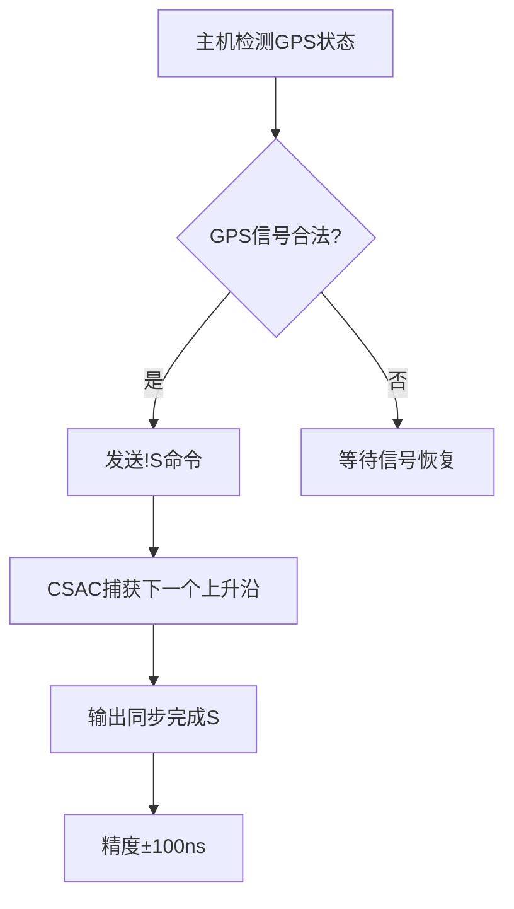
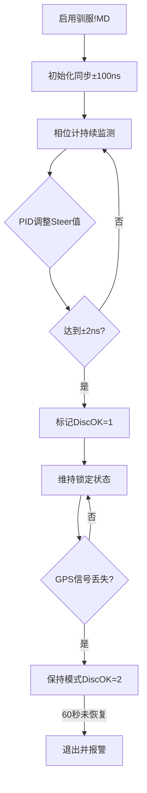

# 6.1

今天就是阅读《重构》，然后做motorCtrl的重构。将所学知识点实践

首先对于何谓“重构”，书中这样所写：

> 如果有人说他们的代码在重构过程中有一两天时间不可用,基本上可以确定,他们在做的事不是重构。

 重构本身，就应该存在坚实的测试体系作为根基。然后小步快走即可。😉我之前所幻想的重构是重写项目。如果我不能在原代码基础上进行重构，怎么能确保新写出来的代码逻辑不出问题呢？

那我应该按照书中的建议，写一个良好的测试基础设施，然后运用大量微小且保持软件行为的步骤,一步步达成大规模的修改。

多次使用`git add`指令进行微小的修改，直到实现一个功能再commit。并且add到暂存区的文件也可以轻松恢复。

```bash
git restore <file> # 将文件恢复到上一次 add 的状态
```

> 重构不是与编程割裂的行为。你不会专门安排时间重构,正如你不会专门安排时间写if语句。

很高兴遇到这本重构的书籍，受教了！

不会改变程序可观察的行为,这是重构的一个重要特征。

那么针对`motorCtrl`这个类，程序很多时候的可观察行为都是需要编译运行后通过界面展示才能通过的，我该怎么办？

# 6.3

## 重构motorCtrl的构造函数遇到的问题

现在还不需要单元测试吧？毕竟现在只是将构造函数的逻辑分层提取函数。

想修改接近500行的构造函数代码之前，请先理顺逻辑吧。😉

需要解决的问题：

- 对于经常出现的条件编译处理

- 对于界面的初始化处理

  ```CPP
  m_frontBack_bt->setChecked(true);
  ```
  
- 对于`m_rightLayout`、`m_midLayout`和`m_leftLayout`的单独配置（左、中、右的界面统一配置）

- 布局：右上角的 [设置] 按钮处理（序号问题 `m_bottom_lb->raise()` 覆盖了一切）

- 添加了`M_Both_X1X2`宏定义，准备作为`getMotorID()`中X1X2的电机序号，但是涉及到之前的判断`X1X2`双电机判断，需要重新修改。以下代码是当前电机的赋值方法

  ```CPP
      // 电机控制模式为（X1 + X2） 的双电机驱动时
      if(M_X1==motorID && m_frontBackModel_btgrp->checkedId() == BothMotors){
          motorID = M_ALL;
      }
  ```

  

## X1、X2电机归零后，X1电机并未正确归零

现在归零X1、X2的原点时，遇到问题时候的日志为：

```bash
INFO 2025-05-30T15:00:53.249 "电机1写入成功,16(514,0)"
INFO 2025-05-30T15:00:53.311 "电机1写入成功,16(515,0)"
INFO 2025-05-30T15:00:53.374 "电机1写入成功,16(290,1)"
INFO 2025-05-30T15:00:53.492 "电机1写入成功,16(290,1)"
INFO 2025-05-30T15:00:53.557 "电机0写入成功,16(514,0)"
INFO 2025-05-30T15:00:53.677 "电机0写入成功,16(515,0)"
INFO 2025-05-30T15:00:53.736 "电机0写入成功,16(290,1)"
INFO 2025-05-30T15:00:53.823 "电机0写入成功,16(290,1)"
INFO 2025-05-30T15:00:53.963 "getLocation: ************ 开始 *************"
INFO 2025-05-30T15:00:54.027 "getLocation: 电机[X2]当前的绝对位置脉冲数为1"
INFO 2025-05-30T15:00:54.027 "getLocation: 电机[X2]带动的负载旋转圈数 7.62939e-07"
INFO 2025-05-30T15:00:54.027 "getLocation: 电机[X2]外径为：44 mm, 负载当前的位置为：0.000 mm"
INFO 2025-05-30T15:00:54.027 "getLocation: ************ 结束 *************"
INFO 2025-05-30T15:00:54.027 "getLocation: ************ 开始 *************"
INFO 2025-05-30T15:00:54.101 "getLocation: 电机[X1]当前的绝对位置脉冲数为-5373952"
INFO 2025-05-30T15:00:54.101 "getLocation: 电机[X1]带动的负载旋转圈数 -4.1"
INFO 2025-05-30T15:00:54.101 "getLocation: 电机[X1]外径为：44 mm, 负载当前的位置为：-566.743 mm"
INFO 2025-05-30T15:00:54.101 "getLocation: ************ 结束 *************"
```

重构后的代码逻辑为：

```Cpp
void MotorCtrl::on_setOriginBT_clicked()
{
    // 入口校验
    if (isRunning()) return;
    if (!checkMotorConfigurationValidity()) return;
    if (!UI_confirmSetOrigin()) return;

    // 设置原点
    setOriginWithAllHandling();
}
```

我们只关心设置原点的函数`setOriginWithAllHandling()`即可。

通过阅读其函数实现，可以得知当为`X1X2`设置原点的时候，调用的函数前后为

```Cpp
setOriginCore(M_X2); // 前
setOriginCore(M_X1); // 后
```

此段逻辑与日志中记录吻合：

```bash
INFO 2025-05-30T15:00:53.249 "电机1写入成功,16(514,0)"
INFO 2025-05-30T15:00:53.311 "电机1写入成功,16(515,0)"
INFO 2025-05-30T15:00:53.374 "电机1写入成功,16(290,1)"
INFO 2025-05-30T15:00:53.492 "电机1写入成功,16(290,1)"
INFO 2025-05-30T15:00:53.557 "电机0写入成功,16(514,0)"
INFO 2025-05-30T15:00:53.677 "电机0写入成功,16(515,0)"
INFO 2025-05-30T15:00:53.736 "电机0写入成功,16(290,1)"
INFO 2025-05-30T15:00:53.823 "电机0写入成功,16(290,1)"
```

所以为什么写入寄存器成功，但是获取位置信息的时候，电机X1仍旧显示错误的位置信息呢？其中有两个可能性：

- 根本没有将X1位置设置为原点
- 获取X1的位置信息错误

接下来根据这两个猜测进行分析🐾

### 设置原点

看下函数设置完毕的寄存器值是否与实际的硬件寄存器值匹配。

首先看手册，设置原点时候涉及的寄存器和值的对应关系

| P100寄存器名称 | 名称                                | 取值含义                                         |
| -------------- | ----------------------------------- | ------------------------------------------------ |
| P4_2 = 0x202   | 内部位置指令 1 的位置圈数设定       | 0：圈数为0                                       |
| P4_3 = 0x203   | 内部位置指令 1 的位置圈内脉冲数设定 | 0：当前圈数内的脉冲数为0                         |
| P3_34 = 0x122  | 复位归零编码器多圈数据              | 1：按成 1 后会自动跳 0，清除编码器单圈和多圈数据 |

- 编码器单圈和多圈数据绝对值坐标清零方法：

  修改 P3-34 的寄存器地址 0X0122，寄存器数据写 1。
  
- 检查数据编码器坐标是否清零

  监视状态内容：dp-进去 F-APO 看看里面数据是否变成 0

### 获取位置信息

根据获取位置信息的函数`getLocation()`中，根据当前电机存储的脉冲数，来计算位置信息。

所以我们将目光聚焦于🔭获取绝对位置的函数`getServoCurrentAbsolutePositionPulseCount()`。

其读取的寄存器为：

```cpp
S24_27 = 0x1018, //绝对位置
```

手册上的`0x1018`寄存器就是与监视状态内容的`F-APo`和`F-APo.`信息重叠。这里我们做下测试，看看电机的位置信息，能否通过寄存器`0x1018`（函数调用）和监视状态获取到相同的信息。

现在移动一个电机，可以获取其位置信息

```bash
INFO  2025-06-03T15:10:07.615 "电机[Z2]当前的绝对位置脉冲数为(127803)" 
```

此时去检查监视状态的`F-APo`和`F-APo.`

```
F-APo  = 27803
F-APo. = 1
```

可以看出确实寄存器`0x1018`（函数调用）和监视状态能获取到相同的绝对位置脉冲信息。

### 问题分析

针对以上两个猜想。根据获取位置信息的日志

```bash
INFO 2025-05-30T15:00:53.963 "getLocation: ************ 开始 *************"
INFO 2025-05-30T15:00:54.027 "getLocation: 电机[X2]当前的绝对位置脉冲数为1"
INFO 2025-05-30T15:00:54.027 "getLocation: 电机[X2]带动的负载旋转圈数 7.62939e-07"
INFO 2025-05-30T15:00:54.027 "getLocation: 电机[X2]外径为：44 mm, 负载当前的位置为：0.000 mm"
INFO 2025-05-30T15:00:54.027 "getLocation: ************ 结束 *************"
INFO 2025-05-30T15:00:54.027 "getLocation: ************ 开始 *************"
INFO 2025-05-30T15:00:54.101 "getLocation: 电机[X1]当前的绝对位置脉冲数为-5373952"
INFO 2025-05-30T15:00:54.101 "getLocation: 电机[X1]带动的负载旋转圈数 -4.1"
INFO 2025-05-30T15:00:54.101 "getLocation: 电机[X1]外径为：44 mm, 负载当前的位置为：-566.743 mm"
INFO 2025-05-30T15:00:54.101 "getLocation: ************ 结束 *************"
```

可以基本推断出，之所以X1并未正确归零，是因为设置X1原点的操作出现了故障。

但是很奇怪的是，重启后，电机X1的脉冲数就接近0了。下次遇到再调试下。

## 重构`on_setOrignBT_clicked()`槽函数

现在我们看下对应的归零函数`on_setOrignBT_clicked()`

```CPP
void MotorCtrl::on_setOrignBT_clicked()
{
    if (!checkMotorConfigurationValidity()) {
         QLOG_ERROR()<<QString("MotorCtrl：设置原点失败");
         return;
    }
    // 运行状态检查
    if(isRunning()){
        return;
    }

    // 操作确认与权限验证
    if(m_funSl_btgrp->checkedId() == Revolve){
        if(SMessageBox::sQdialogOkCancel(this, QMessageBox::Question,"确定要将此位置设为原点?") != QMessageBox::Accepted){
            return;
        }
    }else{
        if(!DbCtrl::getAdminStat()){
            AdminAuthDialog mm_dialog(this);
            if(mm_dialog.exec() == QDialog::Accepted){
                if(!mm_dialog.authResult()){
                    return;
                }
            }else{
                return;
            }
        }
    }

    int mid = getMotorID();
    if(mid<0){
        SMessageBox::sQdialogBoxOk(this, QMessageBox::Critical, "请先选择要控制的目标");
        return;
    }
    if(mid==M_X1 && m_frontBackModel_btgrp->checkedId() == BothMotors){
        setOrign(M_X2);
    }
    if(setOrign(mid)){
        McuCtrl::finshed();
        if(m_motorRegs->refreshReq(mid, MotorRegs::E_regGroupStatus)){
            refreshRealLoc(mid);
        }
        SMessageBox::sQdialogDelayMS(this, QMessageBox::Information, tr("已成功将行车现在位置设成原点。"), 500);
    }else{
        McuCtrl::alarming();
        SMessageBox::sQdialogBoxOk(this, QMessageBox::Critical, QString("行车(电机%1)设置原点失败").arg(DbCtrl::s_motorNameList.at(mid)));
        McuCtrl::cancelAlarm();
    }
}
```

头疼，那就先重构下理解其逻辑。😁

### 逻辑划分

我们按逻辑责任来拆解成几个部分：

#### 🧱 1. 入口校验（早返回）

```CPP
cpp复制编辑if (!checkMotorConfigurationValidity()) return;
if (isRunning()) return;
```

#### 🧱 2. 用户操作确认（带有权限校验）

```cpp
cpp复制编辑if (当前是旋转功能) {
    弹出“确认设置原点”的对话框
} else {
    检查管理员权限（弹出密码对话框）
}
```

#### 🧱 3. 电机 ID 获取与合法性判断

```cpp
cpp复制编辑mid = getMotorID()
if mid < 0 -> 提示“请先选择目标”
if mid == M_X1 && X轴设置了“同时控制” -> 设置另一个电机为原点
```

#### 🧱 4. 设置原点

```cpp
cpp复制编辑setOrigin(mid) 成功/失败分支处理
→ 成功：刷新状态、提示“已设为原点”
→ 失败：报警提示“设置失败”
```

### 不足之处

- 多重 if-else，难以阅读和维护
- UI逻辑与业务混杂：混合了 UI 确认、权限逻辑、控制逻辑
- 命名不统一：`setOrign` 可能应为 `setOrigin`.（直接全局修改函数名即可）

### 最终结果

```CPP
void MotorCtrl::on_setOriginBT_clicked()
{
    // 入口校验
    if (isRunning()) return;
    if (!checkMotorConfigurationValidity()) return;
    if (!UI_confirmSetOrigin()) return;

    // 设置原点
    setOriginWithAllHandling();
}
```

- 将UI弹窗确认是否设置原点抽象为单独函数`UI_confirmSetOrigin()`
- 设置原点抽象为单独中间函数`setOriginWithAllHandling()`
- 修改`Orign`为`Origin`
- 将`setOrigin()`函数改为只涉及寄存器读写的`setOriginCore()`

## 水池Z1位置移动缓慢（TODO）

问题描述：

电机Z1在不挂载负荷的前提下，以4mm/s的速度位置移动20mm。移动完毕后，没有及时退出线程，反而一直在检查

日志记录如下

```bash
INFO  2025-06-03T17:48:08.996 "电机[Z1]当前位置为 (-302.975) mm " 
INFO  2025-06-03T17:48:08.996 "actionDir: 电机[Z1]的目标位置为 (-322.9748) mm" 
INFO  2025-06-03T17:48:09.054 "电机[Z1]写入成功,writeReg16(motorID = 3, regAddr = 514, val = 65513)" 
INFO  2025-06-03T17:48:09.113 "电机[Z1]写入成功,writeReg16(motorID = 3, regAddr = 515, val = 61594)" 
INFO  2025-06-03T17:48:09.172 "电机[Z1]写入成功,writeReg16(motorID = 3, regAddr = 53, val = 1)" 
INFO  2025-06-03T17:48:09.234 "电机[Z1]写入成功,writeReg16(motorID = 3, regAddr = 287, val = 0)" 
INFO  2025-06-03T17:48:09.234 "电机Z1预启动配置完成" 
INFO  2025-06-03T17:48:09.286 "电机[Z1]写入成功,writeReg16(motorID = 3, regAddr = 287, val = 1)" 
INFO  2025-06-03T17:48:09.286 "电机[Z1]已使能, 电机开始运动" 
INFO  2025-06-03T17:48:09.287 "行车运动状态检查线程启动" 
INFO  2025-06-03T17:48:09.514 "电机[Z1]当前位置为 (-304.7) mm " 
INFO  2025-06-03T17:48:09.803 "电机[Z1]当前位置为 (-307.533) mm " 
INFO  2025-06-03T17:48:10.147 "电机[Z1]当前位置为 (-310.801) mm " 
INFO  2025-06-03T17:48:10.451 "电机[Z1]当前位置为 (-313.699) mm " 
INFO  2025-06-03T17:48:10.736 "电机[Z1]当前位置为 (-316.425) mm " 
INFO  2025-06-03T17:48:11.001 "电机[Z1]当前位置为 (-318.928) mm " 
INFO  2025-06-03T17:48:11.300 "电机[Z1]当前位置为 (-321.743) mm " 
INFO  2025-06-03T17:48:11.600 "电机[Z1]当前位置为 (-322.884) mm " 
INFO  2025-06-03T17:48:11.945 "电机[Z1]当前位置为 (-323.167) mm " 
INFO  2025-06-03T17:48:12.226 "电机[Z1]当前位置为 (-323.146) mm " 
INFO  2025-06-03T17:48:12.506 "电机[Z1]当前位置为 (-323.133) mm " 
INFO  2025-06-03T17:48:12.800 "电机[Z1]当前位置为 (-323.044) mm " 
INFO  2025-06-03T17:48:13.075 "电机[Z1]当前位置为 (-322.733) mm " 
INFO  2025-06-03T17:48:13.359 "电机[Z1]当前位置为 (-322.755) mm " 
INFO  2025-06-03T17:48:13.647 "电机[Z1]当前位置为 (-322.766) mm " 
INFO  2025-06-03T17:48:13.952 "电机[Z1]当前位置为 (-322.931) mm " 
INFO  2025-06-03T17:48:14.248 "电机[Z1]当前位置为 (-322.931) mm " 
INFO  2025-06-03T17:48:14.531 "电机[Z1]当前位置为 (-323.201) mm " 
INFO  2025-06-03T17:48:14.816 "电机[Z1]当前位置为 (-323.167) mm " 
INFO  2025-06-03T17:48:15.135 "电机[Z1]当前位置为 (-323.077) mm " 
INFO  2025-06-03T17:48:15.435 "电机[Z1]当前位置为 (-322.756) mm " 
INFO  2025-06-03T17:48:15.736 "电机[Z1]当前位置为 (-322.778) mm " 
INFO  2025-06-03T17:48:16.009 "电机[Z1]当前位置为 (-322.869) mm " 
INFO  2025-06-03T17:48:16.303 "电机[Z1]当前位置为 (-323.143) mm " 
INFO  2025-06-03T17:48:16.588 "电机[Z1]当前位置为 (-323.143) mm " 
INFO  2025-06-03T17:48:16.883 "电机[Z1]当前位置为 (-323.111) mm " 
INFO  2025-06-03T17:48:17.191 "电机[Z1]当前位置为 (-323.042) mm " 
INFO  2025-06-03T17:48:17.531 "电机[Z1]当前位置为 (-322.894) mm " 
INFO  2025-06-03T17:48:17.811 "电机[Z1]当前位置为 (-322.778) mm " 
INFO  2025-06-03T17:48:18.091 "电机[Z1]当前位置为 (-322.81) mm " 
INFO  2025-06-03T17:48:18.371 "电机[Z1]当前位置为 (-322.907) mm " 
INFO  2025-06-03T17:48:18.660 "电机[Z1]当前位置为 (-323.184) mm " 
INFO  2025-06-03T17:48:18.924 "电机[Z1]当前位置为 (-323.184) mm " 
INFO  2025-06-03T17:48:19.221 "电机[Z1]当前位置为 (-323.152) mm " 
INFO  2025-06-03T17:48:19.494 "电机[Z1]当前位置为 (-323.1) mm " 
INFO  2025-06-03T17:48:19.777 "电机[Z1]当前位置为 (-322.823) mm " 
INFO  2025-06-03T17:48:20.061 "电机[Z1]当前位置为 (-322.843) mm " 
INFO  2025-06-03T17:48:20.369 "电机[Z1]当前位置为 (-322.855) mm " 
INFO  2025-06-03T17:48:20.643 "电机[Z1]当前位置为 (-322.855) mm " 
INFO  2025-06-03T17:48:20.915 "电机[Z1]当前位置为 (-322.932) mm " 
INFO  2025-06-03T17:48:21.213 "电机[Z1]当前位置为 (-323.071) mm " 
INFO  2025-06-03T17:48:21.490 "电机[Z1]当前位置为 (-323.204) mm " 
INFO  2025-06-03T17:48:21.791 "电机[Z1]当前位置为 (-323.171) mm " 
INFO  2025-06-03T17:48:22.057 "电机[Z1]当前位置为 (-323.019) mm " 
INFO  2025-06-03T17:48:22.344 "电机[Z1]当前位置为 (-323.019) mm " 
INFO  2025-06-03T17:48:22.618 "电机[Z1]当前位置为 (-323.018) mm " 
INFO  2025-06-03T17:48:22.896 "电机[Z1]当前位置为 (-322.703) mm " 
INFO  2025-06-03T17:48:23.171 "电机[Z1]当前位置为 (-322.716) mm " 
INFO  2025-06-03T17:48:23.452 "电机[Z1]当前位置为 (-322.922) mm " 
INFO  2025-06-03T17:48:23.748 "电机[Z1]当前位置为 (-322.922) mm " 
INFO  2025-06-03T17:48:24.033 "电机[Z1]当前位置为 (-323.233) mm " 
INFO  2025-06-03T17:48:24.305 "电机[Z1]当前位置为 (-323.2) mm " 
INFO  2025-06-03T17:48:24.592 "电机[Z1]当前位置为 (-323.105) mm " 
INFO  2025-06-03T17:48:24.881 "电机[Z1]当前位置为 (-322.73) mm " 
INFO  2025-06-03T17:48:25.181 "电机[Z1]当前位置为 (-322.762) mm " 
INFO  2025-06-03T17:48:25.451 "电机[Z1]当前位置为 (-323.08) mm " 
INFO  2025-06-03T17:48:25.735 "电机[Z1]当前位置为 (-323.079) mm " 
INFO  2025-06-03T17:48:26.035 "电机[Z1]当前位置为 (-323.079) mm " 
INFO  2025-06-03T17:48:26.319 "电机[Z1]当前位置为 (-323.058) mm " 
INFO  2025-06-03T17:48:26.623 "电机[Z1]当前位置为 (-323.048) mm " 
INFO  2025-06-03T17:48:26.900 "电机[Z1]当前位置为 (-323.047) mm " 
INFO  2025-06-03T17:48:27.184 "电机[Z1]当前位置为 (-323.019) mm " 
INFO  2025-06-03T17:48:27.493 "电机[Z1]当前位置为 (-323.019) mm " 
INFO  2025-06-03T17:48:27.782 "电机[Z1]当前位置为 (-322.783) mm " 
INFO  2025-06-03T17:48:28.063 "电机[Z1]当前位置为 (-322.805) mm " 
INFO  2025-06-03T17:48:28.341 "电机[Z1]当前位置为 (-322.816) mm " 
INFO  2025-06-03T17:48:28.602 "电机[Z1]当前位置为 (-323.034) mm " 
INFO  2025-06-03T17:48:28.897 "电机[Z1]当前位置为 (-323.034) mm " 
INFO  2025-06-03T17:48:29.146 "电机[Z1]当前位置为 (-323.034) mm " 
INFO  2025-06-03T17:48:29.416 "电机[Z1]当前位置为 (-323.034) mm " 
INFO  2025-06-03T17:48:29.686 "电机[Z1]当前位置为 (-323.014) mm " 
INFO  2025-06-03T17:48:29.965 "电机[Z1]当前位置为 (-323.013) mm " 
INFO  2025-06-03T17:48:30.241 "电机[Z1]当前位置为 (-323.012) mm " 
INFO  2025-06-03T17:48:30.513 "电机[Z1]当前位置为 (-323.011) mm " 
INFO  2025-06-03T17:48:30.802 "电机[Z1]当前位置为 (-323.002) mm " 
INFO  2025-06-03T17:48:31.076 "电机[Z1]当前位置为 (-323.002) mm " 
INFO  2025-06-03T17:48:31.388 "电机[Z1]当前位置为 (-323.002) mm " 
INFO  2025-06-03T17:48:31.681 "电机[Z1]当前位置为 (-323.001) mm " 
INFO  2025-06-03T17:48:31.976 "电机[Z1]当前位置为 (-322.943) mm " 
INFO  2025-06-03T17:48:32.268 "电机[Z1]当前位置为 (-322.943) mm " 
INFO  2025-06-03T17:48:32.545 "电机[Z1]当前位置为 (-322.943) mm " 
INFO  2025-06-03T17:48:32.851 "电机[Z1]当前位置为 (-322.943) mm " 
INFO  2025-06-03T17:48:33.135 "电机[Z1]当前位置为 (-322.943) mm " 
INFO  2025-06-03T17:48:33.412 "电机[Z1]当前位置为 (-322.943) mm " 
INFO  2025-06-03T17:48:33.717 "电机[Z1]当前位置为 (-322.944) mm " 
INFO  2025-06-03T17:48:33.995 "电机[Z1]当前位置为 (-322.944) mm " 
INFO  2025-06-03T17:48:34.231 "行车(电机Z1)已到位" 
INFO  2025-06-03T17:48:34.315 "电机[Z1]写入成功,writeReg16(motorID = 3, regAddr = 53, val = 0)" 
INFO  2025-06-03T17:48:34.404 "电机[Z1]当前位置为 (-322.957) mm " 
INFO  2025-06-03T17:48:34.465 "行车运行结束.result=1" 
INFO  2025-06-03T17:48:34.472 "------------> 网络控制位置移动结束 <---------" 
INFO  2025-06-03T17:48:34.472 "行车检查线程正常退出" 
```

位置移动的时候，发现检查线程用的时间超长。新版、旧版软件出现的问题相同。

## 新版程序卡死问题

### 日志比对

在执行X1、X2的位置移动时，设置速度、位置均没问题。但是位置移动时，直接卡死。日志记录为

```bash
INFO  2025-06-03T19:26:17.001 "电机[X2]当前位置为 (-4.00784) mm " 
INFO  2025-06-03T19:26:17.053 "电机[X1]当前位置为 (-3.87496) mm " 
INFO  2025-06-03T19:26:17.177 "电机[X1]转速为(2)mm/s" 
INFO  2025-06-03T19:26:19.518 "电机[X1]当前位置为 (-3.87507) mm " 
INFO  2025-06-03T19:26:19.518 "actionDir: 电机[X1]的目标位置为 (6.1249) mm" 
INFO  2025-06-03T19:26:19.518 "-----> 开始检查X1、X2是否同步 <------" 
INFO  2025-06-03T19:26:19.658 "绝对位置脉冲数 : X1 = (3027)pulse, X2 = (3131)pulse" 
INFO  2025-06-03T19:26:19.658 "X1、X2位置差值: (0.13311)mm" 
INFO  2025-06-03T19:26:19.658 "-----> TRUE: X1、X2电机位置同步 <------" 
INFO  2025-06-03T19:26:19.739 "电机[X2]写入成功,writeReg16(motorID = 1, regAddr = 514, val = 0)" 
INFO  2025-06-03T19:26:19.796 "电机[X2]写入成功,writeReg16(motorID = 1, regAddr = 515, val = 4785)" 
INFO  2025-06-03T19:26:19.851 "电机[X1]写入成功,writeReg16(motorID = 0, regAddr = 514, val = 0)" 
INFO  2025-06-03T19:26:19.915 "电机[X1]写入成功,writeReg16(motorID = 0, regAddr = 515, val = 60751)" 
INFO  2025-06-03T19:26:19.976 "电机[X1]写入成功,writeReg16(motorID = 0, regAddr = 53, val = 1)" 
INFO  2025-06-03T19:26:20.032 "电机[X1]写入成功,writeReg16(motorID = 0, regAddr = 287, val = 0)" 
INFO  2025-06-03T19:26:20.032 "电机X1预启动配置完成" 
INFO  2025-06-03T19:26:20.104 "电机[X2]写入成功,writeReg16(motorID = 1, regAddr = 53, val = 1)" 
INFO  2025-06-03T19:26:20.160 "电机[X2]写入成功,writeReg16(motorID = 1, regAddr = 287, val = 0)" 
INFO  2025-06-03T19:26:20.160 "电机X2预启动配置完成" 
```

可以看出，在X2预启动后，程序就卡死了。但是具体原因并不了解。

作为对比，我们看下老版本控制X1、X2位置移动的时候日志：

```bash
INFO  2025-06-03T19:55:22.736 "actionDir: 电机[X1] 的当前位置为 19.988 mm" 
INFO  2025-06-03T19:55:22.736 "actionDir: 电机[X1]要移动的目标位置为 -0.0120468mm" 
INFO  2025-06-03T19:55:22.857 "X1 -15616, X2 -15628, 0.0153589mm" 
INFO  2025-06-03T19:55:22.920 "电机1写入成功,16(514,0)" 
INFO  2025-06-03T19:55:22.981 "电机1写入成功,16(515,65527)" 
INFO  2025-06-03T19:55:23.041 "电机0写入成功,16(514,0)" 
INFO  2025-06-03T19:55:23.101 "电机0写入成功,16(515,9)" 
INFO  2025-06-03T19:55:23.161 "电机0写入成功,16(53,1)" 
INFO  2025-06-03T19:55:23.223 "电机0写入成功,16(287,0)" 
INFO  2025-06-03T19:55:23.223 "电机X1预启动配置完成" 
INFO  2025-06-03T19:55:23.285 "电机1写入成功,16(53,1)" 
INFO  2025-06-03T19:55:23.345 "电机1写入成功,16(287,0)" 
INFO  2025-06-03T19:55:23.345 "电机X2预启动配置完成" 

INFO  2025-06-03T19:55:23.351 "电机-1写入成功,16(287,1)" 
INFO  2025-06-03T19:55:23.351 "电机X1X2已使能" 
INFO  2025-06-03T19:55:23.515 "电机3写入成功,16(53,0)" 

INFO  2025-06-03T19:55:23.515 "actionDir: ********* 结束位置移动 ***********" 
INFO  2025-06-03T19:55:23.517 "行车运动状态检查线程启动" 
INFO  2025-06-03T19:55:23.801 "X1 -14587, X2 -14375, 0.271341mm" 
INFO  2025-06-03T19:55:23.801 "getLocation: ************ 开始 *************" 
INFO  2025-06-03T19:55:23.863 "getLocation: 电机[X2]当前的绝对位置脉冲数为171934" 
INFO  2025-06-03T19:55:23.863 "getLocation: 电机[X2]带动的负载旋转圈数 0.131175" 
INFO  2025-06-03T19:55:23.863 "getLocation: 电机[X2]外径为：44 mm, 负载当前的位置为：18.132 mm" 
INFO  2025-06-03T19:55:23.863 "getLocation: ************ 结束 *************" 
....// 此处省略多次获取的位置信息
INFO  2025-06-03T19:55:27.697 "getLocation: ************ 开始 *************" 
INFO  2025-06-03T19:55:27.757 "getLocation: 电机[X2]当前的绝对位置脉冲数为12559" 
INFO  2025-06-03T19:55:27.757 "getLocation: 电机[X2]带动的负载旋转圈数 0.00958176" 
INFO  2025-06-03T19:55:27.757 "getLocation: 电机[X2]外径为：44 mm, 负载当前的位置为：1.324 mm" 
INFO  2025-06-03T19:55:27.757 "getLocation: ************ 结束 *************" 
INFO  2025-06-03T19:55:27.757 "getLocation: ************ 开始 *************" 
INFO  2025-06-03T19:55:27.818 "getLocation: 电机[X1]当前的绝对位置脉冲数为-10008" 
INFO  2025-06-03T19:55:27.818 "getLocation: 电机[X1]带动的负载旋转圈数 -0.0076355" 
INFO  2025-06-03T19:55:27.818 "getLocation: 电机[X1]外径为：44 mm, 负载当前的位置为：-1.055 mm" 
INFO  2025-06-03T19:55:27.818 "getLocation: ************ 结束 *************" 
INFO  2025-06-03T19:55:28.161 "X1 17, X2 7, 0.0127991mm" 
INFO  2025-06-03T19:55:28.161 "getLocation: ************ 开始 *************" 
INFO  2025-06-03T19:55:28.222 "getLocation: 电机[X2]当前的绝对位置脉冲数为-93" 
INFO  2025-06-03T19:55:28.222 "getLocation: 电机[X2]带动的负载旋转圈数 -7.09534e-05" 
INFO  2025-06-03T19:55:28.222 "getLocation: 电机[X2]外径为：44 mm, 负载当前的位置为：-0.010 mm" 
INFO  2025-06-03T19:55:28.222 "getLocation: ************ 结束 *************" 
INFO  2025-06-03T19:55:28.222 "getLocation: ************ 开始 *************" 
INFO  2025-06-03T19:55:28.282 "getLocation: 电机[X1]当前的绝对位置脉冲数为199" 
INFO  2025-06-03T19:55:28.282 "getLocation: 电机[X1]带动的负载旋转圈数 0.000151825" 
INFO  2025-06-03T19:55:28.282 "getLocation: 电机[X1]外径为：44 mm, 负载当前的位置为：0.021 mm" 
INFO  2025-06-03T19:55:28.282 "getLocation: ************ 结束 *************" 
INFO  2025-06-03T19:55:28.405 "行车(电机X2)已到位" 
INFO  2025-06-03T19:55:28.466 "电机1写入成功,16(53,0)" 
INFO  2025-06-03T19:55:28.466 "getLocation: ************ 开始 *************" 
INFO  2025-06-03T19:55:28.526 "getLocation: 电机[X2]当前的绝对位置脉冲数为-67" 
INFO  2025-06-03T19:55:28.526 "getLocation: 电机[X2]带动的负载旋转圈数 -5.11169e-05" 
INFO  2025-06-03T19:55:28.526 "getLocation: 电机[X2]外径为：44 mm, 负载当前的位置为：-0.007 mm" 
INFO  2025-06-03T19:55:28.526 "getLocation: ************ 结束 *************" 
INFO  2025-06-03T19:55:28.526 "getLocation: ************ 开始 *************" 
INFO  2025-06-03T19:55:28.588 "getLocation: 电机[X1]当前的绝对位置脉冲数为149" 
INFO  2025-06-03T19:55:28.588 "getLocation: 电机[X1]带动的负载旋转圈数 0.000113678" 
INFO  2025-06-03T19:55:28.588 "getLocation: 电机[X1]外径为：44 mm, 负载当前的位置为：0.016 mm" 
INFO  2025-06-03T19:55:28.588 "getLocation: ************ 结束 *************" 
INFO  2025-06-03T19:55:28.801 "行车(电机X1)已到位" 
INFO  2025-06-03T19:55:28.886 "电机0写入成功,16(53,0)" 
INFO  2025-06-03T19:55:29.006 "X1 11, X2 4, 0.00895936mm" 
INFO  2025-06-03T19:55:29.006 "getLocation: ************ 开始 *************" 
INFO  2025-06-03T19:55:29.066 "getLocation: 电机[X2]当前的绝对位置脉冲数为-55" 
INFO  2025-06-03T19:55:29.066 "getLocation: 电机[X2]带动的负载旋转圈数 -4.19617e-05" 
INFO  2025-06-03T19:55:29.066 "getLocation: 电机[X2]外径为：44 mm, 负载当前的位置为：-0.006 mm" 
INFO  2025-06-03T19:55:29.066 "getLocation: ************ 结束 *************" 
INFO  2025-06-03T19:55:29.066 "getLocation: ************ 开始 *************" 
INFO  2025-06-03T19:55:29.126 "getLocation: 电机[X1]当前的绝对位置脉冲数为144" 
INFO  2025-06-03T19:55:29.126 "getLocation: 电机[X1]带动的负载旋转圈数 0.000109863" 
INFO  2025-06-03T19:55:29.126 "getLocation: 电机[X1]外径为：44 mm, 负载当前的位置为：0.015 mm" 
INFO  2025-06-03T19:55:29.126 "getLocation: ************ 结束 *************" 
INFO  2025-06-03T19:55:29.186 "行车运行结束.result=1" 
INFO  2025-06-03T19:55:29.206 "on_allWorkDone start!" 
INFO  2025-06-03T19:55:29.206 "on_allWorkDone end!" 
INFO  2025-06-03T19:55:29.206 "行车检查线程正常退出"
```

对比可以假设，新版软件在执行到此语句时候卡死

```bash
INFO  2025-06-03T19:55:23.351 "电机-1写入成功,16(287,1)" 
INFO  2025-06-03T19:55:23.351 "电机X1X2已使能" 
INFO  2025-06-03T19:55:23.515 "电机3写入成功,16(53,0)" 
```

### 电机X1X2已使能？

从代码中可以看出，可能新版本软件在处理`run2Target(-1)`的时候卡死了。

```CPP
    if(run2Target(motorID)){
        QLOG_INFO()<<QString("电机[%1]已使能, 电机开始运动").arg((motorID==M_ALL)?("X1X2"):(DbCtrl::s_motorNameList.at(motorID)));
    }
```

我们展开函数`run2Target()`

```CPP
bool MotorCtrl::run2Target(qint32 motorID)
{
    if (motorID == M_Y2) {
        if (!setPositionRunEnable(M_Y2, true)) {
            QLOG_ERROR()<<QString("电机 Y2 多段位运行使能失败");
            return false;
        }
    } else {
        if(!m_motorRegs->writeReg16(motorID, MotorRegs::P3_31, 1)){
            QLOG_ERROR()<<QString("电机%1写入P3_31=1失败").arg(DbCtrl::s_motorNameList.at(motorID));
            return false;
        }
    }

    return true;
}
```

### 难道(伪)勤奋也是一种病？

经过日志调试，发现问题出现在函数`writeReg16()`里。

```cpp
bool MotorRegs::writeReg16(qint32 motorID, quint32 regAddr, quint16 val)
{
    //QMutexLocker locker(&m_mutex);
    QString portName = QString(DbCtrl::m_systemInfo_tb.portName);
    m_modbusIO->open(portName, false);
    if(m_modbusIO->isOpen()){
        QVector<quint16> data;
        data.append(val);
        bool ret = m_modbusIO->write(motorID+1, ModbusIO::HoldingRegisters, regAddr, data);
        if(!ret){
            emit writeFailed(motorID);
            QLOG_ERROR()<<QString("电机%1写入失败,16(%2,%3)").arg(motorID).arg(regAddr).arg(val);
        }else{
            QLOG_INFO()<<QString("电机[%1]写入成功,writeReg16(motorID = %2, regAddr = %3, val = %4)").arg(DbCtrl::s_motorNameList.at(motorID)).arg(motorID).arg(regAddr).arg(val);
        }

        return ret;
    }else{
        emit openFailed();
    }
    return false;
}
```

猛然看到`电机[%1]写入成功`，然而`M_ALL`代表的`-1`并不存在于数据库中。哪有索引为`-1`的id？

改过来后就正常了。🤡

# 6.4

## 抱闸问题（TODO）

X1、X2运动使能会导致除Z1外其他电机抱闸断开。

现象描述：X1、X2进行点动操作的时候，不仅X1、X2抱闸松开，也会让除了Z1外的其他电机抱闸也松开。

### 抱闸如何实现？

通过电机的DO端口来控制抱闸。

根据p100s电机的抱闸接线逻辑来看，是伺服控制器的DO4（寄存器`P3-23`）端口负责抱闸逻辑。

但是很有意思的是，由于一些不可抗拒的因素，负责控制抱闸的端口其实是DO2（寄存器`P3-21`）。这一点可以通过查看伺服`P3-21`寄存器的值（`8`）来确认。（所以手册居然不一定对🙄）

`P3-21`的名称为：数字输出 DO2 功能。

而DO的功能为（7.2.3 DO 功能一览表）：

| 定义值 | 符号 |    功能    | 功能解析                                  |
| :----: | :--: | :--------: | ----------------------------------------- |
|   8    | BRK  | 电磁制动器 | ON ：电磁制动器释放。OFF ：电磁制动器制动 |

所以当电机使能的时候，此时`P3-21`所代表的DO2会产生高电平，这时候抱闸松开。

而查看DO端口的当前值，可以通过`dp`的`P-oUt`功能查看当前电机的状态

```bash
dp-(第一层)    --->    P-oUt(第二层)    
```

### 观察是否DO输出正确

当前已知所有电机的DO2端口负责抱闸（功能码为`8`）。

DO2为1时，抱闸松开；DO2为0，抱闸抱死。

而`P-oUt`可以查看5个DO端口输出的信息，所以下面就以正常电机`Z1`的移动，来看下如何观察DO输出。

- `Z1`电机未使能，此时DO2显示为代表低电平的短竖杠。
- `Z1`电机使能， 此时DO2显示为代表高电平的长竖杠。

按照此观察方法，X1、X2电机在运行的时候，应该也遵循相同的DO2输出信息。

### X1、X2的DO2输出分析

X1、X2在电机使能的时候，会让`θ`、`Z2`、`Y1`的电机DO2输出均为高电平。这是什么情况？

纠正一下，我发现并不是X1、X2使能的时候才会让其他电机DO2输出为高电平，而是在点动模式下使能时，会引起其他电机DO2端口的高电平输出。

而在位置控制模式下，就不会产生这个问题。

## 铷钟开发

需求：

现在需要通过铷钟这个设备，来做GPS和嵌入式开发板的时钟同步。GPS提供全局统一的“时间点”，铷钟提供本地稳定的“时间流”，两者结合才能实现精准且连续的嵌入式系统时钟同步。

通过铷钟做GPS设备和嵌入式开发板之间的同步工作。

请你以信号专业人士分析，铷钟在其中发挥的作用，以及为什么要这么做。最后给出怎么才能做的专业建议。

本问题涉及到：**高精度时间同步**和**信号处理**。

### 需要理解的章节

| 章节位置              | 功能                             | 应用解释                                                     |
| --------------------- | -------------------------------- | ------------------------------------------------------------ |
| **2.7**               | **1PPS输出**                     | 铷钟通过 Pin 10 输出1PPS，上升沿是时基；你可接到开发板做“同步脉冲参考”；如果启用了discipline，它非常稳定。 |
| **2.8**               | **1PPS同步（与GPS对齐）**        | 可以将 GPS 1PPS 接入 Pin 9，让铷钟的输出 1PPS 和 GPS 精确对齐，分为：- Manual Sync- Auto Sync（自动） |
| **2.9**               | **1PPS Disciplining**            | 关键功能！铷钟可自动测量内部1PPS和GPS 1PPS的时间差（450ps精度），并通过“Steer”微调自身频率，实现跟踪对齐（长期可达5ns精度） |
| **2.10**              | **Time-of-Day（TOD）管理**       | 可为开发板提供当前“秒数”表示，用于对系统计时器初始化         |
| **3.3.3/3.3.4/3.3.5** | **设置操作模式和Discipline参数** | 使用串口命令配置铷钟的运行模式，比如：启用同步/discipline、查看状态 |
| **5.1**               | **The Art of Disciplining**      | 实践经验和注意事项总结，包括参考信号失效后的行为             |

### 📌总结：你必须掌握的步骤

1. **理解Pin功能** → 尤其是Pin 9 (1PPS IN) 和 Pin 10 (1PPS OUT)
2. **设置铷钟为Disciplined模式** → 实现GPS秒脉冲校准
3. **读取铷钟的Steer/Phase状态** → 验证是否成功同步
4. **嵌入式开发板用1PPS和RF做参考时钟** → 驱动本地计时或ADC采样
5. **若GPS断开** → CSAC进入Holdover，保持高精度运行

## 为什么要用铷钟来辅助GPS

| 原因                       | 描述                                                         |
| -------------------------- | ------------------------------------------------------------ |
| **抗丢星能力**             | GPS信号易受环境影响，铷钟保障系统时钟不中断，提升可靠性。    |
| **短期稳定性强**           | 铷钟短期频率稳定性远优于GPS；配合GPS长期校准，可得最佳效果（即GPSDO）。 |
| **消除抖动与误差累积**     | 频率平滑化输出，可用于高分辨率计时、测距等。                 |
| **嵌入式系统对连续性敏感** | 避免因为1PPS突变导致逻辑误判或触发误差。                     |

因此，用铷钟做**频率标准**、GPS做**时间标准**，形成一个既精准又连续的同步系统，是工程上的**黄金搭配**。**用GPS的长期稳定性修正铷钟的漂移，用铷钟的短期稳定性平滑GPS的抖动**，最终输出“两全其美”的信号。

假设铷钟是一个走时精准但会慢慢跑偏的机械表，GPS是每天自动对时的电波钟：

1. **每天对时一次**（GPS校准铷钟的长期误差）。
2. **对时后**，铷钟靠自己高精度机芯维持秒级稳定（平滑GPS的随机误差）。
3. 最终你的表**既准又稳**，长期不漂移，短期无抖动。

## 频率漂移 vs 抖动（Jitter）

- **频率漂移（Drift）**：**长期、缓慢**的频率变化（如几小时、几天内逐渐偏离）。
  - 例如：铷钟一天后频率从 10 MHz 变成 10.000001 MHz。
- **抖动（Jitter）**：**短期、快速**的时间波动（如纳秒级随机变化）。
  - 例如：GPS 1PPS 信号每秒钟的上升沿有 ±20 ns 的随机偏差。

### 如何解决频率漂移？

在时间同步系统（如 GPS + 铷钟）中，通常采用**锁相（PLL）**和**驯服（Disciplining）**技术：

1. **用 GPS 校准长期漂移**：
   - GPS 1PPS 长期稳定（依赖卫星原子钟），但短期有抖动。
   - 铷钟短期稳定，但长期会漂移。
   - **守时算法**让铷钟跟踪 GPS 的长期稳定性，同时平滑 GPS 的短期抖动。

### 总结

- **频率漂移** = 时钟频率**缓慢偏离标称值**（如从 10 MHz → 10.000001 MHz）。
- **抖动** = 时钟边沿的**快速随机波动**（如 ±20 ns 偏差）。
- **GPS+铷钟驯服**：用 GPS 修正长期漂移，用铷钟抑制短期抖动，输出超稳时钟信号。

## 铷钟1PPS操作

### 连接电源

电路板上的电源接线。VIN（Voltage Input）和GND是电源接入的地方。并且电源为12V

### 串口连接

网线连接+远程连接开发板登录

这部分在4月份的时候写过了，这里不再赘述。如果是新开发环境，一定要配置好开发环境和基础设施！😉

### ✅ Step 1：确认 1PPS 输出是否稳定

使用 `^` 命令读取 `TOD` 字段，确认每秒增加一次。


## 如何使用示波器查看1PPS输出脉冲

已知手册中说明

> Output 1PPS is 100 μs in duration for option 001. Refer to the data sheet for other options. (400 μs for firmware versions 1.06 and earlier).
>
> Timing reference is the rising edge of pin 10. Rise time <10 ns at a load capacitance of 10 pF

解析为：

| **参数**     | **说明**                                                     |
| :----------- | :----------------------------------------------------------- |
| **参考边沿** | 上升沿（Pin 10）是时间同步的绝对参考点（误差通常<±50ns）。   |
| **脉冲宽度** | 高电平持续时间（100 μs 或 400 μs），影响设备识别脉冲的可靠性。 |
| **上升时间** | <10 ns（负载 10 pF），边沿越陡峭，时间戳精度越高。           |
| **负载电容** | 10 pF 是测试条件，实际连接时需匹配负载以避免信号畸变。       |

# 6.5

## 抱闸问题（2）

好吧，昨天调试了一上午的X1、X2，居然忘了还有旋转电机不能转的情况了😐。最后原因是陈亮发现抱闸线接错了。

今天主要任务就是理解：

- X1、X2点动的时候，出现其他刹车灯亮的问题
  - 是否出现了其他电机使能的问题 - 检查点动控制寄存器
- X1、X2位置移动的时候，电机运动的逻辑

其实就是理解p100s型号的电机，其对应的点动和位置移动逻辑。

## p100s点动逻辑

### 前进按钮做了什么

点动逻辑要看函数`actionJog()`。以大屏为例，前进移动的按钮设计如下

```CPP
connect(m_action_upRightFront_bt, &QPushButton::pressed, this, &MotorCtrl::on_actionUpRightFrontBt_pressed);
connect(m_action_upRightFront_bt, &QPushButton::released, this, &MotorCtrl::on_actionUpRightFrontBt_released);
```

前进按钮按下去的时候，会触发槽函数`on_actionUpRightFrontBt_pressed()`执行。我们看下对应函数逻辑

```CPP
void MotorCtrl::on_actionUpRightFrontBt_pressed()
{
    if (!checkMotorConfigurationValidity()) {
         QLOG_ERROR()<<QString("MotorCtrl：前进按钮长按失效");
         return;
    }
    // [点动模式] 移动
    if(m_runMode_chb->isChecked()){
        if(!isRunning()){
            m_allDone =false;
            actionJog(1);
        }
    }
}
```

其逻辑为：如果当前为点动模式且其他电机并没有运行中，则执行`actionJog(1)`控制电机移动。

### 复杂的点动逻辑

查看点动逻辑`actionJog(int)`（已经重构）

```cpp
void MotorCtrl::actionJog(int dir)
{
    if (!canStartJog()) return;

    // 获取电机ID
    int motorID = getMotorID();
    m_jog_done = false;

    disableAllbt(dir);
    logJogStart(motorID, dir);

    // 预启动电机
    if (!applyJogConfig(motorID, dir)) return;
    if (!isPositionWithinLimit(motorID, dir)) return;

    // 点动控制伺服使能
    enableJogServo(motorID, dir);

    m_jog_dir = dir;
    m_checkWoker = new QThread;
    connect(m_checkWoker, &QThread::started, this, &MotorCtrl::checkJog);
    connect(m_checkWoker, &QThread::finished, this, &MotorCtrl::on_threadFinished);
    m_checkWoker->start();
}
```

我们将目光聚焦在`enableJogServo()`函数，其中存在刹车的逻辑。

### 刹车逻辑

X1、X2点动移动的时候，刹车部分想要实现的逻辑：

- 如果是X1、X2电机点动，则需要将其他电机的DO刹车端口屏蔽掉（将P3-21设置为0）
- 执行点动操作
- 恢复X1、X2电机外DO刹车端口正常输出

## 广播修改DO端口

现在想实现的是，通过广播修改P3-21（DO2）寄存器的值。思路是：

- 实现函数`clearBrakeDOConfig()`：将P3-21寄存器改为0
- 实现函数`clearBrakeDOConfig()`：将P3-21寄存器改为8（电磁制动器）
- （首先确保P3-21的值不为0）尝试在X1、X2电机组界面中调用`clearBrakeDOConfig()`发广播，此时查询伺服的`P3-21`寄存器是否为0。
  - 如果是0，则证明广播可行，可以进行下一步
  - 如果不是0，则证明广播修改P3-21不可行，需要循环处理。

当前Z2电机的P3-21值为8，代表刹车功能。

## P3-31寄存器:motor_scooter:

P3-31 寄存器是用于设置**虚拟输入端子状态值**的参数，其作用是：

> **P3-31：虚拟输入端子状态值（00000000~11111111）**
>  通过设置此寄存器的每个位（共 8 位），可模拟输入端子的电平状态，实现“虚拟输入”，以便在无实际硬件接线的情况下进行测试或逻辑控制。

### 配合参数 P3-30 使用

P3-31 的生效方式依赖于参数 `P3-30` 的设置：

- `P3-30 = 0`：使用 DI1~DI4 物理输入，**P3-31 不生效**；
- `P3-30 = 1`：只使用 P3-31 虚拟输入，**可用 8 个虚拟输入**（DI1~DI8）；
- `P3-30 = 2`：混合使用物理输入（DI1~~DI4）和虚拟输入（DI5~~DI8）。


当前`P3-30` 的值为 2，代表可正常使用虚拟输入。即启用了`P3-31`的虚拟输入端子。

### 是否可以用于“点动控制”？

是的，在**速度模式且参数 `PA22=5`** 时，点动控制可以通过如下信号实现：

- `JOGP`（正向寸动）
- `JOGN`（反向寸动）

这些信号可以通过实际接线输入，也可以通过虚拟输入实现。例如：

- 设置 `P3-39` = 22（JOGP）
- 设置 `P3-40` = 23（JOGN）
- 然后将 `P3-30 = 1或2`（启用虚拟输入模式）
- 再通过设置 `P3-31` 相应位为 1，模拟按下按钮，就可以实现点动功能。

例如`P3-31`设置为`0000 0011`（虚拟输入DI1和DI2启用）

`applyJogConfig()`其主要逻辑为：

```CPP
//  进行点动配置
bool ret = jogCfg(motorID, dir*DbCtrl::m_servoMotor_tb[motorID].dir);
if(!ret){
    ...
    return false;
}
```

继续查看函数`jogCfg()`

```Cpp
if(!m_motorRegs->writeReg16(motorID, MotorRegs::P3_31, MotorRegs::JogMode)){
    QLOG_ERROR()<<QString("电机%1写入P3_31=%2失败").arg(DbCtrl::s_motorNameList.at(motorID)).arg(MotorRegs::JogMode);
    return false;
}
quint16 act = MotorRegs::JogRunInc;
if(dir<0){
    act = MotorRegs::JogRunDec;
}
if(!m_motorRegs->writeReg16(motorID, MotorRegs::P3_31, act)){
    QLOG_ERROR()<<QString("电机%1写入P3_31=%2失败").arg(DbCtrl::s_motorNameList.at(motorID)).arg(act);
    return false;
}
```

根据这个推测`P3_31`寄存器的功能是

- **第一次写入是“设定模式”**（告诉控制器我们要进入 Jog 控制模式`JogMode`）；
- **第二次写入是“执行具体动作”**（触发 Jog 正向点动`JogRunInc`或 Jog 负向点动`JogRunDec`）；

现在让我很疑惑的是，p100s的寄存器`P3_31`到底是什么功能？此时需要查看手册理解。

根据手册，P3-31寄存器要想使用，需要P3-30寄存器配置为`1`或`2`：

- `P3-30 = 1`：只使用 P3-31 虚拟输入，**可用 8 个虚拟输入**（DI1~DI8）；
- `P3-30 = 2`：混合使用物理输入（DI1~~DI4）和虚拟输入（DI5~~DI8）。

那么点动之前是否配置了P3-30为`1`或`2`？

在`BaseConfig`类的初始化电机寄存器参数的时候，初始化了此寄存器值为`2`。且其他地方并无更改此寄存器的值。

```CPP
m_p100scfgs.append(qMakePair(MotorRegs::P3_30, 2));
```

下面逐步分析，给`JogMode`和正向点动`JogRunInc`或 Jog 负向点动`JogRunDec`的设置问题。

```CPP
enum JogAct{
	JogMode = 2,
	JogRunInc =6,
	JogRunDec =10
};
```

### JogMode

```CPP
m_motorRegs->writeReg16(motorID, MotorRegs::P3_31, MotorRegs::JogMode)
```

分析此代码的含义。在分析之前，要知道P3-31代表的寄存器都是哪些

> P3-31 代表的输入 IO 数为 8 个,对应参数 P3-38~P3-45

当P3-31设置为值`2`的时候。代表的是二进制数`0000 0010`，代表的寄存器为P3-39的值为`1`。P3-39代表的是

```bash
虚拟 IO 输入 DI2 功能
```

即寄存器P3-39所代表的DI2使能，而P3-39设置的值为`16`，对应的DI功能选项为

| 定义值 | 符号  |     功能     | 功能解析                                                     |
| :----: | :---: | :----------: | ------------------------------------------------------------ |
|   16   | CMODE | 复合模式控制 | 当 PA-4 设置为 3，4，5 时，处于混合控制模式，可通过此输入端子可切换控制模式：<br/>(1)PA-4 为 3 时,CMODE OFF，为位置模式；CMODE ON，则为速度模式；<br/>(2)PA-4 为 4 时,CMODE OFF，为位置模式；CMODE ON，则为转矩模式；<br/>(3)PA-4 为 5 时,CMODE OFF，为速度模式；CMODE ON，则为转矩模式。 |

此时设置的PA-4值为`3`，是位置控制模式。则DI2输出为高电平的时候，则为速度模式。

那么确实将P3-31设置为2的时候，对应DI2端口输出为高电平，此操作会让电机处于速度模式（即点动控制）

### JogRunInc

JogRunInc = 6，当P3-31设置为值`6`的时候。代表的是二进制数`0000 0110`。其含义为：

- `P3-39 = 1` -> DI2输出高电平 ->速度模式
- `P3-40 = 1` -> DI3输出高电平

P3-40代表的是

```bash
虚拟 IO 输入 DI3 功能
```

P3-40设置的DI3功能值为`22`

```CPP
m_p100scfgs.append(qMakePair(MotorRegs::P3_40, 22));
```

对应的DI功能选项为

| 定义值 | 符号 |   功能   | 功能解析                                                     |
| :----: | :--: | :------: | ------------------------------------------------------------ |
|   22   | JOGP | 正向寸动 | 速度模式下，PA22=5 时，此信号接通，电机正方向寸动，速度受 PA21 设置。 |

PA-22寄存器初始化为`5`

```bash
m_p100scfgs.append(qMakePair(MotorRegs::PA22, 5));
```

值`5`代表的意思为：IO端子控制点动操作。

所以此时如果伺服使能的话，就可以执行运动了。但是此时伺服使能寄存器并未置`1`高电平，所以电机不转。

## p100s位置移动逻辑

位置移动要看函数`actionDir()`

## psp获取位置错误

PSP行车检查位置的时候，报错：数据长度错误，期望8字节，实际0字节。

```bash
INFO  2025-06-05T10:47:58.598 "getLocation: 电机[Z2]当前的绝对位置脉冲数为-2157044" 
INFO  2025-06-05T10:47:58.598 "getLocation: 电机[Z2]当前位置为 (227.484) mm " 
INFO  2025-06-05T10:47:58.650 "行车运行结束.result=1" 
INFO  2025-06-05T10:47:58.652 "电机254写入成功,16(17,1)" 
INFO  2025-06-05T10:47:58.652 "电机254写入成功,16(24,1)" 
INFO  2025-06-05T10:47:58.668 "------------> 移动结束 <---------" 
INFO  2025-06-05T10:47:58.668 "行车检查线程正常退出" 
ERROR 2025-06-05T10:48:01.997 "数据长度错误，期望8字节，实际0字节" 
INFO  2025-06-05T10:48:01.997 "getLocation: 电机[Z2]当前的绝对位置脉冲数为0" 
INFO  2025-06-05T10:48:01.997 "getLocation: 电机[Z2]当前位置为 (0) mm " 
INFO  2025-06-05T10:48:01.997 "actionDir: 电机[Z2]的目标位置为 (-100.0000) mm" 
INFO  2025-06-05T10:48:02.050 "电机5写入成功,16(514,7)" 
INFO  2025-06-05T10:48:02.101 "电机5写入成功,16(515,2531)" 
INFO  2025-06-05T10:48:02.157 "电机5写入成功,16(53,1)" 
INFO  2025-06-05T10:48:02.207 "电机5写入成功,16(287,0)" 
INFO  2025-06-05T10:48:02.207 "电机Z2预启动配置完成" 
INFO  2025-06-05T10:48:02.262 "电机5写入成功,16(287,1)" 
INFO  2025-06-05T10:48:02.262 "电机[Z2]已使能, 电机开始运动" 
INFO  2025-06-05T10:48:02.263 "行车运动状态检查线程启动" 
INFO  2025-06-05T10:48:02.264 "电机254写入成功,16(17,60)" 
ERROR 2025-06-05T10:48:02.364 "数据长度错误，期望2字节，实际0字节" 
ERROR 2025-06-05T10:48:02.462 "数据长度错误，期望8字节，实际2字节" 
INFO  2025-06-05T10:48:02.462 "getLocation: 电机[Z2]当前的绝对位置脉冲数为0" 
INFO  2025-06-05T10:48:02.462 "getLocation: 电机[Z2]当前位置为 (0) mm " 
ERROR 2025-06-05T10:48:02.464 "数据长度错误，期望2字节，实际8字节" 
ERROR 2025-06-05T10:48:02.664 "数据长度错误，期望8字节，实际2字节" 
INFO  2025-06-05T10:48:02.665 "getLocation: 电机[Z2]当前的绝对位置脉冲数为0" 
INFO  2025-06-05T10:48:02.665 "getLocation: 电机[Z2]当前位置为 (0) mm " 
ERROR 2025-06-05T10:48:02.666 "数据长度错误，期望2字节，实际8字节" 
ERROR 2025-06-05T10:48:02.867 "数据长度错误，期望8字节，实际2字节" 
INFO  2025-06-05T10:48:02.867 "getLocation: 电机[Z2]当前的绝对位置脉冲数为0" 
INFO  2025-06-05T10:48:02.868 "getLocation: 电机[Z2]当前位置为 (0) mm " 
ERROR 2025-06-05T10:48:02.868 "数据长度错误，期望2字节，实际8字节" 
ERROR 2025-06-05T10:48:03.495 "蓝牙读请求发送成功，但未收到回应" 
INFO  2025-06-05T10:48:03.495 "getLocation: 电机[Z2]当前的绝对位置脉冲数为0" 
INFO  2025-06-05T10:48:03.495 "getLocation: 电机[Z2]当前位置为 (0) mm " 
INFO  2025-06-05T10:48:03.787 "getLocation: 电机[Z2]当前的绝对位置脉冲数为-2021998" 
INFO  2025-06-05T10:48:03.787 "getLocation: 电机[Z2]当前位置为 (213.242) mm " 
```

经过检查，发现是因为`McuCtrl`中控制信号灯操作导致的问题。

但是为什么在windows端用COM端口访问的时候，没有信号灯也不会报错呢？

这里需要todo这个问题：

psp蓝牙发信号灯错误后影响获取位置

## Git忽略已经提交的文件

现在由于每次使用`diff`命令后，都会与没意义的`*.pro.user`进行比对，非常影响对比效率。所以尝试删除git对于此文件的追踪。

### ✅ 步骤 1：将文件加入 `.gitignore`

要忽略 `config.ini` 文件：（这里就是`*.pro.user*`）

1. 打开项目根目录下的 `.gitignore` 文件（如果没有就创建一个）；
2. 添加这一行：

```bash
config.ini
```

### ✅ 步骤 2：从暂存区和 Git 中删除（但保留在本地磁盘）

如果这个文件已经被 Git 跟踪，你需要 **手动移除**：

```bash
git rm --cached config.ini
```

⚠️ 使用 `--cached` 表示从 Git 仓库中删除，但**保留本地文件**不删。

### ✅ 步骤 3：提交更改

```bash
git commit -m "Stop tracking config.ini and ignore it in future"
```

现在该文件不会再被 Git 跟踪，即使你执行 `git add *` 也不会再次被提交。

# 6.6

## 重构阅读记录

> 重构的第一块基石是自测试代码。我应该有一套自动化的测试，我可以频繁地运行它们，并且我有信心：如果我在编程过程中犯了任何错误，会有测试失败。

那么我是否存在这样的自测代码呢？

主要是当前面对的是像电机这样，需要交互，改完代码以后需要上机实践的情况下，怎么做好测试体系呢？

又像是，使用界面的测试，又该怎么写好测试体系呢？🚗

OK，话不多说，开始找寻GPS驯服铷钟的方法。

## GPS时间问题

GPS时间为2030年，是否需要校准时间？是否信号被遮挡？是的，信号就是被遮挡了。

## Ubuntu连接开发板

> 希望在主机已有 IP 地址为：
>
> ```nginx
> ens33 主 IP：192.168.1.11
> ```
>
> 的前提下，**永久添加一个新的虚拟 IP（例如 10.1.2.140），并且在启动后自动生效**。
>
> 非常好，那我们来明确你的目标和环境，然后给出**安全且永久有效的虚拟 IP 配置方法**。
>
> ------
>
> ## ✅ 目标
>
> 你希望在主机已有 IP 地址为：
>
> ```
> ens33 主 IP：192.168.1.11
> ```
>
> 的前提下，**永久添加一个新的虚拟 IP（例如 10.1.2.140），并且在启动后自动生效**。
>
> ------
>
> ## ✅ 正确做法取决于你使用的网络配置方式。下面我提供你基于 Netplan 的配置方案（Ubuntu 18.04+ 默认使用），并假设你的主网卡为 `ens33`。
>
> ------
>
> ## 🧭 第一步：确认你使用的是 Netplan（Ubuntu 18.04+）
>
> 运行命令：
>
> ```bash
> ls /etc/netplan/
> ```
>
> 如果看到类似 `01-netcfg.yaml` 的 `.yaml` 文件，则使用 Netplan；否则请告诉我。
>
> ------
>
> ## ✅ 第二步：编辑 Netplan 配置
>
> ### 示例：添加一个虚拟 IP（例如 10.1.2.140）而保留主 IP（192.168.1.11）
>
> ```bash
> sudo nano /etc/netplan/01-netcfg.yaml
> ```
>
> 假设原始内容如下：
>
> ```yaml
> network:
>   version: 2
>   ethernets:
>     ens33:
>       dhcp4: no
>       addresses:
>         - 192.168.1.11/24
> ```
>
> ### 修改为如下内容：
>
> ```yaml
> network:
>   version: 2
>   ethernets:
>     ens33:
>       dhcp4: no
>       addresses:
>         - 192.168.1.11/24      # 主IP地址
>         - 10.1.2.140/8         # 额外虚拟IP地址
> ```
>
> > 你可以继续添加多个虚拟 IP，每行一个，Netplan 会自动处理，**不需要用 `label ens33:0` 的语法**，Netplan 会直接把多个地址绑定到一个物理接口上。
>
> ------
>
> ## ✅ 第三步：应用配置
>
> ```bash
> sudo netplan apply
> ```
>
> ------
>
> ## ✅ 第四步：验证
>
> ```bash
> ip addr show ens33
> ```
>
> 你应该能看到如下结果：
>
> ```bash
> inet 192.168.1.11/24 ...
> inet 10.1.2.140/8 ...
> ```
>
> 这样就表示已经成功把两个 IP 都配置上去了，并且是**永久生效**的（系统重启后也会保留）。
>
> ------
>
> ## ❗ 常见注意事项：
>
> - **多个网段不会冲突**：192.168.1.0/24 和 10.0.0.0/8 属于不同子网，Linux 网卡可以绑定多个 IP。
> - 不需要手动设置子接口名（如 ens33:0），Netplan 会自动处理。
> - 如果你机器通过 DHCP 获取 IP，不建议手动设置多个静态地址，建议统一改为 `dhcp4: no` 后再设置静态 IP。
>
> ------
>
> 如果你希望我直接帮你写出你当前 `.yaml` 文件的改法，请贴出：
>
> ```bash
> cat /etc/netplan/*.yaml
> ```
>
> 我可以为你完整修改，并确保语法和缩进都正确。

# 6.7

## 铷钟`!S` 命令

`!S` 命令的作用是：

> **在“手动同步模式”下，立即将铷钟的1PPS输出与外部Pin 9的上升沿同步**。

它的前提条件是：

- 必须处于**手动同步模式**（Mode Register 未启用 Auto Sync 或 Discipline，应为 `0x0000`（手动））；
- 必须**在铷钟已锁定**（`Status = 0`，BITE = 0）时调用；
- 必须**有有效1PPS信号接入 Pin 9**，且在短时间内会有一个上升沿；

确保可同步.

当前铷钟状态为

```bash
+------------+------------------+
| Key        | Value            |
+------------+------------------+
| Status     | 0                |
| Alarm      | 0x0000           |
| SN         | 2203CS77980      |
| Mode       | 0x0000           |
| Contrast   | 3456             |
| LaserI     | 1.05             |
| TCXO       | 1.492            |
| HeatP      | 10.21            |
| Sig        | 1.339            |
| Temp       | 30.62            |
| Steer      | 0                |
| ATune      | ---              |
| Phase      | ---              |
| DiscOK     | ---              |
| TOD        | 66720            |
| LTime      | 66622            |
| Ver        | 1.10             |
+------------+------------------+
```

- Status = 0：铷钟状态稳定
- Mode = 0：已经是手动同步模式

那么需要检查的情况：

- 开发板`sync`接口的合法输入信号属性

- GPS的1pps信号是否合法
- 铷钟的1pps输入端口`pin9`是否与开发板接口`sync`相连

OK，经过何总调整，已经通了。此时铷钟的输出结果为：

```bash
| Key        | Value            |
+------------+------------------+
| Status     | 0                |
| Alarm      | 0x0000           |
| SN         | 2203CS77980      |
| Mode       | 0x0010           |
| Contrast   | 3442             |
| LaserI     | 1.05             |
| TCXO       | 1.491            |
| HeatP      | 10.41            |
| Sig        | 1.339            |
| Temp       | 29.03            |
| Steer      | -210             |
| ATune      | ---              |
| Phase      | 1                |
| DiscOK     | 0                |
| TOD        | 75113            |
| LTime      | 75015            |
| Ver        | 1.10             |
+------------+------------------+
```

## GPS驯服铷钟

需求暂定如下：

- GPS驯服铷钟，使得铷钟能够保持即使断开GPS信号源，也能正常使用。
- 嵌入式板的时钟源与GPS信号通过网络同步

具体的GPS驯服铷钟需求如下：

- 用户接入GPS信号源到pin9，并确认功能[GPS驯服铷钟]
- 铷钟自动调用相关命令，获取当前是否满足铷钟驯服条件
- 如果满足驯服条件，则调用命令进行驯服，
  - 精度达到±2ns的时候，退出驯服，并输出成功信息
  - 如果一直不满足±2ns，退出驯服，输出失败原因
- 如果不满足驯服条件，则需要根据铷钟状态，提示驯服失败原因

## 铷钟手册阅读

现在想实现GPS驯服铷钟的需求，就需要先将铷钟手册中相关概念理解清楚：

- 1PPS的手动同步步骤
- 1PPS的自动同步步骤

## 1PPS手动同步模式

### ▌ 核心特性

- **模式寄存器**：默认模式 `Mode = 0x0000`（掉电保留）
- **信号响应**：忽略Pin9的1PPS输入，直到收到同步命令
- **同步精度**：±100 ns（铷钟1PPS输出与输入信号下一个上升沿对齐）
- **超时机制**：3秒内无有效上升沿 → 返回错误 `E`

### ▌ 适用场景

- **GPS信号质量不稳定**
  例如：GPS接收机锁定状态波动时，需先验证信号健康度再同步
- **主机可控场景**
  主机通过 `!S` 命令主动触发同步（避免无效信号干扰）

### ▌ 操作流程




### ▌ 抖动问题解决方案

> GPS 1PPS存在±120ns抖动时：
>
> - **手动同步无法抑制抖动**（仅对齐单次上升沿）
>
> - **需改用驯服模式**：
>
>   ```py
>   send_command("!MD")  # 启用驯服模式
>   send_command("!D300")  # 设置300秒时间常数
>   ```
>
> 驯服模式通过PID算法平滑抖动（原理见章节5.1）

## 1PPS自动同步模式  

### ▌ 核心特性  

- **模式寄存器**：`Mode = 0x0008`（掉电配置保留）  
- **信号响应**：**实时同步**Pin9的每个上升沿  
- **无校验机制**：依赖外部确保信号合法性  

### ▌ 适用场景  

- **无主机交互系统**  
  例如：独立授时设备，无法运行健康检测程序  
- **高可靠性信号源**  
  例如：原子钟输出的1PPS，无需二次验证  

### ▌ 风险控制  

```python
# 外部硬件建议方案
if gps_lock_status() == VALID and gps_jitter < 50ns:
    enable_auto_sync()  # 仅当信号优质时启用
else:
    fallback_to_manual()  # 降级为手动模式
```

### ▌ 与驯服模式互斥性  

| **模式** | **寄存器值** | **冲突解决**                     |
| -------- | ------------ | -------------------------------- |
| 自动同步 | 0x0008       | 启用时自动禁用驯服模式（0x0010） |
| 驯服模式 | 0x0010       | 启用时自动禁用自动同步           |

```py
# 从自动同步切换到驯服模式
send_command("!Ms")  # 先关闭自动同步
send_command("!MD")  # 再启用驯服模式
```

## 1PPS驯服模式（Disciplining Mode）

### ▌ 核心特性  

- **模式寄存器**：`Mode = 0x0010`（非易失性，掉电保留）  
- **工作原理**：  
  - **硬件**：通过高精度相位计，以450 ps分辨率实时测量内部1PPS输出（Pin10）与外部输入参考（Pin9）的时差  
  - **算法**：PID算法动态调整CSAC的微波合成器频率（`Steer`值），同时修正**相位**和**频率**  
  - 最终精度：相位<5 ns，频率<5×10⁻¹³  
- **驯服阶段**：  
  1. **初始化**：自动执行1PPS同步（命令`!S`。对齐在±100 ns内）
  2. **闭环控制**：每秒调整`Steer`值（分辨率10⁻¹⁵）  
  3. **保持模式**：训练时GPS丢失（Pin9丢失信号），此时维持最后校准值

| **场景**         | **常规恢复（相位差≤1μs）** | **异常恢复（相位差 > 1μs）**               |
| ---------------- | -------------------------- | ------------------------------------------ |
| **是否执行同步** | 否（直接从中断处继续驯服） | 是（先纠正相位差）                         |
| **参数重置**     | 不重置任何驯服变量         | 不重置驯服变量，但调整相位偏移             |
| **调整时间**     | 几乎无延迟                 | 取决于相位差大小（可能需数秒至数分钟）     |
| **对系统的影响** | 无干扰                     | 可能引起下游设备轻微时间偏差（需提前缓冲） |

### ▌ 关键配置命令  

```python
# 启用驯服模式（自动触发初始化同步）
send_command("!MD")  

# 设置时间常数（权衡收敛速度与噪声抑制）
send_command("!D1000")  # 1000秒（推荐GPS环境）

# 电缆延迟补偿（每10米RG58电缆≈+30）
send_command("!DC300")  # 补偿30 ns延迟

# 设置锁定阈值（达到±2ns时标记DiscOK=1）
send_command("!m2")  
```

### ▌ 状态监控与退出条件  

- **遥测关键字段**：  

  - `Phase`：实时相位差（单位ns，符号表示超前/滞后）  
  - `DiscOK`：  
    `0`=驯服中，`1`=已锁定（|Phase|<阈值），`2`=保持模式  

- **成功退出条件**：  

  ```python
  if abs(phase) <= 2.0 and discok == 1:  
      return "精度±2ns达成！"  # 需持续稳定（建议10秒验证）
  ```

- **失败处理**：  

  | **现象**          | **原因**            | **解决方案**        |
  | ----------------- | ------------------- | ------------------- |
  | `Phase`持续>50 ns | 时间常数过小        | 增大`!D`值（>3000） |
  | `DiscOK=2`        | GPS信号丢失>60秒    | 检查天线/重启驯服   |
  | `Alarm!=0x0000`   | 硬件异常（见表3-5） | 解析报警码并干预    |

### ▌ 与同步模式的本质差异  

| **特性**     | 手动/自动同步      | 驯服模式            |
| ------------ | ------------------ | ------------------- |
| **精度目标** | ±100 ns            | ±2 ns               |
| **抖动抑制** | 无（直接传递输入） | >90%抑制（见图5-1） |
| **频率校正** | 否                 | 是（补偿铷钟漂移）  |
| **适用场景** | 时间粗同步         | 高精度时频基准      |

### ▌ 工作流程图  



> **设计提示**：  
>
> - 避免频繁写NVRAM（`!FL`命令会磨损存储器）  
> - 电缆补偿`!DC`必须精确（用示波器测量实际延迟）  
> - 时间常数选择参考图5-1（GPS推荐>1000秒）

# 6.8

今天任务：

- 通读1PPS相关章节，做好笔记记录
- 梳理需求，看看需求如何按照章节已有内容实现

## 问题记录

- 驯服模式下，Steer`如何变化来协助调频（单位：ppb，10⁻⁹）

## 驯服模式

### 硬件支持

**phase meter** 就是“相位测量器”，输出的`Phase`为控制算法的输入

- 它比较两个脉冲的**上升沿**谁先谁后，差了多少时间（单位：纳秒）；
- 这个差值通过 telemetry 里面的 `Phase` 字段反映出来；
- 这是 discipline 的**反馈信号**，控制算法的输入。

### 算法支持

**disciplining** 算法通过调整铷钟内部的“微波合成器频率”来补偿这个相位差，其输出为`Steer`

- 铷钟微波合成器核心就是一个调频器：**通过“调频”让输出的时间逐步追上GPS**
- 这个调整量就是：`Steer`（微调值）
- `Steer` 表示当前正在做的频率调整值（单位：ppb，10⁻⁹）
- 比如 `Steer = -37` 表示当前在向下调整频率 -37ppb，使它和GPS对齐；
- **这就是 discipline 的控制输出**。

### 软硬结合

> **最终，这套算法能让你达到两种精度目标：**
>
> - **相位精度小于 5ns（Phase ≤ 5ns）**
> - **频率稳定度 5 × 10⁻¹³（相当于一天漂移不到50微秒）**

这是 discipline 成功的技术指标，非常高，在大多数高精度同步应用中足够用了。

### 自动驯服的优势

> **可以通过手动指令（!FA、!FD）控制微调频率，但这些指令的调节范围是有限的，而 discipline 算法中的 `Steer` 是**无上限的**。**

- `!FA` / `!FD` 是“手动加/减频率微调值”的命令；
- 比如你希望手动调整 ±1ppb，但不能调太多；
- 而 **discipline 算法不受这个限制，它可以自动根据 GPS 相位差调整到更大范围的 steer 值**，直到对齐为止。

### Discipline 控制器类似于一个**低通滤波器 + 积分调节器**：

- 它不会“每一秒都大幅度根据Phase跳变”；

- 而是使用一个**时间常数（Time Constant）**做平滑；

  - 通常通过命令 `!D=300` 设置为 300秒；
  - 表示：当前 `Steer` 是过去5分钟内的 phase 趋势估计；

- 因此：

  > 即使 GPS 抖动 ±10ns，系统也不会剧烈反应，而是**只关注长期偏移趋势**。

  识别抖动 ≠ 真正误差，避免“过度反应”，实现“平滑对准”

## 驯服之前的初始化

GPS 驯服铷钟系统中一个很关键但容易忽视的“前奏”。

### 初始化的时间

- 刚启动 discipline 模式时，系统会做这些准备动作（重置 + 粗对齐）。
- 或者在铷钟上电时已经配置了discipline模式，系统会等到 BITE = 0 且 status = 0（表示铷钟锁定）之后再执行初始化

### 从零开始

这一步会将“steering算法”的相关变量重置为默认状态。

- 清空之前残留的偏移估计，保证此次驯服不会受到上一次运行残留 `Steer` 值的干扰；

### 1PPS 同步

- 是为了将铷钟 **1PPS 输出（Pin 10）** 上升沿，
   **对齐到 GPS 的 1PPS 上升沿（Pin 9）**
- 目标是：**先把时间“粗略对齐”到 ±100ns 内**，
   然后再开始细致调整（微调频率Steer）。
- 如果你观察 `Phase`，会发现刚同步时就已经比较接近；
- 系统不会从一个巨大的 Phase 差值开始“调”；
- 相当于先“把车开到目标线附近”，再做微调刹车。

```tex
[启用 Discipline 模式]
        ↓
[判断 CSAC 是否锁定？]
   └─否→ 等待 status=0, BITE=0
        ↓
[执行初始化阶段]
   ├─ 重置算法变量（Phase, Steer, 滤波器等）
   └─ 执行 1PPS 同步操作（输出对齐 GPS ±100ns）
        ↓
[进入微调频率阶段（Steering）]
   └─ 控制 Steer，逐步将 Phase 缩小到 <5ns
```

## GPS丢失与重连机制

介绍高可靠时间系统的核心容错机制。CSAC铷钟具备容错能力，当GPS断开时会进入Holdover状态保持时间；

- 如果漂移不大，则能平滑恢复同步；
- 只有在严重偏差时才会自动对齐；
- 真正“全重来”需要你手动触发。

### 正常场景

铷钟正在处于 disciplining（驯服）状态时，Pin 9 上的 GPS 1PPS 信号突然消失了（断开了）

### 结果

> **铷钟会进入 holdover（保持）状态，保留上一次计算的 Steer 值继续运行。**

💡**Holdover 是铷钟的核心优势之一：**

- 意思是：**虽然 GPS 不在了，我自己还能凭经验继续走，走得很稳。**
- 它不会乱跳，也不会失控；
- 保留上次 `Steer` 值，继续输出 1PPS 和 10MHz。

> **当 GPS 信号再次出现时，Disciplining 会从断开前的状态“接着来”，而不会重新初始化。**

这很重要！

- 系统不会“重头再来”，不会清除变量；
- **之前积累的滤波状态、Steer估计都保留**；
- 这有助于快速重新进入稳定状态，避免抖动。

### 异常场景

如果在 GPS 断开期间，CSAC 输出的 1PPS 与 GPS 的 1PPS 相位漂移超过了 1μs。

### 异常处理

> 这时会执行一次 1PPS 对齐（类似 `!S`），但不重置 Steer 滤波器等控制变量。

也就是说：

- 系统只“把1PPS重新对准”，让你回到白线附近；
- 但不会像最初那样“清空状态”；
- 相当于“快步调整位置”，继续之前的训练节奏。

### 🚩如果还不够？

> **如果你希望强制重新初始化 disciplining 状态（例如你认为 GPS 信号恢复后仍然不可信），可以通过设置 mode 寄存器关闭再开启 disciplining 模式来实现。**

也就是：

- 用 `!M=0x0000` 先关闭；
- 再用 `!M=0x0010` 重新开启；
- 系统会重新初始化变量、对齐、重新开始 discipline。

```tex
[Disciplining运行中]
        ↓
    [GPS中断]
        ↓
[进入Holdover模式]
  └─保持原Steer值输出
        ↓
[GPS恢复]
  ├─ 若 Phase 漂移 ≤ 1μs → 继续disciplining
  └─ 若 Phase > 1μs     → 自动同步（不清变量）
        ↓
[系统恢复稳定]
```

## 驯服中的状态展示

### Phase

> 当你启用了驯服模式（Disciplining），系统会在每次更新中报告最近一次 **相位测量值**（Phase），精度为 **纳秒（ns）**。

📌 工程意义：

- 这是 `!^` 或 `!6` 命令返回值中 `Phase` 字段的来源；
- 该值来自于铷钟内部的 “phase meter”：
  - 它用来比较外部输入 1PPS（Pin 9）与铷钟输出 1PPS（Pin 10）之间的上升沿时间差；
- 返回值是四舍五入后的整数纳秒，例如：`Phase = -3` 表示差值为 -3ns。

> **符号说明是：GPS 1PPS 与 CSAC 1PPS 谁先谁后。**

📌 计算方式：

```ini
Phase = (1PPS_EXT - 1PPS_CSAC)
```

| 情况                                     | 结果              | 含义                          |
| ---------------------------------------- | ----------------- | ----------------------------- |
| GPS 1PPS（EXT）比铷钟 1PPS（CSAC）**早** | Phase 为负数（-） | 铷钟落后，需要加速            |
| GPS 1PPS 比铷钟 **晚**                   | Phase 为正数（+） | 铷钟走快了，需要减速          |
| 相等                                     | Phase = 0         | 完美对齐（DiscOK = 1 的目标） |

### DiscOK

> 系统中有一个专门的字段叫 `DiscOK`，用于指示当前 discipline 状态是否“良好”。

- 它是一个状态码，不是布尔值；

- 对你来说，它是**系统是否同步成功的官方判定依据**；

- 你应在软件中通过 `DiscOK` 字段判断是否成功对齐 1PPS。

状态值

- ⏳`DiscOK = 0`：系统刚上电或刚进入 discipline 模式
- ✅`DiscOK = 1`：如果连续一段时间内，Phase 的绝对值都小于预设的阈值（例如 5ns），且持续时间大于两倍时间常数（如 2 × 300s），则 `DiscOK = 1`
  - 系统不会因为一两次 phase 很小就说“对齐了”；
  - 它必须观察 “**持续一段时间的稳定性**”；
  - 这段时间是你设置的 time constant（`!D=<value>`）的 2 倍。
- ⚠️`DiscOK = 2`：**启用了驯服模式，但 GPS 1PPS 信号丢失了**，系统进入 holdover 模式。
  - 保留上次的 `Steer` 值；
  - 系统不再调整；

  ```C
  if (DiscOK == 1) {
      log("✅ 铷钟已成功驯服 GPS，保持同步");
  } else if (DiscOK == 0) {
      log("⏳ 正在尝试驯服，Phase未稳定");
  } else if (DiscOK == 2) {
      log("⚠️ GPS信号丢失，进入Holdover");
  }
  ```

  

## 相位对齐（Phase Control）

**相位对齐 → "现在准不准"**

- **原理**：
  相位差（`Phase`）反映 **当前时刻** CSAC的1PPS上升沿与GPS 1PPS上升沿的时间偏差（单位：ns）。

  - 例如：`Phase = -50 ns` 表示CSAC的秒脉冲比GPS晚50 ns（文档§2.9）。

- **对齐作用**：
  通过同步电路强制对齐两个脉冲的上升沿（精度±100 ns），确保**当前时间戳精确**（文档§2.8）。

  - **为何不会"快或慢一秒"**：
    相位对齐直接修正**时间原点**，使CSAC与GPS的"秒"信号在**同一物理时刻**触发（例如整秒时刻对齐），避免累积成整秒误差（§2.7-2.8）。

    > ✅ **类比**：调整钟表的指针位置，让它在"12:00:00"时恰好指向12点。

## 频率对齐（Steer Control）

 **频率对齐 → "未来漂不漂"**

- **原理**：
  `Steer`（单位：10⁻¹²）动态调整CSAC输出频率，使其**长期平均频率**与GPS一致（§2.6）。

  - 例如：若CSAC天生比GPS快0.1 ppb（10⁻¹⁰），则需设置 `Steer = -100`（-100×10⁻¹²）补偿。

- **对齐作用**：
  频率是时间的导数（d(时间误差)dt=频偏*d**t**d*(时间误差)​=频偏）。只有频率对齐，时间误差的增长速率才会归零（§5.5公式）。

  - **为何能"长期不漂移"**：
    若频率完全匹配（Δf/f=0Δ*f*/*f*=0），则相位差不会随时间累积（即时间误差恒定）。

    > ✅ **类比**：校准钟表的走时速度，让它每天不快也不慢。

## 相位与频率的协同关系

| **参数** | **控制目标**   | **影响时间尺度** | **作用**                        | 文档依据   |
| :------- | :------------- | :--------------- | :------------------------------ | :--------- |
| `Phase`  | 当前时间原点   | 瞬时（秒级）     | 消除**瞬时时间偏差**（如50 ns） | §2.8, §2.9 |
| `Steer`  | 长期频率稳定性 | 长期（天/月）    | 消除**时间误差的累积趋势**      | §2.6, §5.1 |

- **关键交互**：

  - 相位差（`Phase`）是**症状**（当前不准的表现）；
  - 频偏（需`Steer`修正）是**病因**（导致未来继续漂移的根源）。

  > 🌰 **示例**（文档图5-2）：
  > 初始相位差50 ns时，驯服算法不仅修正相位（当前准），还注入一个负频偏（`Steer = -9e⁻⁹`）**抵消晶振老化漂移**，确保未来误差不增长。

## GPS驯服模式统一相位频率

在GPS驯服模式下（§2.9）：

1. **相位对齐**：
   高精度相位计实时监测`Phase`，通过1PPS同步电路（§2.8.1）立即修正当前时间偏差（<100 ns）。
2. **频率对齐**：
   算法根据`Phase`的历史变化趋势，动态计算`Steer`值：
   - 若`Phase`持续增大 → 说明CSAC频率偏快 → 增大负向`Steer`降频；
   - 最终使频偏收敛到±5×10⁻¹³（§2.9），彻底抑制长期漂移。

> ⚠️ **注意**：
>
> - 短时间常数（τ=2秒）优先修正相位（"现在准"）；
> - 长时间常数（τ>5000秒）优先抑制频率漂移（"未来不漂"）（§5.1）

### **结论**

- **"相位对齐"** 是**治标**：解决当下时刻的时间误差（如50 ns），避免整秒偏差。
- **"频率对齐"** 是**治本**：消除时钟系统的固有频偏，确保未来时间误差不累积（如从50 ns降到5 ns并保持）。
- **驯服算法的核心**：用`Phase`反馈实时校准时间原点，用`Steer`反馈抑制频率漂移——二者协同实现"现在准，未来更准"。

## 桥接模式下网络不通的问题

### ping不通

```bash
crx@ubuntu:~$ ping baidu.com
ping: connect: Network is unreachable
```

####  IP 地址和子网掩码

使用以下命令查看网络接口配置：

```bash
ip addr show
```

结果输出为：

```bash
crx@ubuntu:~$ ip addr show
1: lo: <LOOPBACK,UP,LOWER_UP> mtu 65536 qdisc noqueue state UNKNOWN group default qlen 1000
    link/loopback 00:00:00:00:00:00 brd 00:00:00:00:00:00
    inet 127.0.0.1/8 scope host lo
       valid_lft forever preferred_lft forever
    inet6 ::1/128 scope host
       valid_lft forever preferred_lft forever
2: ens33: <BROADCAST,MULTICAST,UP,LOWER_UP> mtu 1500 qdisc fq_codel state UP group default qlen 1000
    link/ether 00:0c:29:3a:f4:32 brd ff:ff:ff:ff:ff:ff
    altname enp2s1
    inet 192.168.1.11/24 brd 192.168.1.255 scope global ens33
       valid_lft forever preferred_lft forever
    inet 10.1.2.11/8 brd 10.255.255.255 scope global ens33
       valid_lft forever preferred_lft forever
    inet6 240e:3a2:1371:4420:20c:29ff:fe3a:f432/64 scope global dynamic mngtmpaddr noprefixroute
       valid_lft 85986sec preferred_lft 85986sec
    inet6 fe80::20c:29ff:fe3a:f432/64 scope link
       valid_lft forever preferred_lft forever

```

可以看出ip配置没问题。

#### 检查网关配置

**网关（Gateway）是一个网络通向其他网络的 “出入口”**，本质上是一台设备（通常是路由器、防火墙或三层交换机），用于连接不同的网络（如局域网和广域网）。

通过以下命令查看默认网关：

```bash
ip route show default
```

输出为空或网关地址错误，需手动设置网关：

```bash
sudo ip route add default via <网关IP> dev <接口名>
```

而此时我的默认网关为空。

```bash
# 1. 添加默认网关（假设网关为 192.168.1.1）
sudo ip route add default via 192.168.1.1 dev ens33

# 2. 验证配置
ip addr show  # 确认只剩 192.168.1.11/24
ip route      # 确认存在 default via 192.168.1.1

# 3. 测试网络连通性
ping 192.168.1.1    # 测试网关连通性
ping baidu.com      # 测试外网访问
```

### 永久生效

网关设置永久生效

```bash
network:
  version: 2
  ethernets:
    ens33:
      dhcp4: no
      addresses:
        - 192.168.1.11/24       # 主 IP，用于默认网关
        - 10.1.2.11/8           # 虚拟第二 IP，相当于原来的 ens33:0
      gateway4: 192.168.1.1     # 默认网关绑定的是主IP段
      nameservers:
        addresses:
          - 8.8.8.8
          - 8.8.4.4
```

# 6.9

今天主要任务是：

- 书写软件设计说明书
- 编写ruclock的测试接口

## 1PPS驯服状态OK检查的相位阈值设置

### ▌ 核心功能

- **控制参数**：`DiscOK`状态标记的触发条件
- **物理意义**：定义"驯服成功"的相位容差范围
- **命令格式**：
  - 设置：`!mX`（X=阈值绝对值，单位ns）
  - 查询：`!m?`
- **默认值**：20 ns（出厂设置）

### 🎯 一般建议时间常数（Time Constant，单位为秒）：

| 时间常数        | 说明                                             |
| --------------- | ------------------------------------------------ |
| `300 ~ 1000` 秒 | 推荐用于 GPS 驯服，避免频繁震荡（oversteering）  |
| `> 2000` 秒     | 更平滑但更慢，适合高精度应用或信号非常干净的场合 |
| `< 100` 秒      | 不推荐用于 GPS 驯服，会响应太快，受抖动影响严重  |

### 🛠️ 结合你当前设置：DiscOK 阈值 = 2ns

建议：

- **不要直接使用 2ns 的阈值**，除非你对 GPS 1PPS 做了滤波（如使用双缓冲或平均）
- 如果坚持用 2ns 阈值，**必须延长时间常数至 ≥2000 秒以上**，否则几乎不可能满足“连续两个时间常数都小于 2ns”这个条件

## 根据用户设定阈值 `T_ns`，返回推荐的时间常数 `τ` 的策略

### 📌 目标：

用户输入一个阈值 T（单位 ns），我们返回一个推荐的时间常数 τ（单位秒），以使 DiscOK 判定**既不过于敏感，也不太迟钝**。

### 📐 经验法则（适合 GPS 参考）：

使用下面的经验函数：

```mathematica
τ = K × (200 / T_ns)^2
```

其中：

- `T_ns`：用户设置的阈值（必须 ≥ 10ns）
- `K`：比例因子（经验推荐：K ≈ 300）

### 推荐公式封装（伪代码）：

```py
def recommend_time_constant(T_ns: float) -> int:
    if T_ns < 10:
        raise ValueError("阈值不能小于10ns，否则DiscOK极易为0")
    K = 300
    tau = K * (200 / T_ns) ** 2
    return int(round(tau))
```

## GPS驯服铷钟设计

费尽千辛万苦，终于来到了我的舒适区🚂。从现在开始，我要基于TOD（）：先从**设计测试用例（Use Cases / Test Cases）入手**，再编写接口实现。

> 确保所有测试都完全自动化，让它们检查自己的测试结果。

### 需求描述

使用户实现GPS输入驯服铷钟的功能。

驯服铷钟的时间内，输出当前驯服状态信息。并且发现GPS丢失后，提示用户重新执行驯服流程。

### 功能逻辑

- 用户点击1PPS界面，如果条件当前满足铷钟驯服的条件，则可以进行下一步操作。否则提示不满足的原因。
  - 铷钟状态稳定：BITE = 0 且 status = 0（表示铷钟锁定）
  - GPS 1PPS信号接入：通过 `!S` 命令主动触发同步，如果返回为`S`则成功。
- 驯服铷钟
  - 输入参数：相位阈值和训练时间常数。在输入相位阈值的时候，会根据当前GPS 1PPS的精度（会提前配置），推荐合理的训练时间。
  - 点击训练。训练过程中，不断返回训练的参数：`Phase`和是否训练成功`DiscOK`
- 异常处理
  - 断电检测：出现断电（或者漂移超过1μs，`DiscOK = 2`或者`Phase > 1μs`），则立刻停止训练，提示错误
- 驯服成功
  - 提示成功结果，终止驯服

## ruclock测试体系搭建

### :question: 需求描述

> **在不依赖实际嵌入式设备的情况下，在Linux开发环境下跑自动测试（mock get_current_value）**，并通过 TDD 完成 discipline 逻辑的开发。

现在想遵循先写测试案例再写接口实现，但是存在的问题是：

- 测试体系不够完善：当前文件结构下，并没有完善的测试体系，需要构筑测试体系。包括如何启动测试，编写Makefile等

- 当前铷钟的运行方法，依赖于`ruclock.c`中的函数`get_current_value()`来进行

  ```C
  int get_current_value(const char *command, char *response);
  ```

  此方法依赖铷钟（交叉编译到开发板上），输入命令`command`，返回结果`response`。但是现在问题是，想要让测试速度快，就必须要在当前linux开发环境中测试。

  所以对于之前的测试流程

  ```bash
  改完函数 -> 交叉编译为ruclock可执行文件 -> scp到嵌入式板 -> 在嵌入式板运行输入命令 -> 对比命令结果是否符合预期
  ```

  如何让其优化为

  ```
  改完函数 -> 直接编译为ruclock -> 运行在liunx上直接测试是否正常
  ```

就以这个需求，我该如何调整自己的`Makefile`等，使之能够实现期待的测试体系？


```C
/**
 * @brief 启动训练过程
 * 
 * 该函数执行训练前的准备工作并启动训练过程。具体步骤包括：
 * 1. 检查设备是否处于可执行训练的状态
 * 2. 执行1PPS同步
 * 3. 设置相位阈值和时间常数
 * 4. 启用训练模式
 * 
 * @param ns_threshold 相位阈值（纳秒），当相位差超过此值时训练失败
 * @param time_constant 时间常数（秒），训练过程的持续时间
 * @return bool 训练是否成功启动
 */
bool discipliner_start_training(uint8_t ns_threshold, uint16_t time_constant) {
    if (!discipliner_is_ready_to_execute()) {
        printf("状态不满足：BITE!=0 或 status!=0\n");
        return false;
    }

    if (!discipliner_try_sync_1pps()) {
        printf("1PPS 同步失败\n");
        return false;
    }

    discipliner_set_phase_threshold(ns_threshold);
    discipliner_set_time_constant(time_constant);
    discipliner_enable(true);

    printf("开始训练...\n");
    return true;
}

bool discipliner_update_training_status() {
    T_ruclock_telemetry telemetry;
    get_telemetry_data(&telemetry);

    if (telemetry.DiscOK == 1) {
        discipliner_stop_training("训练成功！");
        return true;
    }

    if (telemetry.DiscOK == 2 || abs(telemetry.Phase) > 1000) {
        discipliner_stop_training("训练失败：信号中断或漂移过大");
        return false;
    }

    printf("训练中：DiscOK=%d, Phase=%d ns\n", telemetry.DiscOK, telemetry.Phase);
    return false;
}

void discipliner_stop_training(const char *reason) {
    discipliner_enable(false);
    printf("训练终止：%s\n", reason);
}

```

# 6.10

现在基础的测试框架已经设计好了，昨天也进行了相应的单元测试，没什么问题。今天继续设计接口和重构`ruclock.c`

## WRITE_READ_RUCLOCK 输入和输出不匹配

其主要功能其实是与CSAC进行通信，为所有模块提供统一的读写接口`WRITE_READ_RUCLOCK`

```C
int WRITE_READ_RUCLOCK(const char *command, char *response)
{
  int recv_n;
  int len = 0, iRet = 0;
  time_t start_time = time(NULL);
  char recv_buf[MAX_RESPONSE_LENGTH] = {0};
  // 串口初始化
  uart_exit(UART2);
  iRet = uart_init(UART2);
  if(iRet!=0) {
    return iRet;
  }

  // 发送命令
  DEBUG_LOG("command: %s", command);
  uart_send(UART2, (const unsigned char *)command, strlen(command));

  // 获取响应
  do {
    // 检查是否超时
    if (time(NULL) - start_time > TIMEOUT_SECONDS) {
      ERR_LOG("Timeout occurred while waiting for response!\n");
      return -1;
    }

    recv_n = uart_recv(UART2, (unsigned char *)(recv_buf + len), sizeof(recv_buf) - len);
    // 检查响应的合法性
    if (is_last_two_chars_crlf(recv_buf, len)) {
      break;
    }
    if(recv_n > 0) len += recv_n;
  } while(1);

  len = remove_end_crlf_in_string(recv_buf, len, response);
  DEBUG_LOG("RESPONSE: len = %d, response = {%s}\n", len, response);

  return len;
}
```

但是现在的问题在于：

### 输入和输出不匹配

如何让函数只关注“业务”命令。

当我们与铷钟进行交互的时候，需要输入类似`!MD\r\n`或者`!m200\r\n`的命令。前缀为`!`。整体格式类似于

```C
!%c%d\r\n 或者 !%c?\r\n
```

铷钟输出的时候，会以`response\n\n`的形式输出。所以输入和输出都有对应的后缀。

如果想让调用`WRITE_READ_RUCLOCK()`的函数只关心命令本身而不是前后缀的问题，需要让此`WRITE_READ_RUCLOCK()`函数满足以下两个特点：

- 输入：对于输入的任何命令，都加上前缀`!`和后缀`\r\n`
- 输出：自动去除末尾的`\n\n`

现在我已经实现了去除末尾的`\n\n`的功能：

```C
is_last_two_chars_crlf();
remove_end_crlf_in_string();
```

那我如何实现前缀的功能呢？请你以重构和代码整洁之道的专业人士，帮我实现这个功能。

> 将命令封装为符合 CSAC 格式的完整串口协议帧：加 `!` 前缀和 `\r\n` 后缀。

### 解决办法

添加`ruclock_utils.c/h`专门负责铷钟的输入和输出格式化

```C
int format_ruclock_command(const char *raw_cmd, char *full_cmd, size_t bufsize);
int sanitize_ruclock_response(const char *raw, int len, char *cleaned);
```

并且辅助测试体系`test_ruclock_utils.c`来协助测试。

## 修改`WRITE_READ_RUCLOCK`

既然已经实现了输入输出的格式话，那么现在的步骤就是修改`WRITE_READ_RUCLOCK`函数。

- 将`ruclock_utils`模块中处理输入和响应的方法加入
- 修改所有涉及到`WRITE_READ_RUCLOCK`的逻辑，将命令改为不带`!`和`\r\n`
- 在`moc_ruclock`中修改逻辑，运行测试
- 执行`mkr`将完整文件编译后运行在铷钟真机上，测试

# 6.11

今天我还是发现，自己对于git使用不够熟练。每次都要查询许久才能实现某些功能。GIt...

- 获取状态信息
- 设置模式

## SVN提交

由于昨晚修改了目录结构，导致使用`svn status`的时候返回：

```bash
crx@ubuntu:~/work/4CHs_MYZR/sources/apps/ruclock$ svn status
M      .
?       .git
!       collecter_ver
!       discipline
!       discipline/discipliner.c
!       discipline/discipliner.h
!       enums.h
?       include
?       lib
!       main.c
!       metadata.c
!       metadata.h
?       ruclock
!       ruclock.c
!       ruclock.h
!       ruclock_macros.h
?       ruclock_ver
?       src
?       test/mock_csac_interfac.c
?       test/mock_csac_interfac.h
!       test/mock_ruclock.c
!       test/mock_ruclock.h
?       test/test_ruclock
?       test/test_ruclock_utils.c
!       uart.c
!       uart.h
```

现在我想让svn做以下处理：

- 屏蔽`.git`、`.gitignore`的提交。
- 对于删除的文件，全部删除
- 对于未加入管理的文件，全部加入管理

我该怎么处理？

你可以依次执行以下操作来让 `svn` 做出你想要的处理。

------

### ✅ 目标 1：屏蔽 `.git` 和 `.gitignore`

你可以将它们加入 `.svn` 的忽略列表：

```bash
svn propset svn:ignore -F- . <<EOF
.git
.gitignore
EOF
```

然后提交属性变更：

```bash
svn commit -m "Ignore .git and .gitignore"
```

------

### ✅ 目标 2：删除所有 `!` 状态的（被删或找不到的）文件

你可以使用如下命令批量删除那些已在版本库中但在本地消失的文件：

```bash
svn status | grep '^!' | awk '{print $2}' | xargs svn delete
```

------

### ✅ 目标 3：添加所有 `?` 状态的（新加入但未加入版本控制的）文件和目录

使用：

```bash
svn status | grep '^?' | awk '{print $2}' | xargs svn add --force
```

说明：

- `--force` 允许你递归添加目录下的内容。
- 会自动跳过已添加的文件。

------

### ✅ 最后统一提交：

```bash
svn commit -m "Clean up: add new files, delete missing files, ignore Git files"
```

------

### ✅ 附加建议

你可以将忽略规则加入到当前目录或全局配置中：

### 若你想永久忽略 `.git` 文件夹的添加，可设置全局 svn 忽略：

编辑 `~/.subversion/config` 文件，找到 `[miscellany]` 部分，添加：

```ini
global-ignores = *.o *.lo *.la *.al .libs *.so .git .gitignore
```

------

如果你还有多个模块目录（如多个子目录有 `.git`），你可能需要在每个子目录下分别设置忽略属性，或者用脚本递归设置。

需要我帮你写一个自动处理这些操作的脚本吗？

## 获取状态信息

在设置完毕GPS驯服状态后，就会进入到循环查询驯服状态的阶段。

其中用到的三个参数：

- Steer：修正的频率值
- Phase：相位差
- DiscOK：是否驯服成功

而这三个参数，都是通过

```bash
Telemetry data command: !^[CRLF]
```

来实现的。所以要实现这个需求。

### 目录结构

创建`system_info` 模块。专注于处理所有与铷钟状态查询和信息获取相关的功能。

- 遥测数据获取（`^` 命令）

### 字段属性

根据`TABLE 3-3: TELEMETRY PARAMETERS`设置遥测数据字段。

| 结构体字段名 | 描述（Description）                                          | 备注（Notes）                                     | 格式/长度（String Length）         | C 类型映射 | 存储逻辑与取值范围                                        |
| ------------ | ------------------------------------------------------------ | ------------------------------------------------- | ---------------------------------- | ---------- | --------------------------------------------------------- |
| `status`     | 设备状态（Unit status）                                      | 见 `Note 1` 和 `Table 3-4`                        | 最多2位十进制数（2字符）           | `uint8_t`  | 0~99 的整数，代表设备状态编码                             |
| `alarm`      | 待处理设备告警（Pending unit alarms）                        | 见 `Note 2` 和 `Table 3-5`                        | `"0x" + 4位十六进制`（最多6字符）  | `uint16_t` | 0x0000 ~ 0xFFFF，存十六进制告警码                         |
| `sn`         | 设备序列号（Unit serial number）                             | 见 `Note 3`                                       | 11字符                             | `char[12]` | 存序列号字符串（含 `\0` 结束符）                          |
| `mode`       | 工作模式（Mode of operation）                                | 见 `Table 3-6`                                    | `"0x" + 4位十六进制`（最多6字符）  | `uint16_t` | 0x0000 ~ 0xFFFF，存模式编码                               |
| `contrast`   | 信号强度指示（Indication of signal level）                   | 锁定时≈>2000，解锁时=0                            | 32位无符号数（最多10字符）         | `uint32_t` | 0 ~ 4294967295（信号强度数值）                            |
| `laserI`     | 激光电流（Laser current, mA）                                | 典型0.6mA ~ 1.3mA                                 | 16位无符号数 + 小数（最多8字符）   | `double`   | 存实际电流值（如 `0.6`/`1.3`）                            |
| `tcxo`       | 调谐电压（Tuning voltage, V）                                | 0VDC ~ 2.5VDC，精度±10⁻⁵                          | 16位无符号数 + 小数（最多9字符）   | `double`   | 存实际电压值（如 `0.0`/`2.5`）                            |
| `heatP`      | 物理包加热功率（Physics package heater power, mW）           | 典型10mW ~ 20mW（25℃环境）                        | 16位无符号数 + 小数（最多8字符）   | `double`   | 存实际功率值（如 `10.0`/`20.0`）                          |
| `sigV`       | 直流信号电平（DC signal level, V）                           | 典型0.8V ~ 1.7V（正常工作）                       | 16位无符号数 + 小数（最多9字符）   | `double`   | 存实际电平值（如 `0.8`/`1.7`）                            |
| `temp`       | 设备温度（Unit temperature, °C）                             | 绝对精度±2℃                                       | 16位无符号数 + 小数（最多8字符）   | `double`   | 存实际温度值（如 `-20.0`/`85.0`）                         |
| `steer`      | 模拟调谐调整（Analog tuning adjust）                         | 分辨率1e⁻¹²                                       | 32位有符号数（最多11字符）         | `int32_t`  | -2147483648 ~ 2147483647（调谐补偿值）                    |
| `aTune`      | 调谐电压输入（Analog tuning voltage input）                  | 禁用时0V ~ 2.5V，使能时无输出                     | 16位无符号数 + 小数（最多9字符）   | `double`   | 存实际电压值（如 `0.0`/`2.5`）无输出时替换为`NAN`         |
| `phase`      | CSAC与外部1PPS的相位差（Difference between CSAC and external 1PPS, ns） | 仅在使能或相位测量模式下有效，否则为 `NEEDREFPPS` | 16位有符号数（最多6字符）          | `int16_t`  | -32768 ~ 32767（相位差数值，ns）无输出时替换为`INT16_MIN` |
| `disOK`      | 驯服状态（Discipline status）                                | 使能时：0=捕获中，1=锁定，2=保持；否则为 `---`    | `"0"`/`"1"`/`"2"`/`"---"`（3字符） | `int8_t`   | -1 表示 "---", 0/1/2 表示对应的数字                       |
| `TOD`        | 时间（秒，Time in seconds）                                  | 上电默认从0开始，除非命令设置                     | 32位无符号数（最多10字符）         | `uint32_t` | 0 ~ 4294967295（秒数，系统运行计时）                      |
| `LTime`      | 锁定后时长（Time since lock, seconds）                       | 锁定时从0开始                                     | 31位无符号数（最多10字符）         | `uint32_t` | 0 ~ 2147483647（锁定后运行秒数）                          |
| `fwVer`      | 固件版本（Firmware version）                                 | 格式 `M.m`（M主版本，m次版本）                    | 如 `1.09`（4字符，未来可能更长）   | `char[16]` | 存版本字符串（如 `"1.09"`/`"2.10"`）                      |

### 接口属性

首先是获取总的遥感采集信息

```C
typedef struct CSAC_telemetry{
  E_telemetry_status        status;        // Unit status
  E_telemetry_alarms       alarms;         // Pending unit alarms
  char SN[12];                             // Unit serial number
  E_telemetry_operating_modes  modes;      // Mode of operation
  uint32_t  Contrast;     // Indication of signal level
  double laserI;          // Laser current (mA)
  double tcxo;            // Tuning voltage (V)
  double heatP;           // Physics package heater power (mW)
  double sigV;            // DC signal level (V)
  double temp;            // Unit temperature (°C)
  int32_t steer;          // Frequency adjust
  double aTune;           // Analog tuning voltage input (V)
  int16_t phase;          // Difference between CSAC and external 1PPS (ns)
  int8_t disOK;           // Discipline status
  uint32_t TOD;           // Time (seconds)
  uint32_t LTime;         // Time since lock (seconds)
  char fwVer[5];          // Firmware version
} T_CSAC_telemetry;
```

其中对应的`aTune`、`phase`和`disOK`无输出时对应值为：

- `aTune`:`NAN`
- `phase`:`INT16_MIN`
- `disOK`:`-1`

请你根据这个设计测试接口。

### 字符转换接口

对应的`aTune`、`phase`和`disOK`无输出时对应值转换函数实现。

```C
double  convert_aTune(char *str);
int16_t convert_phase(char *str);
int8_t  convert_disOK(char *str);
```

### 测试用例

根据接口文档，交付给AI生成对应的测试接口。

# 6.12

## TDD 工作流程

1. **编写测试**：先编写上述测试用例，此时测试会失败（红灯）
2. **最小实现**：实现最基本的接口功能使测试通过（绿灯）
3. **重构优化**：优化代码结构，保持测试通过（重构）
4. **增加测试**：添加更多边界和错误处理测试
5. **迭代开发**：重复上述过程直到所有功能完善

### 测试覆盖率目标

1. **函数覆盖**：100% 覆盖 `set_mode` 和 `query_modes`
2. **分支覆盖**：>95% 覆盖所有条件分支
3. **错误路径**：100% 覆盖所有错误返回情况
4. **边界条件**：覆盖所有模式组合和边界值

目标大纲

```BASH
.
├── src/
│   ├── main.c                      # 主程序入口
│   ├── ruclock_core/              # 铷钟核心驱动
│   │   ├── ruclock.c              # 核心命令解析与调度
│   │   ├── ruclock.h
│   │   ├── command_dispatcher.c   # 命令分发器
│   │   └── response_parser.c      # 响应解析器
│   │
│   ├── system_info/               # 系统状态与信息获取
│   │   ├── status_query.c         # `6`, `^`, `?` 命令实现
│   │   ├── telemetry_handler.c    # 遥测数据处理
│   │   └── help_system.c          # 帮助文档生成
│   │
│   ├── frequency_control/         # 频率控制
│   │   ├── steer_control.c        # `F` 频率偏移控制
│   │   └── calibration.c          # 校准功能实现
│   │
│   ├── operation_modes/           # 工作模式设置
│   │   ├── mode_controller.c      # `M` 模式设置
│   │   ├── pps_synchronization.c  # 1PPS同步功能
│   │   └── ulp_manager.c          # 超低功耗模式
│   │
│   ├── time_management/           # 时间控制与同步
│   │   ├── tod_handler.c          # `T`/`D` 时间设置
│   │   ├── discipline/            # discipline 核心实现
│   │   │   ├── discipliner.c
│   │   │   └── discipliner.h
│   │   └── sync_thresholds.c      # 同步阈值管理
│   │
│   ├── special_operations/        # 特殊设置
│   │   └── deferred_commands.c    # `@` 延迟命令实现
│   │
│   └── hardware_interface/        # 硬件辅助功能
│       ├── analog_tuning.c        # 模拟调节
│       └── bite_pin_monitor.c     # BITE pin 状态监控
│
├── lib/
│   └── comm_protocol/             # 通信协议层
│       ├── uart.c                 # 串口通信实现
│       ├── uart.h
│       ├── protocol_encoder.c     # 命令编码
│       ├── protocol_decoder.c     # 响应解码
│       └── crc_handler.c          # CRC校验
│
├── include/                       # 公共头文件
│   ├── enums.h                    # 枚举定义
│   ├── ruclock_macros.h           # 宏定义
│   ├── command_constants.h        # 命令字常量
│   └── version.h                  # 版本信息
│
├── utils/                         # 通用工具
│   ├── data_formatters.c          # 数据格式化
│   ├── time_converters.c          # 时间转换
│   └── logging.c                  # 日志系统
│
├── test/                          # 测试套件
│   ├── unit/                      # 单元测试
│   │   ├── test_frequency_control.c
│   │   ├── test_discipliner.c
│   │   └── ...
│   ├── integration/               # 集成测试
│   ├── mocks/                     # 模拟对象
│   └── test_runner.c              # 测试主程序
│
├── build/                         # 构建输出
├── Makefile                       # 主构建文件
└── docs/                          # 文档
    ├── command_reference.md       # 命令参考
    └── protocol_spec.md           # 协议规范
```

今天任务是：

在`discipline`模块中

- 实现驯服使能

  ```C
  /**
   * @brief 启用或禁用 GPS disciplining 模式
   * @param enable true = 启用 (发送 !MD)，false = 禁用 (!Md)
   */
  bool discipliner_enable(bool on);
  ```

在`ruclock`模块中

- 实现驯服状态检测

  ```C
  
  /**
   * @brief 启动训练过程
   * 
   * 该函数执行训练前的准备工作并启动训练过程。具体步骤包括：
   * 1. 检查设备是否处于可执行训练的状态
   * 2. 执行1PPS同步
   * 3. 设置相位阈值和时间常数
   * 4. 启用训练模式
   * 
   * @param ns_threshold 相位阈值（纳秒），当相位差超过此值时训练失败
   * @param time_constant 时间常数（秒），训练过程的持续时间
   * @return bool 训练是否成功启动
   */
  bool discipliner_start_training(uint8_t ns_threshold, uint16_t time_constant);
  
  
  /**
   * @brief 更新训练状态并决定是否停止训练
   *
   * 该函数通过读取遥测数据判断当前铷钟的训练状态（DiscOK 和 Phase），
   * 决定是否终止训练过程，并打印相应信息：
   *
   * - 若 DiscOK 为 1，则说明训练成功，调用 discipliner_stop_training() 停止训练。
   * - 若 DiscOK 为 2 或 Phase 漂移超过 1000ns，说明训练失败，停止训练并报告错误原因。
   * - 否则，继续训练并打印当前状态信息。
   *
   * @return true 表示训练成功，false 表示训练未成功（可能正在进行或失败）。
   */
  bool discipliner_update_training_status();
  
  
  /**
   * @brief 停止训练过程并输出终止原因
   *
   * 该函数用于在训练成功或失败时关闭训练功能（通过 discipliner_enable(false)），
   * 并打印终止的原因信息。
   *
   * @param reason 表示训练终止的原因描述字符串。
   */
  void discipliner_stop_training(const char *reason)
  ```

创建模块`operation_modes`，实现工作模式。

```bash
│   ├── operation_modes/           # 工作模式设置
│   │   ├── mode_controller.c      # `M` 模式设置
│   │   ├── pps_synchronization.c  # 1PPS同步功能
```

## operation_modes

现在要实现操作模式的功能模块。

### 功能描述

按照手册提供的标准，模式设置和清除的功能描述如下：

| 使能位分配（Enable Bit Assignment） | 使能参数（Enable Arguments to IM） | 功能定义（Definition）                          | 禁用参数（Disable Argument to IM） |
| :---------------------------------: | :--------------------------------: | ----------------------------------------------- | :--------------------------------: |
|              `0x0001`               |                `A`                 | 模拟调谐（Analog tuning）                       |                `a`                 |
|              `0x0002`               |                 —                  | 保留（Reserved）                                |                 —                  |
|              `0x0004`               |                `M`                 | 1PPS 相位测量（仅固件版本 1.08 及以上可用）     |                `m`                 |
|              `0x0008`               |                `S`                 | 1PPS 自动同步（1PPS auto-sync）                 |                `s`                 |
|              `0x0010`               |                `D`                 | discipline（文档未详细说明，按原文直译）        |                `d`                 |
|              `0x0020`               |                `U`                 | 超低功耗模式（Ultra-Low Power mode）            |                `u`                 |
|              `0x0040`               |                `C`                 | 命令需校验和（Require checksum on `!` command） |                `c`                 |
|              `0x0080`               |                 —                  | 保留（Reserved）                                |                 —                  |
|                  —                  |                `?`                 | 查询当前设置（Report current settings）         |                 —                  |

基于表格中 8 种模式控制 + 查询功能，逐个拆解输入输出：

| 功能描述                                      | 使能位分配 | 使能命令参数 |     禁用命令参数      | 执行后查询响应（示例值，依实际配置）   | 补充说明                          |
| --------------------------------------------- | :--------: | :----------: | :-------------------: | -------------------------------------- | --------------------------------- |
| 模拟调谐（Analog tuning）                     |  `0x0001`  |     `MA`     |         `Ma`          | `0x0001`（使能后）/ `0x0000`（禁用后） | 基础模式控制                      |
| 保留（Reserved）                              |  `0x0002`  |      —       |           —           | —                                      | 无实际功能，暂不使用              |
| 1PPS 相位测量（固件 ≥1.08）                   |  `0x0004`  |     `MM`     |         `Mm`          | `0x0004`（使能后）/ `0x0000`（禁用后） | 与其他 1PPS 模式互斥              |
| 1PPS 自动同步（1PPS auto-sync）               |  `0x0008`  |     `MS`     |         `Ms`          | `0x0008`（使能后）/ `0x0000`（禁用后） | 与其他 1PPS 模式互斥              |
| Discipline（文档未详述）                      |  `0x0010`  |     `MD`     |         `Md`          | `0x0010`（使能后）/ `0x0000`（禁用后） | 与其他 1PPS 模式互斥              |
| 超低功耗模式（Ultra-Low Power mode）          |  `0x0020`  |     `MU`     |         `Mu`          | `0x0020`（使能后）/ `0x0000`（禁用后） | 切换低功耗状态                    |
| 命令校验和（Require checksum on `!` command） |  `0x0040`  |     `MC`     | `Mc`（启用后`Mc*2E`） | `0x0040`（使能后）/ `0x0000`（禁用后） | 控制命令是否需带校验和            |
| 保留（Reserved）                              |  `0x0080`  |      —       |           —           | —                                      | 无实际功能，暂不使用              |
| 查询当前设置（Report current settings）       |     —      |     `M?`     |           —           | 如 `0x0001`（当前使能位组合值）        | 可简写为 `M` ，返回实时模式配置值 |

需要注意的点是：

- 互斥：M/S/D三者命令互斥

- 位叠加：

  ```bash
  [root@VUSR tmp]# ./ruclock --read M?
  format_command: !M?
  RESPONSE: len = 6, response = {0x0000}
  [root@VUSR tmp]# ./ruclock --read MA
  format_command: !MA
  RESPONSE: len = 6, response = {0x0001}
  [root@VUSR tmp]# ./ruclock --read MM
  format_command: !MM
  RESPONSE: len = 6, response = {0x0005}
  ```

  两个不互斥的命令执行完毕后，最终结果为两个位的叠加。

基于这个功能表格，生成TDD的模块`operation_modes`，实现工作模式。类似：

```bash
│   ├── operation_modes/           # 工作模式设置
│   │   ├── mode_controller.c      # `M` 模式设置
```

### 枚举定义

```C
/**
 * @brief Operating modes for CSAC.
 *
 * Each bit represents a toggleable feature or reserved space.
 * Mode values correspond to enable/disable commands and telemetry reports.
 */
typedef enum {
  MODE_NONE                      = 0x0000,  ///<  Initial state, no modes enabled
  MODE_ANALOG_TUNING             = 0x0001,  ///< 'A' Analog tuning, disable with 'a'
  MODE_1PPS_PHASE_MEASUREMENT    = 0x0004,  ///< 'M' 1PPS phase measurement, disable with 'm'
  MODE_1PPS_AUTO_SYNC            = 0x0008,  ///< 'S' 1PPS auto-sync, disable with 's'
  MODE_DISCIPLINE                = 0x0010,  ///< 'D' Discipline, disable with 'd'
  MODE_ULTRA_LOW_POWER           = 0x0020,  ///< 'U' Ultra-low power mode, disable with 'u'
  MODE_CHECKSUM_REQUIRED         = 0x0040,  ///< 'C' Require checksum on '!' commands, disable with 'c'
} E_CSAC_operating_modes;
```

### 接口定义

```C
#ifndef MODE_CONTROLLER_H
#define MODE_CONTROLLER_H

#include <stdint.h>
#include <stdbool.h>
#include "enums.h"

/**
 * @brief 设置指定模式的状态
 * 
 * @param mode 要设置的模式（单个模式位）
 * @param enable true=使能, false=禁用
 * @param[out] new_modes 设置成功后设备返回的新模式状态
 * @return int 0=成功, -1=通信失败, -2=解析失败, -3=设置未生效
 */
int set_mode(E_CSAC_operating_modes mode, bool enable, uint16_t* new_modes);

/**
 * @brief 查询当前所有模式的状态
 * 
 * @param[out] modes 当前模式位图
 * @return int 0=成功, -1=通信失败, -2=解析失败
 */
int query_modes(uint16_t* modes);

#endif
```

基于您提供的接口定义，我将按照TDD原则设计完整的测试用例。测试用例将覆盖正常功能、边界条件和错误处理场景，确保接口的健壮性和正确性。

### 测试策略设计

1. **测试分类**：
   - 正常功能测试
   - 错误处理测试
   - 边界条件测试
   - 互斥模式测试

2. **模拟设备行为**：
   - 使用虚拟设备模拟器替代真实CSAC设备
   - 控制设备响应以测试各种场景

### 测试用例设计

#### 1. `set_mode` 正常功能测试

```c
void test_set_mode_success() {
  uint16_t new_modes;
  
  // 测试使能非互斥模式
  assert(set_mode(MODE_ANALOG_TUNING, true, &new_modes) == 0);
  assert(new_modes == MODE_ANALOG_TUNING);
  
  // 测试使能互斥模式
  assert(set_mode(MODE_1PPS_PHASE_MEASUREMENT, true, &new_modes) == 0);
  assert(new_modes == (MODE_1PPS_PHASE_MEASUREMENT | MODE_ANALOG_TUNING));
  
  // 测试禁用模式
  assert(set_mode(MODE_ANALOG_TUNING, false, &new_modes) == 0);
  assert(new_modes == MODE_1PPS_PHASE_MEASUREMENT);
  
  // 测试互斥模式自动清除
  assert(set_mode(MODE_DISCIPLINE, true, &new_modes) == 0);
  assert(new_modes == MODE_DISCIPLINE);  // 应清除前一个互斥模式

  assert(set_mode(MODE_1PPS_PHASE_MEASUREMENT, true, &new_modes) == 0);
  assert(new_modes == MODE_1PPS_PHASE_MEASUREMENT);  // 应清除前一个互斥模式

  printf("✅ UC1: test_set_mode_success: PASS\n");
}
```

#### 2. `set_mode` 错误处理测试

```c
void test_set_mode_errors() {
  uint16_t new_modes;
  
  // 通信失败
  mock_set_comm_failure(true);
  assert(set_mode(MODE_ANALOG_TUNING, true, &new_modes) == -1);
  mock_set_comm_failure(false);
  
  // 解析失败
  mock_set_mode_response("?");
  assert(set_mode(MODE_ULTRA_LOW_POWER, true, &new_modes) == -2);
  mock_set_mode_response("0x0000"); // 恢复默认
  
  // 设置未生效
  mock_set_operation_failure_mask(MODE_ANALOG_TUNING);
  int ret = set_mode(MODE_ANALOG_TUNING, true, &new_modes);
  assert(ret == -3);
  assert(new_modes == MODE_NONE); // 设备返回的状态
  mock_set_operation_failure_mask(MODE_NONE); // 恢复
  
  // 无效模式位
  assert(set_mode(0x0002, true, &new_modes) == -2);
  assert(set_mode(0x00FF, true, &new_modes) == -2);

  printf("✅ UC2: test_set_mode_errors: PASS\n");
}
```

#### 3. `query_modes` 正常功能测试

```c
void test_query_modes_success() {
  uint16_t modes;
  
  // 初始状态查询
  assert(query_modes(&modes) == 0);
  assert(modes == MODE_NONE);
  
  // 设置后查询
  set_mode(MODE_ULTRA_LOW_POWER, true, &modes);
  assert(query_modes(&modes) == 0);
  assert(modes == MODE_ULTRA_LOW_POWER);
  
  // 组合模式查询
  set_mode(MODE_ANALOG_TUNING, true, &modes);
  set_mode(MODE_CHECKSUM_REQUIRED, true, &modes);
  assert(query_modes(&modes) == 0);
  assert(modes == (MODE_ANALOG_TUNING | MODE_ULTRA_LOW_POWER | MODE_CHECKSUM_REQUIRED));

  printf("✅ UC3: test_query_modes_success: PASS\n");
}
```

#### 4. `query_modes` 错误处理测试

```c
void test_query_modes_errors() {
  uint16_t modes;
  
  // 通信失败
  mock_set_comm_failure(true);
  assert(query_modes(&modes) == -1);
  mock_set_comm_failure(false);
  
  // 解析失败
  mock_set_mode_response("00s1111");
  assert(query_modes(&modes) == -2);
  mock_set_mode_response("0x0000"); // 恢复默认

  printf("✅ UC4: test_query_modes_errors: PASS\n");
}
```

#### 5. 互斥模式测试

```c
void test_mutex_modes() {
  mock_reset();
  uint16_t new_modes;
  
  // 互斥模式设置顺序测试
  assert(set_mode(MODE_1PPS_PHASE_MEASUREMENT, true, &new_modes) == 0);
  assert(new_modes == MODE_1PPS_PHASE_MEASUREMENT);
  
  assert(set_mode(MODE_1PPS_AUTO_SYNC, true, &new_modes) == 0);
  assert(new_modes == MODE_1PPS_AUTO_SYNC); // 应覆盖前一个模式
  
  // 禁用互斥模式后设置另一个
  assert(set_mode(MODE_1PPS_AUTO_SYNC, false, &new_modes) == 0);
  assert(set_mode(MODE_DISCIPLINE, true, &new_modes) == 0);
  assert(new_modes == MODE_DISCIPLINE);
  
  // 互斥模式与非互斥模式共存
  assert(set_mode(MODE_ULTRA_LOW_POWER, true, &new_modes) == 0);
  assert(new_modes == (MODE_DISCIPLINE | MODE_ULTRA_LOW_POWER));

  printf("✅ UC5: test_mutex_modes: PASS\n");
}
```

#### 6. 边界条件测试

```c
void test_boundary_conditions() {
  mock_reset();
  uint16_t new_modes;
  
  // 重复设置相同状态
  assert(set_mode(MODE_CHECKSUM_REQUIRED, true, &new_modes) == 0);
  assert(set_mode(MODE_CHECKSUM_REQUIRED, true, &new_modes) == 0); // 应成功
  assert(new_modes & MODE_CHECKSUM_REQUIRED);
  
  // 禁用未启用的模式
  assert(set_mode(MODE_ANALOG_TUNING, false, &new_modes) == 0); // 应成功
  assert(!(new_modes & MODE_ANALOG_TUNING));
  
  // 最大模式组合
  uint16_t all_modes = MODE_ANALOG_TUNING | MODE_1PPS_PHASE_MEASUREMENT |
                       MODE_ULTRA_LOW_POWER | MODE_CHECKSUM_REQUIRED;
  // 注意：互斥模式只能同时启用一个，所以这里使用MODE_1PPS_PHASE_MEASUREMENT
  
  mock_reset();
  assert(set_mode(MODE_ANALOG_TUNING, true, &new_modes) == 0);
  assert(set_mode(MODE_1PPS_PHASE_MEASUREMENT, true, &new_modes) == 0);
  assert(set_mode(MODE_ULTRA_LOW_POWER, true, &new_modes) == 0);
  assert(set_mode(MODE_CHECKSUM_REQUIRED, true, &new_modes) == 0);
  assert(query_modes(&new_modes) == 0);
  assert(new_modes == all_modes);
  printf("✅ UC6: test_boundary_conditions: PASS\n");
}
```

### 测试辅助工具实现

这一部分比较麻烦。

### TDD 工作流程

1. **编写测试**：先编写上述测试用例，此时测试会失败（红灯）
2. **最小实现**：实现最基本的接口功能使测试通过（绿灯）
3. **重构优化**：优化代码结构，保持测试通过（重构）
4. **增加测试**：添加更多边界和错误处理测试
5. **迭代开发**：重复上述过程直到所有功能完善

### 测试覆盖率目标

1. **函数覆盖**：100% 覆盖 `set_mode` 和 `query_modes`
2. **分支覆盖**：>95% 覆盖所有条件分支
3. **错误路径**：100% 覆盖所有错误返回情况
4. **边界条件**：覆盖所有模式组合和边界

这个测试方案完全遵循TDD原则，覆盖了接口的所有功能点和边界条件。每个测试用例都针对特定需求设计，并提供了模拟设备行为的工具，可以在没有实际硬件的情况下进行完整测试。

至此，已经完成今天的`operation_modes`的开发工作。

## TDD 测试用例设计：ruclock_discipliner_start_training

对于`ruclock_discipliner_start_training`的函数原型：

```C
/**
 * @brief 启动训练过程
 * 
 * 该函数执行训练前的准备工作并启动训练过程。具体步骤包括：
 * 1. 检查设备是否处于可执行训练的状态
 * 2. 执行1PPS同步
 * 3. 设置相位阈值和时间常数
 * 4. 启用训练模式
 * 
 * @param ns_threshold 相位阈值（纳秒），当相位差超过此值时训练失败
 * @param time_constant 时间常数（秒），训练过程的持续时间
 * @return bool 训练是否成功启动
 */
bool discipliner_start_training(uint8_t ns_threshold, uint16_t time_constant);
```

设计完整的 TDD 测试用例，覆盖所有关键场景和边界条件。

### 测试策略

1. **状态检查测试**：验证设备状态检查逻辑
2. **同步测试**：验证 1PPS 同步逻辑
3. **参数设置测试**：验证阈值和时间常数的设置
4. **训练启动测试**：验证训练模式的正确启用
5. **边界值测试**：验证参数边界情况

### 测试用例实现

### 测试用例说明

1. 设备状态检查失败 (`test_start_training_fail_on_device_not_ready`)

- **场景**：设备状态不满足训练条件（status != 0）
- **预期结果**：训练启动失败，返回 false
- **验证点**：
  - 未设置阈值和时间常数
  - 未启用训练模式

2. 1PPS 同步失败 (`test_start_training_fail_on_sync_failure`)

- **场景**：1PPS 同步失败
- **预期结果**：训练启动失败，返回 false
- **验证点**：
  - 未设置阈值和时间常数
  - 未启用训练模式

3. 成功启动训练 (`test_start_training_success`)

- **场景**：所有前置条件满足
- **预期结果**：训练启动成功，返回 true
- **验证点**：
  - 正确设置阈值和时间常数
  - 启用训练模式

4. 边界值 - 最小相位阈值 (`test_start_training_min_threshold`)

- **场景**：使用最小相位阈值 (1ns)
- **预期结果**：训练启动成功
- **验证点**：正确设置最小阈值

5. 边界值 - 最大相位阈值 (`test_start_training_max_threshold`)

- **场景**：使用最大相位阈值 (255ns)
- **预期结果**：训练启动成功
- **验证点**：正确设置最大阈值

6. 边界值 - 最小时间常数 (`test_start_training_min_time_constant`)

- **场景**：使用最小时间常数 (1秒)
- **预期结果**：训练启动成功
- **验证点**：正确设置最小时间常数

7. 边界值 - 最大时间常数 (`test_start_training_max_time_constant`)

- **场景**：使用最大时间常数 (65535秒)
- **预期结果**：训练启动成功
- **验证点**：正确设置最大时间常数

8. 零时间常数处理 (`test_start_training_zero_time_constant`)

- **场景**：使用零时间常数 (0秒)
- **预期结果**：训练启动成功
- **验证点**：正确处理零值

9. 状态检查通过但同步失败 (`test_start_training_state_ok_but_sync_fail`)

- **场景**：设备状态满足但同步失败
- **预期结果**：训练启动失败
- **验证点**：未设置参数和启用训练

10. 状态检查失败但同步通过 (`test_start_training_state_fail_but_sync_ok`)

- **场景**：设备状态不满足但同步成功
- **预期结果**：训练启动失败
- **验证点**：未设置参数和启用训练

### 函数实现

```C
bool ruclock_discipliner_start_training(uint8_t ns_threshold, uint16_t time_constant)
{
  if (!discipliner_is_ready_to_execute()) {
    printf("铷钟状态不稳定\n");
    return false;
  }

  if (!discipliner_try_sync_1pps()) {
    printf("无 1PPS 信号接入\n");
    return false;
  }

  discipliner_set_phase_threshold(ns_threshold);
  discipliner_set_time_constant(time_constant);
  discipliner_enable(true);

  printf("开始训练...\n");
  return true;
}
```

