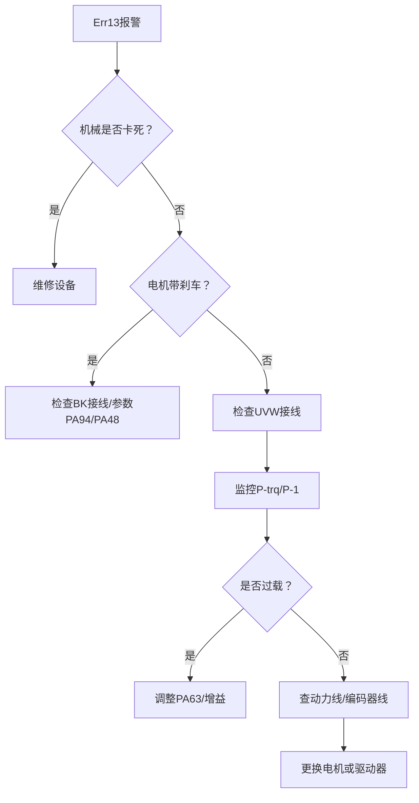

# Err13

根据P100S手册的故障代码说明，**Err13（驱动器过负载）** 通常由瞬时过载或过热引起。以下是系统化的排查步骤，结合手册内容针对性解决：

---

### **一、核心原因分析（手册第94页）**
1. **机械负载过大**  
   - 电机超出额定转矩运行（如卡死、阻力突增）。
2. **制动器未释放**  
   - 带刹车的电机（型号含"B"后缀），抱闸信号（BK）未通电释放。
3. **参数设置不当**  
   - 增益过高导致电机振荡，或负载惯量比（PA63）与实际不匹配。
4. **硬件故障**  
   - UVW动力线接触不良、缺相，或编码器接线错误。

---

### **二、具体排查步骤**
#### **1. 检查机械系统（优先处理）**
   - **脱离负载测试**：断开电机与设备的联轴器，空载运行。若正常，说明机械负载过大（如导轨卡滞、齿轮损坏）。
   - **手动转动电机轴**：断电后尝试手动旋转电机轴，检查是否顺畅（带刹车电机需先解除制动）。

#### **2. 确认抱闸状态（若电机带刹车）**
   - **接线检查**：  
     参考手册第33页图4.6，确认抱闸电源（24V）和BK信号线连接正确（无极性要求）。
   - **参数设置**：  
     检查参数 `PA53`（伺服使能模式）：
     - `0`：需外部信号（DI11/SON）使能。
     - `1`：软件强制使能（无需外部信号）。
   - **时序问题**：  
     调整 `PA94`（抱闸释放延时）和 `PA48`（抱闸闭合延时），确保电流建立后再释放刹车（手册第66页）。

#### **3. 优化参数设置**
   - **负载惯量比（PA63）**：  
     计算公式：`((负载惯量 + 电机惯量) / 电机惯量) × 100`。  
     **步骤**：  
     ① 估算实际负载惯量（通过JOG运行观察加减速抖动）；  
     ② 将PA63设为估算值（默认100，过大易振荡）。
   - **降低增益**：  
     - 位置增益（PA9）：默认80，适当减小（如60）。
     - 速度增益（PA5）：默认150，减小至100-120。
   - **检查转矩限制**：  
     确认外部转矩限制参数（PA34-PA37）是否过低（默认值见手册第64页）。

#### **4. 检查电气连接**
   - **UVW动力线**：  
     确保驱动器U/V/W端子与电机U/V/W一一对应（接错会导致堵转，手册第19页）。
   - **编码器线（CN2）**：  
     检查是否松动，屏蔽层接地（手册第28页）。
   - **制动电阻**：  
     若使用外部电阻，确认P-C端子接线正确（手册第16页图B），阻值≥25Ω。

#### **5. 监控运行状态**
   - **实时数据查看**：  
     通过面板监视：
     - `P-trq`：实时转矩（＞100%即过载）。
     - `P-1`：电机电流（持续＞额定值）。
     - `P-EPo`：位置偏差（过大需调增益）。
   - **过热检查**：  
     手触驱动器散热器温度，＞70℃需改善通风（手册第9页安装间隔要求）。

---

### **三、紧急处理措施**
1. **复位报警**：  
   - 短接DI12（ARST端子）或断电重启。
2. **降低负载**：  
   - 临时调高转矩限制（PA34/PA35），但勿超过300%。
3. **强制散热**：  
   - 清理驱动器风道，确保周围间隙＞5cm（手册第9页图1.3）。

---

### **四、仍未解决？→ 硬件故障可能**
1. **电机问题**：  
   - 绕组短路（测三相电阻是否平衡）。
2. **驱动器损坏**：  
   - IPM模块故障（伴随Err11报警）或电流检测异常（Err23）。
3. **编码器故障**：  
   - 报错Err50/51（通信中断），需更换电机。

> **重要提示**：若需更换硬件，务必记录电机型号（如DB80-02430A6-TJAB）并与驱动器匹配（手册第8页适配表）。

---

**总结排查流程**：  

按此流程逐步排查，可高效定位问题根源。若需参数调整细节，可提供当前配置进一步分析。

