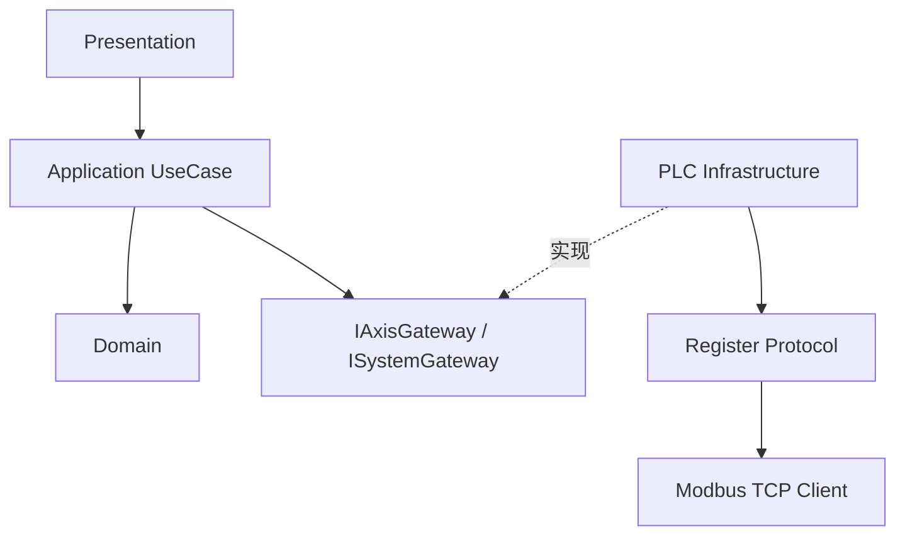

# PLC 16 槽位动态轴整体重构实施规划

> 文档状态：实施规划稿  
> 日期：2026-08-03  
> 适用工程：`servoV6`、`PLC_re`  
> 关联设计：[PLC16槽位动态轴领域模型与职责配置协议](../architecture/PLC16槽位动态轴领域模型与职责配置协议.md)  
> 核心策略：通讯基础设施优先、纵向小步迁移、新旧并行验证、完成迁移后删除旧路径。

## 1. 文档目的

本文将 PLC 16 槽位动态轴适配拆分为可执行、可验证、可回滚的重构阶段，用于指导 `servoV6` 从固定六轴和旧寄存器模型迁移到当前 PLC 的统一16槽位模型。

本文重点回答：

- 为什么先重构通讯基础设施。
- 每个阶段应修改什么、不应修改什么。
- 每个阶段如何测试及判断完成。
- 新旧实现如何并存和逐步切换。
- Domain、Application、ViewModel 应在何时迁移。
- 如何避免一次性大规模重写导致运动控制行为失真。

## 2. 重构总体结论

本次重构采用以下顺序：


通讯基础设施优先是合理的，但必须先定义稳定、类型化的上层端口，不能让 Domain 直接依赖 D/M 地址、Modbus 数据帧或 `RegisterInfo`。

推荐表述为：

> 先冻结上层所需的类型化通讯边界，再实现16槽位协议和真实读写；通讯链路通过自动测试与在线对比后，才在其上重构 Domain 和 UI。

## 3. 重构原则

### 3.1 保持既有可观察行为

依据《重构：改善既有代码的设计》，重构期间应尽量保持外部可观察行为：

- 不在同一个提交中同时重写通讯、Domain 和 UI。
- 新实现先旁路运行，再切换正式调用方。
- 每次只迁移一个数据方向、一个命令或一个轴类型。
- 新路径稳定后再删除旧路径。
- 每个提交都必须可编译、可测试、可回滚。

PLC 协议升级本身属于行为变化，应与纯代码重构分开提交和验证。

### 3.2 单一职责

各层职责固定如下：

| 层 | 应负责 | 不应负责 |
|---|---|---|
| Domain | 轴状态、参数、业务约束、联动配置/反馈 | Modbus、D/M地址、重试、线程 |
| Application | 用例编排、命令顺序、超时、错误转换 | 寄存器字节序、UI渲染 |
| Infrastructure | PLC快照、寄存器读写、断线状态、触发发送 | 业务功能轴映射、UI展示规则 |
| Protocol | 地址公式、数据类型、编解码、职责Codec | 业务状态机 |
| Presentation | ViewModel投影、用户输入、显示状态 | 直接写PLC、重试命令 |

### 3.3 依赖倒置

Domain 和 Application 依赖抽象端口，Infrastructure 实现端口：



### 3.4 明确表达 PLC 两步定位协议

绝对和相对定位必须保留四个独立接口：

```cpp
setAbsTarget(slot, target);
triggerAbsMove(slot);

setRelTarget(slot, distance);
triggerRelMove(slot);
```

不提供把目标设置和运动触发重新合并的接口。

### 3.5 避免过早抽象

- 第一阶段只抽象已经在 PLC 中稳定存在的共同规律。
- 不提前设计无限轴数；当前边界明确为16槽位。
- 不用复杂模板替代简单地址公式。
- 不在真实需求出现前设计多PLC事务框架。
- 先实现普通轴，再泛化联动轴流程。

## 4. 目标技术架构

```text
Presentation
  QtAxisViewModel / AxisViewModelCore
             │
Application  │
  Axis UseCases / CommandExecutor / JogSession
             │
Domain       │
  Axis / SingleAxis / CoupledAxis / AxisSystem
             │
Port         │
  IAxisGateway / ISystemGateway
             │
Infrastructure
  PlcAxisGateway / PlcSnapshotReader / PlcCommandWriter
             │
Protocol
  AxisRegisterLayout / AxisRoleCodec / RegisterCodec
             │
Transport
  IModbusClient / AsioModbusTcpClient
```

### 4.1 建议通讯端口

```cpp
class IAxisGateway {
public:
    virtual ~IAxisGateway() = default;

    virtual Result<PlcAxisSnapshot>
    readAxis(PlcAxisSlot slot) = 0;

    virtual CommunicationResult
    setAbsTarget(PlcAxisSlot slot, float target) = 0;

    virtual CommunicationResult
    triggerAbsMove(PlcAxisSlot slot) = 0;

    virtual CommunicationResult
    setRelTarget(PlcAxisSlot slot, float distance) = 0;

    virtual CommunicationResult
    triggerRelMove(PlcAxisSlot slot) = 0;

    // 其余速度、使能、点动、清零、限位和报警接口按同样方式补充。
};
```

端口可以表达 PLC 能力，但不能暴露 `D1096`、`M48`或 Modbus 功能码。

## 5. 阶段总览与工期

以下工期以一名熟悉 C++、Qt、Modbus 和当前工程的开发者估算，不包含 PLC 程序本身的大幅变更时间。

| 阶段 | 目标 | 预计工期 | 主要里程碑 |
|---|---|---:|---|
| 0 | 协议冻结与测试安全网 | 2–4天 | 可以检测重构是否破坏既有行为 |
| 1 | 16槽位协议层 | 3–5天 | 地址和类型全部公式化 |
| 2 | 新通讯只读链路 | 4–6天 | 能读取16槽位可信快照 |
| 3 | 新通讯写入链路 | 5–7天 | 所有参数、触发、电平可独立验证 |
| 4 | 职责读取与校验 | 3–5天 | 能动态解释并验证16个职责字 |
| 5 | 新旧通讯并行验证 | 3–5天 | 新旧反馈差异可解释 |
| 6 | Domain模型重构 | 5–8天 | 动态 Axis 模型独立通过测试 |
| 7 | Application命令调度 | 4–6天 | 顺序、超时、抢占、心跳清晰 |
| 8 | SystemContext与UI迁移 | 5–8天 | A/B组和普通/联动轴动态展示 |
| 9 | 删除旧实现 | 3–5天 | 固定六轴和旧协议路径清理完成 |

总工作量约为37–59个工作日。建议按6–10周排期，并为真实 PLC 在线验证预留缓冲时间。

## 6. 阶段0：协议冻结与测试安全网

### 6.1 目标

在修改核心代码前建立可以重复运行的行为基线。

### 6.2 工作内容

- 固化 PLC 槽位0–15与 L0-L9、C0-C2、SYN0-SYN2的映射。
- 固化所有参数、反馈和触发的基地址、类型和跨度。
- 明确 Float32 双字顺序和字节序。
- 固化运动状态0–5的含义。
- 固化限位状态0–4的含义。
- 固化告警码位定义。
- 固化软限位控制 bit0/bit1。
- 明确职责为 UInt16，而不是32位。
- 明确急停采用命令确认模型。
- 明确报警解除接口保留但 PLC 逻辑后续补齐。

### 6.3 测试安全网

至少建立以下测试：

- `PlcAxisSlot`边界：0、15合法，16非法。
- Float32编码、解码和字序测试。
- Coil地址范围测试。
- 一次连续读取请求的范围测试。
- Modbus断线时快照可信状态测试。
- 绝对目标设置和触发保持独立测试。
- 相对距离设置和触发保持独立测试。
- 触发命令不在重连后自动重放测试。
- 急停写入优先级测试。

### 6.4 不做事项

- 不修改 UI。
- 不创建新的动态 Axis 对象。
- 不删除旧寄存器表。
- 不切换正式 PLC 读写路径。

### 6.5 退出条件

- 协议表经过 PLC 和上位机双方确认。
- 所有编码和地址测试通过。
- 能通过自动测试识别明显的地址、类型和字序错误。

## 7. 阶段1：16槽位寄存器协议层

### 7.1 目标

用槽位和地址公式替代固定功能轴寄存器表及 `AxisId switch`。

### 7.2 建议结构

```cpp
namespace plc::axis_registers {

RegisterInfo jogSpeed(PlcAxisSlot slot);
RegisterInfo positioningSpeed(PlcAxisSlot slot);

RegisterInfo absolutePosition(PlcAxisSlot slot);
RegisterInfo relativePosition(PlcAxisSlot slot);
RegisterInfo motionState(PlcAxisSlot slot);
RegisterInfo limitState(PlcAxisSlot slot);
RegisterInfo alarmBits(PlcAxisSlot slot);

RegisterInfo absTarget(PlcAxisSlot slot);
RegisterInfo absTrigger(PlcAxisSlot slot);
RegisterInfo relTarget(PlcAxisSlot slot);
RegisterInfo relTrigger(PlcAxisSlot slot);

}
```

### 7.3 实施规则

- Float32地址统一使用 `base + slot * 2`。
- UInt16地址统一使用 `base + slot`。
- Coil地址统一使用 `base + slot`。
- 地址构造函数只接受经过校验的 `PlcAxisSlot`。
- 描述字符串不得影响寻址逻辑。
- Domain 不引用该命名空间。

### 7.4 测试

使用表驱动测试验证全部16槽位：

```cpp
EXPECT_EQ(absTarget(slot(0)).address, 1096);
EXPECT_EQ(absTarget(slot(15)).address, 1126);

EXPECT_EQ(absTrigger(slot(0)).address, 48);
EXPECT_EQ(absTrigger(slot(15)).address, 63);
```

还应检查相邻寄存器区间没有重叠错误。

### 7.5 退出条件

- 新寄存器协议层可以独立构建和测试。
- 不再需要为 X/Y/Z/R分别新增地址常量。
- 尚未切换正式调用方，旧系统行为保持不变。

## 8. 阶段2：新通讯只读链路

### 8.1 目标

在不控制电机的情况下，先证明16槽位寄存器可以稳定、正确读取。

### 8.2 快照模型

```cpp
struct PlcAxisSnapshot {
    PlcAxisSlot slot;

    float jogSpeed;
    float positioningSpeed;

    float absolutePosition;
    float relativePosition;

    std::uint16_t motionState;
    std::uint16_t limitState;
    std::uint16_t alarmBits;

    float relativeZeroRecord;
    float absTarget;
    float relTarget;

    float negativeSoftLimit;
    float positiveSoftLimit;
    std::uint16_t softLimitControl;

    bool trusted;
    std::uint64_t timestamp;
};
```

该结构属于 PLC Gateway DTO，不是最终 Domain 实体。

### 8.3 读取策略

- 尽量合并连续 D 区读取，避免每个轴逐项请求。
- 一次请求失败时，整段数据标记为不可信。
- 不用默认零值覆盖最后可信状态。
- 快照必须携带采样时间和可信标志。
- 绝对位置、相对位置、运动、限位和告警尽量来自同一轮快照。

### 8.4 诊断工具

在接入 Domain 前提供只读诊断输出：

```text
slot=0 plc=L0 abs=... rel=... motion=... limit=... alarm=...
...
slot=15 plc=SYN2 abs=... rel=... motion=... limit=... alarm=...
```

### 8.5 不做事项

- 不向新路径开放任何写操作。
- 不用新快照直接替换现有 UI 数据源。
- 不在读取层推导 A/B组和功能轴。

### 8.6 退出条件

- 16槽位均可读取。
- 在线值与 PLC 监控值一致。
- 状态直接来自 D128，不依赖旧 Coil 推导。
- 限位直接来自 D144，不依赖位置猜测。
- 断线和读取失败不会生成伪造的正常状态。

## 9. 阶段3：新通讯写入链路

### 9.1 目标

在不依赖新 Domain 的前提下，通过集成测试或维护诊断入口验证所有 PLC 写入能力。

### 9.2 建议实现顺序

按风险从低到高推进：

1. 手动速度、定位速度。
2. 软件正负限位、软限位控制。
3. 使能轴控、使能电机。
4. 相对原点设置/清除、绝对位置清零。
5. 绝对目标设置、相对距离设置。
6. 绝对定位触发、相对定位触发。
7. 绝对/相对定位终止触发。
8. 点动正反转与心跳。
9. 告警码清零和报警解除。
10. 急停与急停解除。

### 9.3 定位调用规则

必须维持四个独立命令：

```text
SetAbsTargetCommand
TriggerAbsMoveCommand
SetRelTargetCommand
TriggerRelMoveCommand
```

执行约束：

- 设置接口成功只表示目标值写入成功，不表示运动已经开始。
- 触发接口不隐式写入目标值。
- 目标写入失败时，上层不得继续触发。
- 通讯层不得把四个命令重新包装为一个合并命令。
- 一次性触发不允许在断线重连后自动重放。

### 9.4 命令优先级

建议优先级：

```text
系统急停
  > 运动终止/点动停止
  > 报警解除/清零
  > 定位触发
  > 目标和参数设置
  > 普通状态同步
```

### 9.5 点动心跳

- 点动开始后创建底层 JogSession。
- 每500–1000ms发送一次心跳。
- 点动停止、急停、报警或断线后销毁 JogSession。
- 不由 QML 定时器承担安全心跳。

### 9.6 报警解除能力

上位机保留类型化接口。PLC 逻辑未启用时，驱动返回明确的能力错误，不能假装成功。

### 9.7 急停模型

- M224写 ON 成功后，本地立即进入急停状态。
- 急停锁定后禁止普通轴写操作。
- M225解除触发成功后，本地解除急停状态。
- 本阶段不等待独立急停反馈。

### 9.8 退出条件

- 每类写入均有自动测试或真实 PLC 验证记录。
- 写失败能够传递到调用方。
- 定位设置与触发顺序明确。
- 断线不会重放旧触发。
- 急停能够抢占普通命令。

## 10. 阶段4：职责读取与配置校验

### 10.1 目标

将 D1244-D1259解释成可靠的启动配置，但不将职责当作运行时状态。

### 10.2 处理流程

```text
连续读取16字
  -> 有效位检查
  -> 位字段结构校验
  -> 全局语义校验
  -> 生成 AxisRoleConfig[16]
  -> 发布配置版本/指纹
```

### 10.3 必要校验

- 有效位。
- 保留位必须为0。
- 功能码0–5。
- 同组功能轴唯一。
- X联动轴位于 SYN0-SYN2。
- 主轴、从轴不同。
- 当前主从成员只能引用 L0-L9。
- 主从槽位配置有效。
- 主从与同组 X1/X2映射一致。

### 10.4 CRC实施顺序

第一阶段不要求 CRC 阻塞领域重构，但必须完成有效位和语义校验。

后续增强：

- Magic。
- SchemaVersion。
- Generation。
- 整组 CRC32。
- 双 Header 快照检查。

### 10.5 失败策略

- 配置无效时锁定全部运动控制。
- 保持诊断读取和急停可用。
- 不回退到固定六轴映射。
- 输出槽位、原始职责字和具体失败规则。

### 10.6 退出条件

- 任意输入都能得到确定的 Valid/Invalid结果。
- 不存在职责为0时误创建 A/X 的情况。
- 不存在重复功能轴静默覆盖映射的情况。

## 11. 阶段5：新旧通讯并行验证

### 11.1 目标

在不影响正式控制的情况下，对比新旧读取结果，降低直接切换风险。

### 11.2 运行模式

```text
旧驱动：继续为现有Domain/UI提供数据和命令
新驱动：只读影子模式，不下发运动命令
对比器：记录相同轴的反馈差异
```

### 11.3 对比内容

- 绝对位置和相对位置。
- 运动状态。
- 限位状态。
- 告警位。
- 速度和限位参数。
- 快照时间和轮询耗时。
- 断线恢复行为。

### 11.4 差异分类

| 差异 | 处理 |
|---|---|
| 新协议值正确、旧推导错误 | 记录为预期迁移差异 |
| 字节序或地址错误 | 修复新协议层，不得进入Domain阶段 |
| 采样时间差 | 调整快照比较容差 |
| PLC值本身不稳定 | 与PLC侧联合确认 |
| 无法解释 | 阻塞正式切换 |

### 11.5 切换顺序

只读切换建议依次进行：

1. 位置。
2. 速度和普通参数。
3. 运动状态。
4. 限位状态。
5. 告警位。
6. 联动反馈。

### 11.6 退出条件

- 连续在线运行期间无无法解释的差异。
- 新快照在断线、重连、急停和运动过程中保持可信语义。
- 可以安全作为新 Domain 的输入。

## 12. 阶段6：Domain模型重构

### 12.1 目标

在已验证的通讯能力之上建立纯领域模型。

### 12.2 实施内容

- 将现有 `Axis`整理为公共抽象基类和共享实现。
- 新增 `SingleAxis`。
- 新增 `CoupledAxis`。
- 新增 `AxisIdentity`、`AxisParameters`、`AxisFeedback`。
- 新增 `CouplingConfig`、`CouplingFeedback`。
- 新增 `AxisSystem/AxisRegistry`。
- 将轴控使能和电机使能拆分。
- 告警使用 UInt16位集合。
- 运动和限位直接映射 PLC 统一状态。

### 12.3 Domain接口

```cpp
class Axis {
public:
    virtual ~Axis() = default;

    virtual CommandResult setAbsTarget(float position);
    virtual CommandResult triggerAbsMove();

    virtual CommandResult setRelTarget(float distance);
    virtual CommandResult triggerRelMove();

    virtual CommandResult stopAbsoluteMove();
    virtual CommandResult stopRelativeMove();

    // 速度、使能、点动、零点、限位和报警接口省略。
};
```

### 12.4 Domain禁止项

- 不引用 `RegisterInfo`。
- 不包含 D/M地址。
- 不调用 `IModbusClient`。
- 不维护网络重连。
- 不使用 QTimer。
- 不通过旧 Coil 推导运动状态。
- 不把联动配置位当作实际联动状态。

### 12.5 单元测试

- Axis参数合法性。
- 运动状态准入。
- 限位状态下的方向限制。
- 目标设置和触发分别产生独立命令。
- CoupledAxis配置与反馈分离。
- AxisRegistry槽位及功能查找。
- 无效职责不创建轴。
- 同组重复功能配置失败。

### 12.6 退出条件

- Domain测试不依赖真实 Modbus。
- Fake Gateway可以驱动全部领域行为。
- Domain不包含寄存器和网络细节。

## 13. 阶段7：Application命令调度

### 13.1 目标

将命令顺序、超时、通讯错误和周期任务从 Axis 实体中分离。

### 13.2 建议用例

```text
SetAbsTargetUseCase
TriggerAbsMoveUseCase
SetRelTargetUseCase
TriggerRelMoveUseCase
StartJogUseCase
StopJogUseCase
SetRelativeZeroUseCase
ResetAlarmUseCase
EmergencyStopUseCase
ReleaseEmergencyStopUseCase
```

### 13.3 CommandExecutor

负责：

- 单线程或明确串行化的命令执行。
- 命令优先级。
- 写入结果返回。
- 超时和取消。
- 断线期间拒绝新触发。
- 重连后不自动重放触发。
- 将 Infrastructure 错误转换为 Application 错误。

### 13.4 定位调用链

```text
UI设置绝对目标
  -> SetAbsTargetUseCase
  -> Axis::setAbsTarget
  -> IAxisGateway::setAbsTarget
  -> PLC目标寄存器写入成功

UI触发绝对定位
  -> TriggerAbsMoveUseCase
  -> Axis::triggerAbsMove
  -> IAxisGateway::triggerAbsMove
  -> PLC触发寄存器
```

两个用例保持独立。UI 可以分别操作，Application 不创建合并定位命令。

### 13.5 JogSession

点动心跳由独立会话负责：

- 开始点动后启动。
- 周期发送心跳。
- 停止、报警、急停、断线后终止。
- 不占用 Axis 的单一 pending command。

### 13.6 退出条件

- ViewModel不再直接调用 Driver。
- Axis不负责网络重试和定时器。
- 四个定位用例彼此独立。
- 急停和停止可以抢占普通命令。

## 14. 阶段8：SystemContext和UI动态迁移

### 14.1 目标

将固定六轴系统替换为职责驱动的动态16槽位系统。

### 14.2 SystemContext迁移

旧模型：

```text
构造时固定创建 X/X1/X2/Y/Z/R
```

新模型：

```text
读取职责
  -> 校验
  -> AxisFactory按slot创建对象
  -> 建立(group, function)到slot映射
  -> 发布AxisRegistry
```

### 14.3 推荐轴迁移顺序

1. A/Y普通轴。
2. A/Z普通轴。
3. A/R旋转轴。
4. A/X1和A/X2成员轴。
5. A/X联动轴。
6. B组普通轴。
7. B组联动轴。

联动 X 最后迁移，因为它涉及 SYN虚拟轴、成员锁定、联动反馈和超差逻辑。

### 14.4 UI规则

- UI通过 `(group, function)`查找 Axis。
- `visible=false`只控制显示。
- 隐藏轴继续轮询并参与安全管理。
- 配置无效时不开放运动控件。
- 职责变化后整体重建相关 ViewModel。
- ViewModel不得持有已销毁 Axis 的引用。

### 14.5 运行时职责变化

职责属于启动配置，不做热替换：

1. 发现配置变化。
2. 锁定运动控制。
3. 停止点动心跳。
4. 清理在途命令。
5. 销毁旧 ViewModel。
6. 重新初始化 AxisRegistry。
7. 重新创建 UI映射。

### 14.6 退出条件

- UI不再依赖固定 `AxisId`。
- A/B组可以使用相同功能名而不冲突。
- 普通轴和联动轴均通过职责动态创建。
- 隐藏轴的安全反馈仍持续更新。

## 15. 阶段9：删除旧实现

### 15.1 删除前提

- 所有轴已迁移到新注册表。
- 所有控制命令已迁移到新 Gateway。
- 新路径通过在线测试。
- 不再存在旧路径回退需求。

### 15.2 删除范围

- 固定六轴构造逻辑。
- 旧 `AxisId`寄存器选择器。
- 按 X/Y/Z/R划分的旧地址常量。
- 旧 `AxisStateDeriver`。
- 基于 `alarmCode == 3`的位置限位猜测。
- legacy 合并 `MoveCommand`。
- 旧 X/X1/X2 特殊分支。
- 已无调用方的 Gantry临时适配器。
- 无效的兼容代码和过期测试。

### 15.3 删除方法

- 使用 `rg`确认类型、方法和寄存器常量的全部调用点。
- 每类旧代码单独提交删除。
- 删除后运行全量单元测试和 PLC集成测试。
- 不使用大范围无审查的机械删除。

### 15.4 退出条件

- 代码中只有一套正式轴通讯路径。
- 新开发不需要在新旧模型之间做选择。
- 文档、测试和实现使用同一套术语。

## 16. 测试策略

### 16.1 测试金字塔

```text
大量：纯函数与Domain单元测试
中量：Gateway + MemorySnapshot集成测试
少量：真实PLC在线验收测试
```

### 16.2 协议测试

- 16槽位地址公式。
- Float32字节序。
- UInt16位域。
- 职责编解码。
- CRC测试向量。
- 连续读取范围。

### 16.3 Gateway测试

- 读快照成功/失败。
- 单项写入。
- 触发写入。
- 目标失败后不触发。
- 断线不重放。
- 急停抢占。
- 心跳生命周期。

### 16.4 Domain测试

- 参数范围。
- 状态准入。
- 软硬限位。
- 告警位。
- 联动配置/反馈分离。
- 动态注册和功能映射。

### 16.5 在线验收场景

- 16槽位空闲读取。
- 单轴使能/掉电。
- 正反点动和松开。
- 心跳超时保护。
- 绝对目标设置后触发。
- 相对距离设置后触发。
- 两类定位终止。
- 相对零点设置/清除。
- 绝对位置清零。
- 正负软限位和硬限位。
- 告警清零和报警解除。
- 急停和解除。
- 联动建立、解除和超差。
- 网络断开与重连。

## 17. Git提交与评审策略

### 17.1 提交原则

- 一个提交只解决一个明确问题。
- 每个提交可独立构建和回滚。
- 重命名与行为改变尽量分开。
- 新增路径、切换路径、删除旧路径分开提交。
- 不在同一提交同时修改 PLC协议、Domain和UI。

### 17.2 推荐提交序列

```text
1. 增加16槽位值对象和地址公式
2. 增加协议表驱动测试
3. 增加只读PlcAxisSnapshot
4. 增加影子轮询，不切换旧UI
5. 增加参数写入Gateway
6. 增加四个独立定位命令
7. 增加职责Codec和验证器
8. 增加新旧反馈对比
9. 增加SingleAxis/CoupledAxis
10. 增加AxisRegistry
11. 迁移A/Y
12. 迁移其他普通轴
13. 迁移联动轴
14. 迁移动态UI
15. 删除旧协议路径
```

### 17.3 评审重点

- Domain 是否泄漏寄存器细节。
- 目标设置和触发是否仍然独立。
- 触发是否可能在重连后重放。
- 快照失败是否被误当作零值。
- 急停是否能抢占普通命令。
- ViewModel 是否可能持有悬空 Axis 引用。
- 配置失败是否静默回退。

## 18. 风险与控制措施

| 风险 | 影响 | 控制措施 |
|---|---|---|
| 寄存器类型或字节序错误 | 参数和位置错误 | 协议测试 + PLC在线比对 |
| 大爆炸式替换 | 难以定位回归 | 新旧并行、分轴迁移 |
| 触发在重连后重放 | 意外运动 | 触发不持久化、断线丢弃 |
| 目标和触发乱序 | 使用旧目标运动 | 四接口 + 有序执行 + 失败阻断 |
| 职责错误映射 | 控制错误电机 | 有效位、语义校验、运动锁定 |
| ViewModel悬空引用 | 崩溃或误控制 | 注册表整体发布、UI整体重建 |
| 心跳依赖UI线程 | UI卡顿导致停机 | 独立 JogSession |
| 新旧代码长期共存 | 维护成本翻倍 | 设置删除旧路径的明确里程碑 |
| PLC逻辑继续变化 | 重复返工 | 阶段0冻结协议版本 |
| CRC被误认为业务校验 | 错误配置仍被接受 | CRC + 结构校验 + 语义校验 |

## 19. 进度跟踪模板

每阶段使用同一格式记录：

```markdown
### 阶段状态

- 状态：未开始 / 进行中 / 阻塞 / 已完成
- 负责人：
- 开始日期：
- 计划完成日期：
- 实际完成日期：

### 完成项

- [ ] 代码实现
- [ ] 单元测试
- [ ] 集成测试
- [ ] 在线PLC验证
- [ ] 日志和诊断
- [ ] 文档同步
- [ ] 旧路径清理或保留原因记录

### 阻塞项

- 无 / 具体问题

### 退出条件检查

- [ ] 阶段退出条件全部满足
- [ ] 下一阶段依赖已准备
```

## 20. 总体验收条件

整体重构完成必须同时满足：

1. 16槽位全部使用统一地址公式读写。
2. Domain 不包含 Modbus 和 D/M地址。
3. 职责只作为启动配置来源。
4. 配置无效时系统锁定运动控制且诊断明确。
5. 普通轴和联动轴由职责动态创建。
6. A/B组功能轴映射正确。
7. 运动状态直接读取 D128。
8. 限位状态直接读取 D144。
9. 告警码按 D160位域处理。
10. 绝对目标设置和绝对触发是独立接口。
11. 相对距离设置和相对触发是独立接口。
12. 目标写入失败不会继续触发。
13. 触发命令不会在断线重连后重放。
14. 点动心跳不依赖UI线程。
15. 急停能够抢占并锁定所有普通控制。
16. 联动配置与 PLC实际联动状态分离。
17. UI不再依赖固定六轴枚举。
18. 旧寄存器路径和旧状态推导已删除。
19. 单元、集成和在线验收测试通过。
20. 代码库只保留一套正式实现。

## 21. 最终执行建议

本次重构不应以“先写出最终类图”为起点，而应以“先建立可信的16槽位通讯能力”为第一个工程目标。

推荐实际执行主线：

```text
第一里程碑：能正确读取16槽位
第二里程碑：能类型安全地写入全部PLC能力
第三里程碑：职责配置可以可靠校验
第四里程碑：新旧通讯在线对比通过
第五里程碑：新Domain接管一个普通轴
第六里程碑：全部普通轴迁移
第七里程碑：联动轴迁移
第八里程碑：动态UI迁移
第九里程碑：删除旧路径
```

通讯基础设施优先可以减少 Domain 的试错成本；特征测试、影子运行和逐轴切换则保证这种优先顺序不会演变成一次性底层重写。两者结合，才符合“改善既有代码设计而不破坏既有逻辑”的重构原则。
